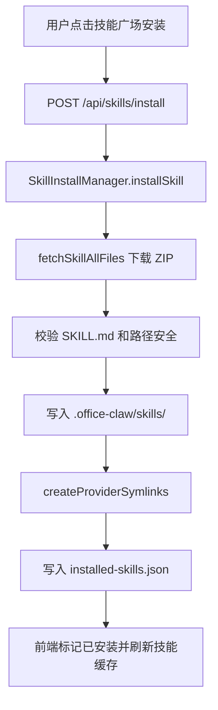
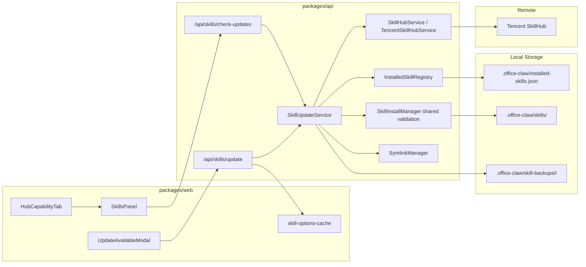
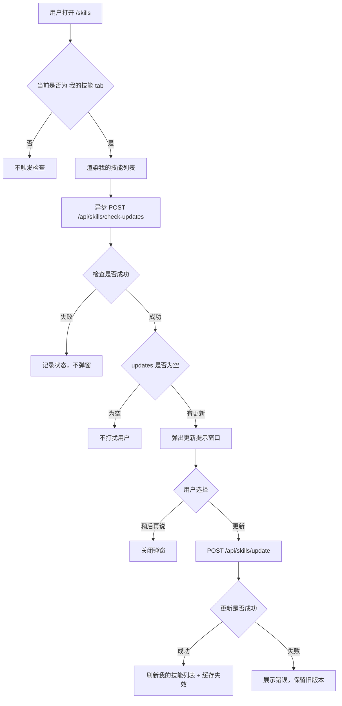
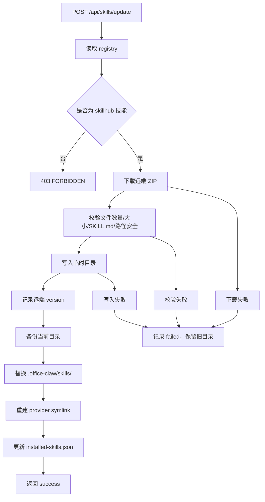
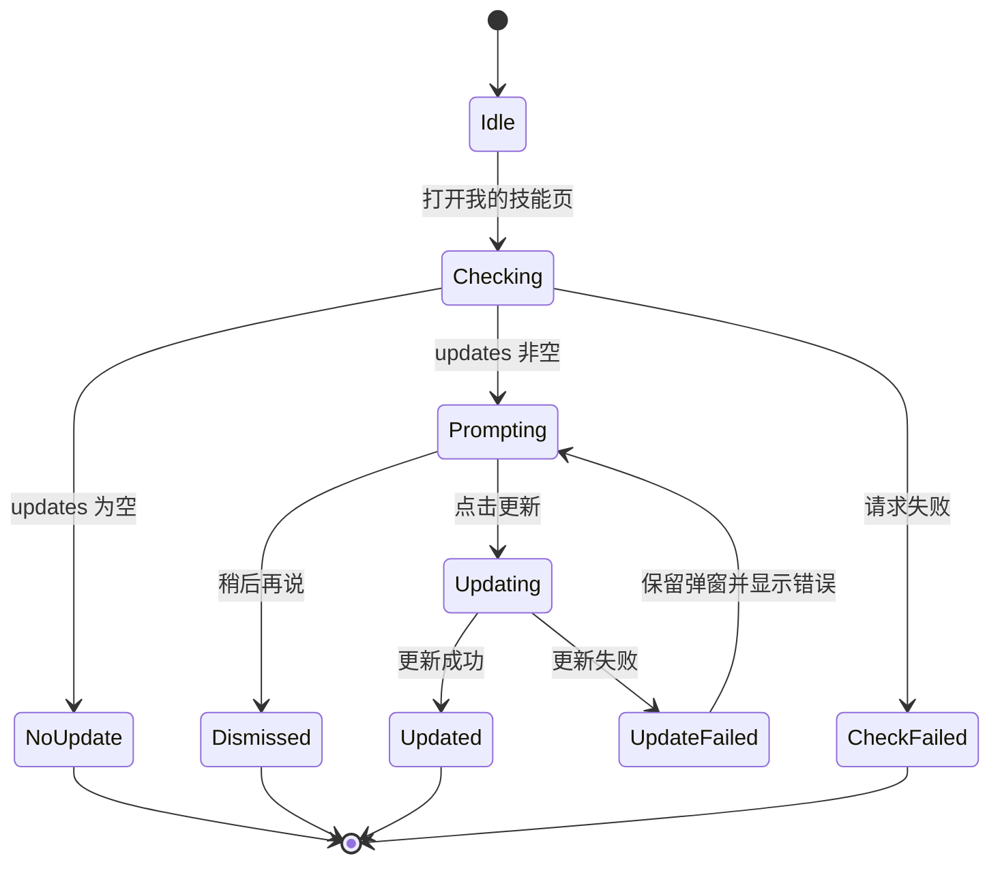
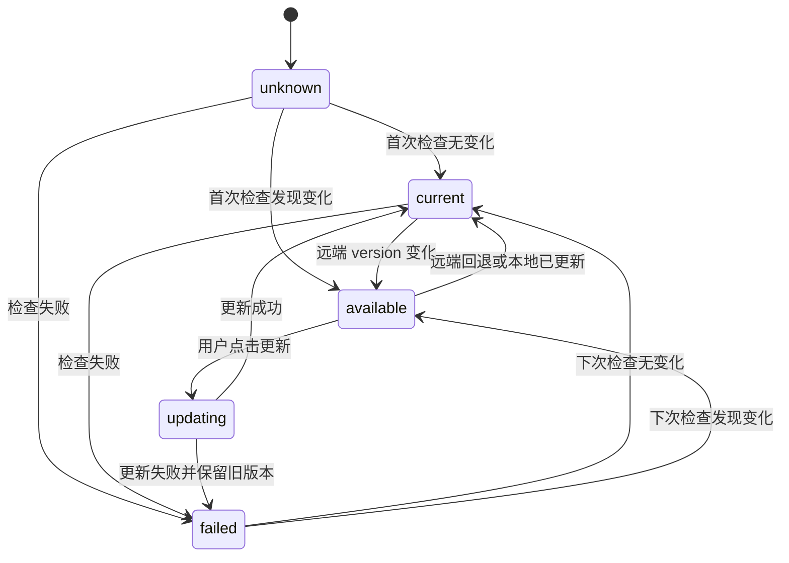
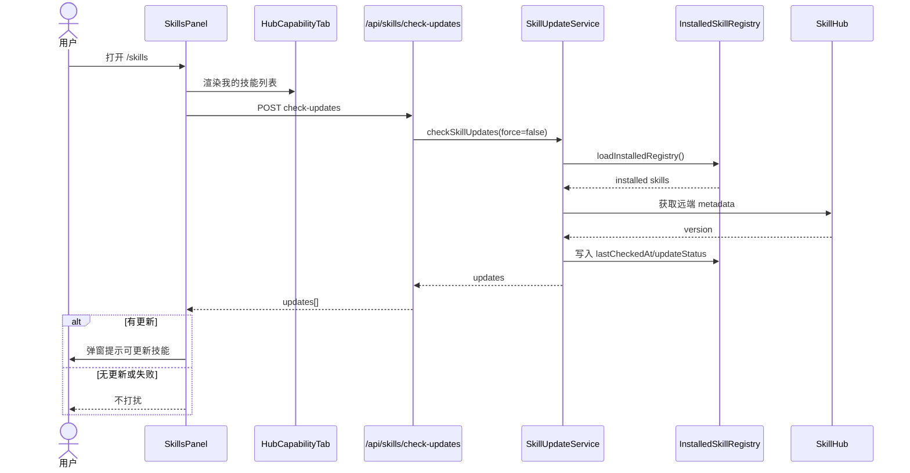
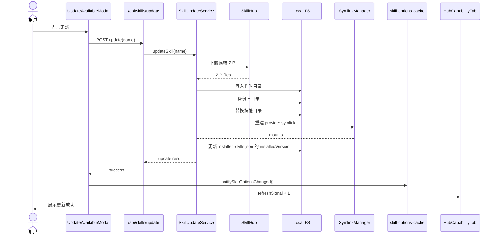

# Skill 自动检查与手动更新机制设计

## 背景

当前 OfficeClaw 已具备技能广场浏览、远程技能安装、本地技能上传、我的技能管理和运行时技能发现能力。远程技能安装后会写入用户持久目录 `.office-claw/skills/<skill-name>`，安装来源记录在 `.office-claw/installed-skills.json`，前端通过“我的技能”页展示已安装技能。

当前缺口是：远程 SkillHub 上的技能发生更新后，本地已安装技能不会主动发现，也不会提醒用户。本设计要实现一个低风险的第一版机制：用户打开“我的技能”页时自动检查一次远程更新；如果发现可更新技能，弹出提示窗口；更新动作必须由用户点击按钮手动触发。

## 1. 需求分析

### 1.1 需求场景分析

核心用户场景：

1. 用户从技能广场安装第三方技能后，后续 SkillHub 发布了新版本或内容更新。
2. 用户打开“我的技能”页，希望自然看到是否有技能可更新，不需要主动搜索或重新安装。
3. 系统发现更新后，应清楚提示“哪些技能有更新”，但不能静默覆盖本地技能内容。
4. 用户点击更新按钮后，系统下载远端最新内容并替换本地对应技能。
5. 如果检查失败，不能影响“我的技能”页正常使用。
6. 如果更新失败，应保留旧版本技能，不让用户进入半更新状态。

本期目标：

1. 打开“我的技能”页自动触发一次更新检查。
2. 只检查通过 SkillHub 安装的远程技能。
3. 有更新时弹窗提示用户。
4. 用户点击按钮后手动更新。
5. 更新成功后刷新技能列表、技能选择缓存和 provider 挂载状态。
6. 检查和更新失败时给出可恢复状态，不破坏已安装技能。

本期非目标：

1. 不做静默自动更新。
2. 不做后台定时检查。
3. 不做应用启动时全量检查。
4. 不做内置技能 `office-claw-skills/` 的在线更新；内置技能仍跟随应用版本升级。
5. 不做本地上传技能的远程更新。
6. 不做跨设备同步、多人权限隔离和企业集中策略。
7. 不做复杂 diff 预览；后续可补充“更新前变更摘要”。
8. 本期不做全量内容 hash 比较；远端 SkillHub 当前可返回 `version` 字段，MVP 以版本号作为更新判断依据。

### 1.2 当前现状

当前相关代码路径：

1. 远程安装服务：`packages/api/src/domains/cats/services/skillhub/SkillInstallManager.ts`
2. 安装记录持久化：`packages/api/src/domains/cats/services/skillhub/InstalledSkillRegistry.ts`
3. SkillHub 远程数据源：`packages/api/src/domains/cats/services/skillhub/TencentSkillHubService.ts`
4. 技能路由：`packages/api/src/routes/skills.ts`
5. 能力看板路由：`packages/api/src/routes/capabilities.ts`
6. 我的技能页容器：`packages/web/src/components/SkillsPanel.tsx`
7. 我的技能列表：`packages/web/src/components/HubCapabilityTab.tsx`
8. 技能选项缓存：`packages/web/src/utils/skill-options-cache.ts`

当前安装流程：



当前 `installed-skills.json` 已记录：

1. `name`
2. `source`
3. `skillhubUrl`
4. `owner`
5. `repo`
6. `remoteSkillName`
7. `installedAt`
8. `displayDescription`

当前未记录：

1. 安装时版本号。
2. 最近检查时间。
3. 最新远端版本。
4. 更新状态。
5. 更新失败原因。
6. 最近更新时间。

### 1.3 架构影响分析

本需求会影响以下架构层：

1. SkillHub domain service：新增更新检查和更新执行服务。
2. installed registry：扩展远程技能的更新元数据。
3. skills routes：新增检查更新和执行更新接口。
4. capabilities routes：可选择透出更新状态给“我的技能”列表。
5. frontend skills panel：进入页面时触发检查，展示更新弹窗。
6. skill options cache：更新完成后必须触发缓存失效。
7. provider symlink：更新后需要确保 Claude/Codex/Gemini 的技能挂载仍正确。

整体架构图：



架构原则：

1. 更新检查逻辑不放在 route 中，新增 `SkillUpdateService` 保持 domain service 边界。
2. 安装和更新共享“下载、校验、文件安全检查”能力，但更新不能直接复用现有覆盖写目录逻辑。
3. 更新采用临时目录、备份、替换的方式，避免半更新。
4. 前端自动检查不能阻塞“我的技能”列表加载。
5. 自动检查可以默认发生，自动更新必须用户显式点击。

### 1.4 版本兼容性

`installed-skills.json` 需要保持向后兼容。

兼容策略：

1. `version` 暂不升级也可以支持新增可选字段，因为现有读取逻辑对额外字段天然兼容。
2. 如果后续需要严格 schema，可将 registry `version` 从 `1` 升到 `2`，但第一版建议维持 `1` 并使用可选字段降低迁移风险。
3. 老用户没有 `installedVersion` 时，第一次检查仅记录远端 `latestVersion`；是否提示更新需要结合安装时是否能补齐版本，避免误把未知版本当成可更新。
4. 损坏或缺失 registry 时沿用当前 `loadInstalledRegistry` 的空 registry fallback，更新检查返回空列表，不影响页面。
5. 当前 `source === 'local'` 的上传技能不参与远程更新，避免误把本地用户资产覆盖。

兼容状态矩阵：

| 场景 | 行为 |
|---|---|
| 老 registry 无更新字段 | 首次检查补充 latestVersion / checkedAt |
| 老 registry 远程技能记录完整 | 正常检查 |
| 老 registry 本地上传技能 | 跳过检查 |
| 内置技能存在于 `office-claw-skills/` | 跳过检查 |
| registry 损坏 | 返回空更新列表，记录日志 |
| 远端无 version | 本期标记为无法判断，不提示更新 |
| 远端 version 不变但内容变化 | 本期不判定更新，后续增强可引入 hash |

## 2. 方案设计

### 2.1 整体方案设计

本期采用“打开页面自动检查 + 用户确认更新”的两阶段方案：

1. 检查阶段：用户打开“我的技能”页，前端异步调用检查接口。
2. 提示阶段：后端返回可更新技能列表，前端弹窗提示。
3. 更新阶段：用户点击更新按钮，前端调用更新接口。
4. 刷新阶段：更新成功后刷新我的技能列表，触发技能选项缓存失效。

整体流程图：



### 2.2 后端详细方案

新增文件：

```text
packages/api/src/domains/cats/services/skillhub/SkillUpdateService.ts
```

建议导出能力：

```ts
export async function checkSkillUpdates(
  hostRoot: string,
  options?: { force?: boolean; now?: Date },
): Promise<SkillUpdateCheckResult>;

export async function updateSkill(
  hostRoot: string,
  name: string,
): Promise<SkillUpdateResult>;
```

检查更新的核心步骤：

1. 调用 `loadInstalledRegistry(hostRoot)`。
2. 筛选 `source === 'skillhub'` 的记录。
3. 对每个记录判断是否需要检查：
   - `force === true` 时强制检查。
   - `lastCheckedAt` 距当前小于限频窗口时返回缓存状态。
   - 默认限频窗口建议 6 小时。
4. 根据 `remoteSkillName` 拉取远端技能元数据。
5. 读取远端 `version`。
6. 比较本地 `installedVersion` 和远端 `version`。
7. 写回 `latestVersion`、`lastCheckedAt`、`updateStatus`。
8. 返回 `updateStatus === 'available'` 的技能列表。

更新技能的核心步骤：

1. 读取 registry，确认技能存在且 `source === 'skillhub'`。
2. 下载远端 ZIP。
3. 校验 ZIP 文件。
4. 写入临时目录。
5. 备份当前目录。
6. 原子替换当前目录。
7. 重建 provider symlink。
8. 更新 registry 的 `installedVersion`、`lastUpdatedAt`、`updateStatus`。
9. 返回更新结果。

更新执行流程图：



### 2.3 前端详细方案

改动文件：

1. `packages/web/src/components/SkillsPanel.tsx`
2. `packages/web/src/components/HubCapabilityTab.tsx`
3. 可新增 `packages/web/src/components/SkillUpdateAvailableModal.tsx`
4. 必要时扩展 `packages/shared/src/types/capability.ts`

前端行为：

1. `SkillsPanel` 维护检查状态：
   - `hasCheckedUpdatesRef`
   - `checkingUpdates`
   - `pendingUpdates`
   - `showUpdateModal`
   - `updatingSkillNames`
2. 当 `activeTab === 'installed'` 且 `hasCheckedUpdatesRef.current === false` 时触发检查。
3. 检查接口失败时静默处理，可记录 console 或 toast，但不阻塞页面。
4. `updates.length > 0` 时打开弹窗。
5. 弹窗中用户点击更新后调用 `/api/skills/update`。
6. 更新成功后：
   - 调用 `notifySkillOptionsChanged()`。
   - 增加 `capabilityRefreshSignal` 刷新 `HubCapabilityTab`。
   - 从 pending list 中移除已更新技能。
   - 全部更新成功后关闭弹窗。

前端状态图：



### 2.4 接口设计

#### 2.4.1 检查更新

```http
POST /api/skills/check-updates
Content-Type: application/json
```

请求：

```ts
interface SkillUpdateCheckRequest {
  force?: boolean;
}
```

响应：

```ts
interface SkillUpdateCheckResponse {
  success: true;
  checkedAt: string;
  updates: SkillUpdateSummary[];
  skipped: SkillUpdateSkippedSummary[];
}

interface SkillUpdateSummary {
  name: string;
  remoteSkillName: string;
  owner: string;
  repo: string;
  currentVersion?: string;
  latestVersion?: string;
  installedAt: string;
  lastCheckedAt: string;
  description?: string;
  reason: 'version';
}

interface SkillUpdateSkippedSummary {
  name: string;
  reason: 'local-skill' | 'builtin-skill' | 'recently-checked' | 'missing-directory' | 'unsupported-source';
}
```

错误码：

| 状态码 | 场景 |
|---|---|
| 401 | 缺少用户身份 |
| 500 | 本地 registry 或文件系统异常 |
| 502 | SkillHub 不可用 |

检查接口原则：

1. 单个技能检查失败不应导致整个接口失败。
2. 如果 SkillHub 整体不可用，可返回 `success: true` 但 `updates: []` 和失败摘要；也可返回 502。第一版建议单技能失败写入 `lastUpdateError`，整体请求仍尽量成功。
3. 前端只在 `updates.length > 0` 时弹窗。

#### 2.4.2 执行更新

```http
POST /api/skills/update
Content-Type: application/json
```

请求：

```ts
interface SkillUpdateRequest {
  name: string;
}
```

响应：

```ts
interface SkillUpdateResponse {
  success: true;
  name: string;
  previousVersion?: string;
  currentVersion?: string;
  updatedAt: string;
  mounts: {
    claude: boolean;
    codex: boolean;
    gemini: boolean;
  };
}
```

错误码：

| 状态码 | 场景 |
|---|---|
| 400 | 缺少或非法 name |
| 401 | 缺少用户身份 |
| 403 | 不是 SkillHub 安装的远程技能 |
| 404 | 技能记录或本地目录不存在 |
| 409 | 更新锁冲突，已有更新进行中 |
| 422 | 远端包校验失败 |
| 502 | 下载失败或 SkillHub 不可用 |
| 500 | 本地写入、备份、替换失败 |

### 2.5 数据结构设计

#### 2.5.1 registry 扩展

当前 `InstalledSkillRecord` 建议扩展为：

```ts
export interface InstalledSkillRecord {
  name: string;
  source: 'skillhub' | 'local';
  skillhubUrl: string;
  owner: string;
  repo: string;
  remoteSkillName: string;
  installedAt: string;
  displayDescription?: string;

  installedVersion?: string;
  latestVersion?: string;
  lastCheckedAt?: string;
  lastUpdatedAt?: string;
  updateStatus?: 'unknown' | 'current' | 'available' | 'failed';
  lastUpdateError?: string;
}
```

字段说明：

| 字段 | 含义 |
|---|---|
| `installedVersion` | 本地当前安装版本，来自远端 metadata 或 skill frontmatter |
| `latestVersion` | 最近一次检查到的远端版本 |
| `lastCheckedAt` | 最近一次检查时间 |
| `lastUpdatedAt` | 最近一次成功更新时间 |
| `updateStatus` | 当前更新状态 |
| `lastUpdateError` | 最近一次检查或更新失败原因 |

#### 2.5.2 版本比较规则

MVP 使用 SkillHub 返回的 `version` 字段作为唯一更新判断依据。

比较规则：

1. 安装时记录远端 `version` 到 `installedVersion`。
2. 检查时获取远端最新 `version`，写入 `latestVersion`。
3. `latestVersion` 存在且不同于 `installedVersion` 时，判定为 `available`。
4. `latestVersion` 存在且等于 `installedVersion` 时，判定为 `current`。
5. 远端缺少 `version` 时，判定为 `unknown` 或 `failed`，不提示更新。
6. 不在 MVP 中解析 semver 大小关系；只做字符串不相等判断，避免远端版本格式不标准导致误判。

说明：实际请求 `https://lightmake.site/api/skills?page=1&pageSize=3&sortBy=score&order=desc` 时，返回的技能对象包含 `version` 字段，例如 `3.0.21`、`1.0.0`、`0.1.0`。当前代码中的 `TencentSkill` 类型已声明 `version?: string`，但 normalize 后的统一 `SkillHubSkill` 尚未透出该字段，实现时需要补齐类型和映射。

#### 2.5.3 更新状态机



### 2.6 时序设计

#### 2.6.1 打开我的技能页自动检查



#### 2.6.2 用户点击更新



## 3. 可靠可用性

### 3.1 不阻塞主路径

打开“我的技能”页时，更新检查必须异步执行，不阻塞 `HubCapabilityTab` 的技能列表加载。

原则：

1. 列表加载失败和更新检查失败相互独立。
2. 更新检查失败不弹阻断型错误。
3. SkillHub 不可用时，用户仍可查看和使用本地已安装技能。

### 3.2 限频与并发控制

限频策略：

1. 默认 6 小时内不重复检查同一个技能。
2. 页面生命周期内只自动检查一次。
3. 后端对同一技能更新操作加锁，避免并发替换目录。
4. 检查多个技能时限制并发，建议最大并发 3。

并发锁建议：

```ts
const updateLocks = new Map<string, Promise<void>>();
```

同一 `name` 更新中再次请求时返回 409。

### 3.3 原子性与回滚

更新目录不能直接覆盖写入，应采用：

```text
.office-claw/skills/.tmp-<name>-<timestamp>
.office-claw/skill-backups/<name>/<timestamp>
.office-claw/skills/<name>
```

更新步骤：

1. 远端内容先写临时目录。
2. 临时目录校验通过后再备份旧目录。
3. 旧目录备份成功后替换正式目录。
4. registry 最后写入。

失败处理：

| 失败阶段 | 处理 |
|---|---|
| 下载失败 | 保留旧目录，记录失败 |
| 校验失败 | 删除临时目录，保留旧目录 |
| 写临时目录失败 | 删除临时目录，保留旧目录 |
| 备份失败 | 不替换正式目录 |
| 替换失败 | 尝试恢复备份 |
| registry 写入失败 | 保留目录，记录日志，下一次检查可修正 |

### 3.4 可观测性

后端日志建议包含：

1. `skill_update_check_started`
2. `skill_update_check_finished`
3. `skill_update_available`
4. `skill_update_failed`
5. `skill_update_applied`

日志字段：

1. `name`
2. `remoteSkillName`
3. `reason`
4. `durationMs`
5. `error`
6. `installedVersion`
7. `latestVersion`

隐私注意：日志不记录 skill 文件正文，不记录完整用户输入，不记录敏感路径之外的文件内容。

### 3.5 测试策略

后端单测：

1. 只检查 `source === 'skillhub'`。
2. 跳过 `source === 'local'`。
3. version 变化返回 available。
4. version 相同返回 current。
5. version 缺失时不提示更新。
6. 检查失败写入 failed，但不删除技能目录。
7. 更新成功替换目录并更新 registry。
8. 更新失败保留旧目录。
9. 并发更新同一技能返回 409。

前端测试：

1. 打开我的技能页自动调用 `/api/skills/check-updates`。
2. 无更新不弹窗。
3. 有更新弹窗。
4. 点击稍后再说关闭弹窗。
5. 点击更新调用 `/api/skills/update`。
6. 更新成功触发 `notifySkillOptionsChanged()` 并刷新我的技能列表。
7. 更新失败展示错误，不关闭弹窗。

## 4. 安全隐私

### 4.1 安全边界

技能可能包含 Markdown 指令、脚本、配置和其他辅助文件。第三方 skill 更新本质上是引入新的本地可读内容和 agent 行为规则，因此必须遵循以下边界：

1. 系统可以自动检查。
2. 系统不能默认自动覆盖。
3. 更新前必须提示用户。
4. 更新动作必须由用户点击触发。
5. 本地上传技能和内置技能不参与第三方远程更新。

### 4.2 文件安全校验

下载的远端 ZIP 必须校验：

1. 必须包含 `SKILL.md`。
2. `SKILL.md` 内容不能为空。
3. 单文件大小限制。
4. 总文件大小限制。
5. 文件数量限制。
6. 禁止路径穿越：`..`、绝对路径、盘符路径。
7. 禁止写入隐藏文件和隐藏目录。
8. 跳过 `__MACOSX/` 和 `.DS_Store`。
9. 不执行下载内容中的任何脚本。

建议第一版复用上传限制：

1. 文件数量最多 100。
2. 单文件最多 1MB。
3. 总大小最多 4MB。

如果远程安装当前允许 3MB `SKILL.md`，更新服务可以先采用更严格的上传限制，避免第三方更新扩大本地攻击面。若产品需要兼容大 skill，可后续统一安装和上传限制。

### 4.3 隐私保护

更新检查会向 SkillHub 发送已安装远程技能的标识，例如 `remoteSkillName`、`owner`、`repo`。这属于外部请求，必须控制范围。

隐私原则：

1. 只检查用户通过 SkillHub 安装过的远程技能。
2. 不上传本地 skill 内容。
3. 不上传用户项目路径。
4. 不上传用户会话、提示词、文件内容。
5. 不上传内置技能列表以外的本地目录信息。
6. 日志不记录 skill 文件正文。

### 4.4 供应链风险

第三方 skill 更新可能带来供应链风险：

1. 远端作者账号被接管。
2. 技能内容新增恶意指令。
3. 技能脚本新增危险操作。
4. 技能描述保持不变但文件内容变化。
5. 远端版本回退或被替换。

本期缓解：

1. 用户手动确认更新。
2. 版本号变化才提示更新，降低检查成本。
3. 更新前后保留 registry 元数据。
4. 备份旧版本目录。
5. 不执行更新包脚本。
6. 失败时不破坏旧版本。

后续增强：

1. 更新前展示文件变更摘要。
2. 高风险文件变化时要求二次确认，例如新增 `.ps1`、`.sh`、`.py`。
3. 支持回滚到上一个备份版本。
4. 支持用户对单个技能禁用更新提醒。
5. 支持可信来源白名单。
6. 引入全量内容 hash，覆盖“版本号未变但内容变化”的异常场景。

## 实施拆分

建议按以下顺序落地：

1. 扩展 `InstalledSkillRecord` 类型，保持旧 registry 兼容。
2. 将 SkillHub `version` 字段透出到统一类型和搜索/列表返回。
3. 新增 `SkillUpdateService.checkSkillUpdates`。
4. 新增 `POST /api/skills/check-updates`。
5. 前端“我的技能”页打开时自动检查并弹窗。
6. 新增 `SkillUpdateService.updateSkill`，实现临时目录、备份、替换和 registry 更新。
7. 新增 `POST /api/skills/update`。
8. 前端接入更新按钮、成功刷新和失败展示。
9. 补充后端和前端测试。

第一阶段验收标准：

1. 打开我的技能页会自动检查一次远程技能更新。
2. 无更新时没有弹窗。
3. 有更新时弹出更新提示。
4. 点击更新后能替换本地远程技能。
5. 更新成功后技能列表和聊天输入技能菜单能看到最新技能。
6. 检查失败或更新失败不影响旧技能使用。
7. 本地上传技能和内置技能不会被远程更新机制覆盖。
