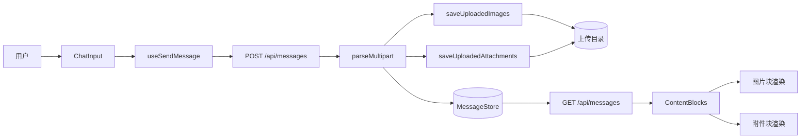
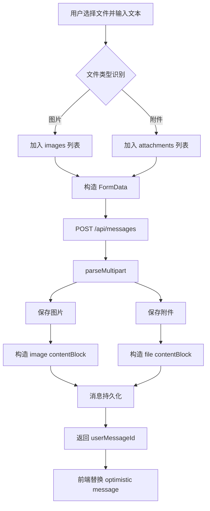
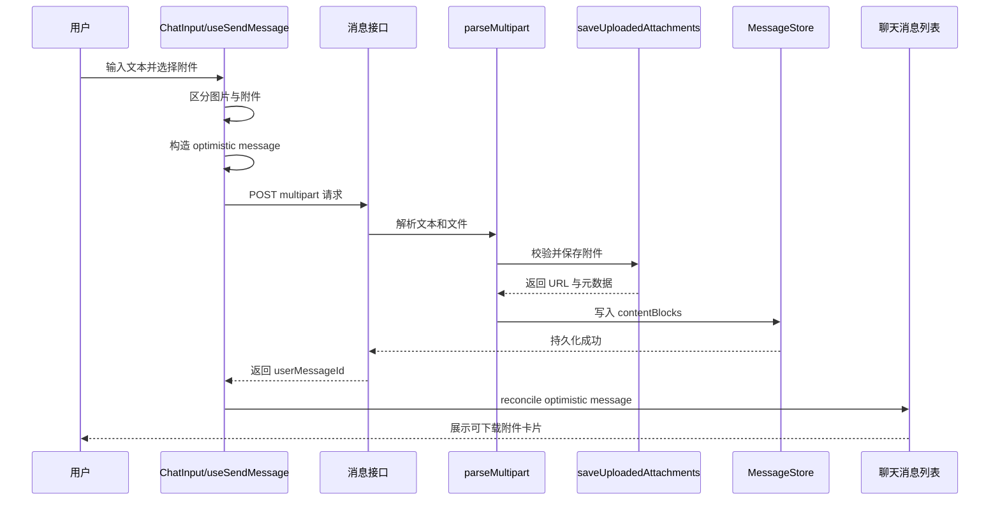
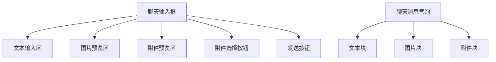
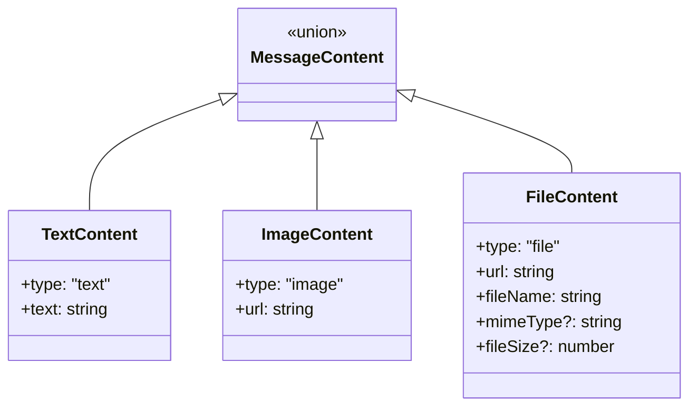
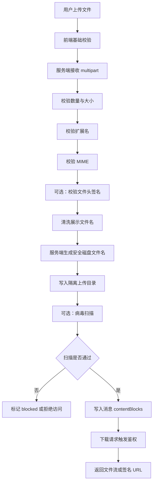
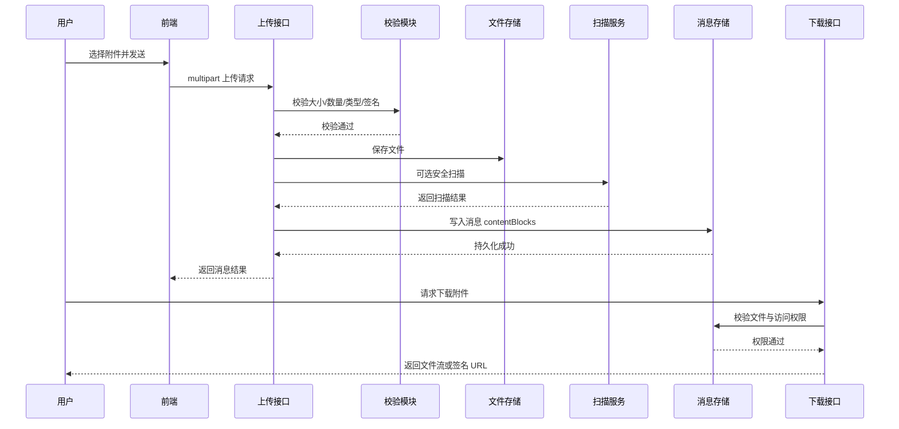

# F140：聊天附件上传能力设计说明

> **状态**：implemented spec | **Owner**：Maine Coon | **Priority**：P1

## 1. 文档概述

## 1.1 文档目的

本文档用于沉淀聊天系统“附件上传能力”的完整设计方案，覆盖：

- 需求背景与目标
- 场景分析
- 架构影响分析
- 技术选型
- 功能方案设计
- 详细方案设计
- 接口设计
- 界面设计
- 数据结构设计
- 可靠性、可用性与安全设计

本文档既可用于需求评审，也可作为后续开发、联调、测试和能力演进的参考依据。

## 1.2 功能定义

在现有聊天图片上传能力的基础上，扩展支持以下附件类型：

- `pdf`
- `docx`
- `xlsx`
- `pptx`
- `txt`
- `csv`

用户可以在聊天发送时上传这些附件，系统将：

1. 接收并保存文件
2. 生成可访问的文件 URL
3. 将文件 URL 与元数据写入消息 `contentBlocks`
4. 在消息中渲染附件卡片
5. 支持后续下载

## 1.3 本期范围

本期方案支持：

1. 上传附件
2. 将附件保存到上传目录
3. 在消息中记录附件 URL 与元数据
4. 在聊天中展示与下载附件

本期不支持：

1. 模型读取附件内容
2. 文档解析、OCR、摘要生成
3. 在线预览与编辑
4. 高级附件权限体系
5. 企业级安全扫描闭环

---

## 2. 需求分析

## 2.1 需求背景

当前系统已经支持图片上传。现有图片上传链路已经具备比较成熟的基础能力：

- 统一由 `POST /api/messages` 进入
- 使用 multipart 方式发送文件
- 文件写入服务端上传目录
- 消息通过 `contentBlocks` 保存文件引用
- 前端依据 `contentBlocks` 渲染图片消息

随着实际使用深入，用户在聊天中传递的信息载体不再局限于图片。更高频的文件类型还包括：

- 产品需求文档
- 汇报材料
- 数据表
- 方案说明
- 原始文本文件

如果聊天系统无法承载这些文件，用户只能通过以下方式绕过：

1. 粘贴本地路径
2. 使用外部网盘链接
3. 脱离聊天系统转为其他协作工具

这会导致：

1. 文件与消息上下文割裂
2. 历史回看时无法直接知道某条消息附带了什么文件
3. 用户协作成本增加
4. 对话上下文的完整性下降

因此，需要在现有图片上传机制的基础上扩展附件上传能力。

## 2.2 业务目标

本功能的业务目标是：

**让用户能够像发送图片一样，在聊天消息中发送常见附件，并在会话上下文中完整保留该附件。**

## 2.3 用户需求拆解

从用户视角看，需求包括三个层面。

### 基础能力诉求

- 我能在聊天里上传文件
- 文件会跟随消息一起保存
- 刷新后还能看到这个文件

### 使用体验诉求

- 上传动作要尽量和图片保持一致
- 发送前可以看到已选择的附件
- 发送后消息里能展示一个清晰的文件卡片
- 点击后可以直接下载

### 系统一致性诉求

- 最好不要多一套独立上传流程
- 最好不影响原有图片上传
- 新建线程时首条消息也能带附件

## 2.4 核心需求

系统必须满足以下核心能力：

1. 前端支持选择指定类型附件
2. 前端支持文本、图片、附件混合发送
3. 服务端支持接收并校验附件
4. 服务端支持保存附件文件
5. 服务端支持把附件写入消息 `contentBlocks`
6. 前端支持根据 `contentBlocks` 渲染附件
7. 用户可以从消息中下载附件

## 2.5 非目标

为了控制范围，本阶段明确不做以下能力：

1. 不实现模型直接读取附件
2. 不实现服务端文档内容抽取
3. 不实现附件内容预览页
4. 不实现全文检索和向量化
5. 不实现复杂权限体系

---

## 3. 场景分析

## 3.1 典型场景

### 场景 A：已有线程中发送附件

用户在一个已有线程里输入文本，并选择一个 `pdf` 或 `docx` 文件发送。系统在一条用户消息中同时保存文本块与附件块。

### 场景 B：图片与附件混合发送

用户在同一条消息中发送：

- 一段文本
- 两张图片
- 一个 `pptx`

系统应统一处理，并最终得到一个带多个 `contentBlocks` 的消息对象。

### 场景 C：新建线程时首条消息带附件

用户尚未创建线程，但希望第一条消息就附带文件。系统需要先创建线程，再把缓存的带附件消息发送出去。

### 场景 D：历史消息回显

用户刷新页面或重新进入线程时，历史消息中的附件卡片应正确恢复并继续支持下载。

## 3.2 边界场景

需要额外考虑以下边界：

- 上传不支持的文件类型
- 上传数量超过限制
- 文件大小超过限制
- 仅发送附件、不发送文本
- optimistic message 已展示但服务端发送失败
- 用户发送前删除某个附件

## 3.3 当前不处理场景

本期不覆盖：

- 剪贴板粘贴文档类附件
- 附件内容预览
- 病毒扫描阻断链路
- 权限敏感文件隔离下载

---

## 4. 设计目标与约束

## 4.1 设计目标

本方案遵循以下目标：

1. **最小侵入**
   在现有图片上传架构上扩展，而不是新建一套文件系统。

2. **统一表达**
   通过 `contentBlocks` 统一表达文本、图片、附件。

3. **前后端一致**
   上传、持久化、回显、历史恢复使用同一套结构。

4. **低回归风险**
   保持图片链路与现有消息发送行为稳定。

## 4.2 设计约束

### 约束 A：复用现有消息发送入口

不得引入新的独立附件上传接口，必须继续使用 `POST /api/messages`。

### 约束 B：保留现有图片行为

图片上传行为不能变化，包括：

- 文件选择
- 图片压缩
- multipart 提交
- optimistic 渲染
- 历史消息回显

### 约束 C：不改变模型调用语义

本阶段附件只负责上传、落盘、展示，不作为模型解析输入。

### 约束 D：最小化调用方改动

前端发送函数需要保持向后兼容，避免把现有消息发送调用点全部打碎。

---

## 5. 架构影响分析

## 5.1 受影响模块

### Shared 层

- 扩展消息联合类型
- 增加 `FileContent`
- 扩展 schema 校验

### API 层

- 扩展 multipart 解析逻辑
- 增加附件保存逻辑
- 增加 `file` 类型内容块

### Web 层

- 扩展文件选择逻辑
- 扩展发送逻辑
- 扩展 optimistic message 逻辑
- 扩展消息渲染逻辑
- 扩展新线程暂存发送逻辑

## 5.2 不受影响模块

以下模块保持不变：

- 模型路由逻辑
- Agent 执行逻辑
- 消息主存储模型
- 消息查询主接口
- WebSocket 消息生命周期机制

## 5.3 架构影响结论

本次改造是对现有上传链路的扩展，而不是新建子系统。整体架构影响有限，适合以较低风险增量交付。

## 5.4 架构图



---

## 6. 技术选型

## 6.1 可选方案

### 方案一：扩展现有 multipart 消息发送链路

在现有 `/api/messages` 中新增 `attachments` 字段。

### 方案二：新建独立附件上传接口

先上传文件，再单独提交消息引用。

### 方案三：走 Rich Block 体系

不扩展 `contentBlocks`，而是将附件存在 `extra.rich.blocks`。

## 6.2 选型结论

采用 **方案一：扩展现有 multipart 消息发送链路**。

## 6.3 选型原因

1. 与图片上传最一致
2. 改动范围最小
3. 不需要两阶段上传状态机
4. 易于保持历史消息与当前消息一致
5. 可作为后续更复杂附件能力的基础版本

## 6.4 方案对比

| 方案 | 优点 | 缺点 | 结论 |
|---|---|---|---|
| 扩展 `/api/messages` multipart | 复用度高、成本低、一致性好 | 上传与消息发送耦合 | 采用 |
| 独立上传接口 | 上传与消息可分离 | 前端状态复杂、可能产生孤儿文件 | 不采用 |
| Rich Block 表达附件 | 富媒体扩展性强 | 相对过重，不符合本期“最小改动”目标 | 不采用 |

---

## 7. 功能方案设计

## 7.1 整体方案

本功能遵循“统一发送、统一存储、统一渲染”的设计原则：

1. 用户在聊天输入框选择文件
2. 前端区分图片和附件
3. 前端统一通过 multipart 提交给 `/api/messages`
4. 服务端解析文本、图片、附件
5. 服务端分别保存图片与附件
6. 服务端统一构造 `contentBlocks`
7. 前端通过 optimistic message 和历史消息回放展示最终结果

## 7.2 整体流程图



## 7.3 时序图



---

## 8. 详细方案设计

## 8.1 前端输入层设计

### 8.1.1 文件分类

前端文件选择入口保持现有附件按钮不变，选择后的文件按规则分类：

- 若 `file.type.startsWith('image/')`，视为图片
- 若 MIME 或扩展名命中允许附件集合，视为附件
- 否则视为不支持类型

### 8.1.2 上传数量限制

首期沿用统一限制：

- 单条消息总上传项不超过 `5`
- 图片与附件合并计数

设计原因：

1. 与后端 multipart 限制保持一致
2. 改动最小
3. 有利于降低大批量上传风险

### 8.1.3 图片与附件处理差异

图片：

- 保持压缩逻辑
- 保持图片预览方式

附件：

- 不压缩
- 使用新的文件预览卡片

### 8.1.4 粘贴行为

本期粘贴仅保留图片能力，暂不支持附件粘贴。

## 8.2 前端发送层设计

### 8.2.1 发送函数签名

为控制调用方影响面，`attachments` 参数追加在签名末尾：

```ts
handleSend(
  content: string,
  images?: File[],
  overrideThreadId?: string,
  whisper?: WhisperOptions,
  deliveryMode?: DeliveryMode,
  sendOptions?: SendMessageOptions,
  attachments?: File[],
)
```

这样可以兼容：

- 普通线程发送
- SplitPane 发送
- 新建线程首条消息发送
- 继续执行类发送场景

### 8.2.2 multipart 构造

当存在图片或附件时，统一使用 `FormData`：

```ts
formData.append('content', content)
formData.append('threadId', threadId)
formData.append('images', imageFile)
formData.append('attachments', attachmentFile)
```

## 8.3 乐观渲染设计

### 8.3.1 optimistic message

在服务端响应前，前端先构造本地消息：

- 文本块：`text`
- 图片块：`image`
- 附件块：`file`

附件块示例：

```ts
{
  type: 'file',
  url: URL.createObjectURL(file),
  fileName: file.name,
  mimeType: file.type,
  fileSize: file.size,
}
```

### 8.3.2 blob URL 回收

前端 store 原先只回收图片 blob URL，本次扩展为同时回收文件 blob URL，避免 optimistic 阶段造成内存泄漏。

## 8.4 服务端 multipart 解析设计

服务端通过 `parseMultipart` 完成：

1. 文本字段解析
2. 图片文件收集
3. 附件文件收集
4. 调用保存函数
5. 拼接 `contentBlocks`

分类规则：

- `fieldname === 'images'`：进入图片队列
- `fieldname === 'attachments'`：进入附件队列

最终 `contentBlocks` 顺序为：

1. 文本块
2. 图片块
3. 附件块

## 8.5 服务端附件保存设计

### 8.5.1 校验项

附件保存阶段至少执行以下校验：

1. MIME 白名单
2. 文件大小限制
3. 文件数量限制

### 8.5.2 磁盘命名

服务端生成磁盘文件名：

```text
file-<timestamp>-<uuid8>.<safe_ext>
```

例如：

```text
file-1712745600000-a1b2c3d4.pdf
```

### 8.5.3 展示名策略

消息中展示的文件名来源于用户原始文件名，但必须经过清洗，并最终以校验后的扩展名为准，而不是盲目信任客户端扩展名。

### 8.5.4 返回结构

附件保存函数返回：

- 磁盘绝对路径
- 相对访问 URL
- `FileContent`

## 8.6 新建线程首条消息兼容设计

`pendingNewThreadSend` 结构被扩展支持 `attachments`，以保证：

1. 新建线程前的草稿消息可缓存附件
2. 线程创建成功后可完整重放发送

---

## 9. 接口设计

## 9.1 消息发送接口

### 接口定义

`POST /api/messages`

### 请求模式

- 文本消息：`application/json`
- 带文件消息：`multipart/form-data`

### multipart 字段

| 字段 | 类型 | 必填 | 说明 |
|---|---|---:|---|
| `content` | string | 是 | 消息文本 |
| `threadId` | string | 否 | 线程 ID |
| `images` | file[] | 否 | 图片数组 |
| `attachments` | file[] | 否 | 附件数组 |
| `idempotencyKey` | string | 否 | 幂等键 |
| `deliveryMode` | string | 否 | 投递模式 |
| `visibility` | string | 否 | 可见性 |
| `whisperTo` | string[] | 否 | 悄悄话目标 |

## 9.2 消息查询接口

### 接口定义

`GET /api/messages`

### 响应变化

无需增加新的独立响应字段，只需让 `contentBlocks` 支持 `file` 类型。

## 9.3 文件访问方式

当前方案沿用静态访问路径：

```text
/uploads/<server-generated-file-name>
```

前端在渲染时，若发现是相对上传路径，则会拼接 `API_URL`。

---

## 10. 界面设计

## 10.1 输入区设计

聊天输入区保留原有结构，仅扩展出附件预览区域。

包括：

- 文本输入区
- 图片预览区
- 附件预览区
- 附件选择按钮
- 发送按钮

## 10.2 发送前附件预览设计

附件预览卡片展示：

- 文件扩展名
- 文件名
- 文件大小
- 删除按钮

## 10.3 消息中的附件展示

附件块展示为可下载文件卡片，包含：

- 文件类型标识
- 文件名
- 文件大小与 MIME 信息
- 下载入口

## 10.4 界面结构图



---

## 11. 数据结构设计

## 11.1 内容块模型

原始模型：

```ts
type MessageContent = TextContent | ImageContent
```

扩展后模型：

```ts
type MessageContent = TextContent | ImageContent | FileContent
```

## 11.2 FileContent 结构

```ts
interface FileContent {
  type: 'file';
  url: string;
  fileName: string;
  mimeType?: string;
  fileSize?: number;
}
```

## 11.3 示例消息结构

```json
{
  "id": "msg_001",
  "type": "user",
  "content": "请看这个文档",
  "contentBlocks": [
    {
      "type": "text",
      "text": "请看这个文档"
    },
    {
      "type": "file",
      "url": "/uploads/file-1712745600000-a1b2c3d4.pdf",
      "fileName": "需求说明.pdf",
      "mimeType": "application/pdf",
      "fileSize": 204800
    }
  ],
  "timestamp": 1712745600000
}
```

## 11.4 类型图



---

## 12. 可靠性与可用性设计

## 12.1 可靠性目标

本功能需要保证：

1. 不破坏现有图片上传
2. 不破坏历史消息回放
3. 不丢失新建线程首条消息中的附件
4. optimistic UI 不造成资源泄漏

## 12.2 可靠性设计

### 设计一：统一消息表达

附件与文本、图片统一进入 `contentBlocks`，避免引入第二条消息渲染链路。

### 设计二：复用现有 multipart 协议

通过复用 `/api/messages` 避免新增双阶段上传状态机，降低链路复杂度。

### 设计三：发送签名追加式扩展

`handleSend` 仅在末尾追加 `attachments` 参数，减少旧调用方回归风险。

### 设计四：blob URL 生命周期管理

将 `file` 块纳入 blob URL 回收机制，避免内存泄漏。

### 设计五：新线程待发送缓存扩展

`pendingNewThreadSend` 增加 `attachments`，保障新线程首条消息带附件的能力。

## 12.3 可用性设计

可用性上采取以下措施：

1. 发送前可见附件预览
2. 发送中有统一上传状态提示
3. 发送后消息中可立即看到附件卡片
4. 历史消息刷新后仍可恢复显示

---

## 13. 安全设计

## 13.1 安全目标

文件上传相关安全目标包括：

1. 防止恶意文件进入系统
2. 防止文件类型伪装绕过
3. 防止通过文件名、扩展名、路径进行攻击
4. 防止大文件和批量上传拖垮系统
5. 防止上传后的文件被越权访问
6. 防止附件在下载和渲染时形成二次风险

## 13.2 主要风险分析

附件上传相关典型风险如下：

| 风险类型 | 风险说明 |
|---|---|
| 文件类型伪造 | 将恶意文件伪装成 `pdf/docx` 上传 |
| MIME 欺骗 | 客户端提交的 `Content-Type` 与真实文件内容不一致 |
| 恶意扩展名 | 如 `report.pdf.exe`、`test.html` |
| 路径穿越 | 利用文件名逃逸出上传目录 |
| 存储型 XSS | 通过 HTML、SVG 等文件被浏览器执行 |
| 病毒木马 | 上传文件本身带恶意载荷 |
| 资源耗尽 | 超大文件、超多文件、并发刷上传接口 |
| 越权访问 | 知道 URL 就能下载他人的附件 |
| 元数据污染 | 文件名污染 UI、日志或下游系统 |

## 13.3 安全设计原则

### 原则一：默认拒绝

系统采用白名单策略，只允许明确支持的附件类型上传，其他文件一律拒绝。

### 原则二：服务端可信

前端校验仅用于体验优化，真正的安全判断必须以服务端为准。

### 原则三：文件内容与文件名分离

- 磁盘文件名由服务端生成
- 原始文件名仅作为展示元数据
- 展示文件名必须清洗
- 扩展名应以服务端校验结果为准

### 原则四：上传与访问分离

“允许上传”不等于“允许任何人访问”，上传控制与下载控制要分开设计。

## 13.4 上传阶段安全控制

### 13.4.1 文件类型白名单

当前允许的附件 MIME 类型如下：

- `application/pdf`
- `application/vnd.openxmlformats-officedocument.wordprocessingml.document`
- `application/vnd.openxmlformats-officedocument.spreadsheetml.sheet`
- `application/vnd.openxmlformats-officedocument.presentationml.presentation`
- `text/plain`
- `text/csv`

允许扩展名如下：

- `.pdf`
- `.docx`
- `.xlsx`
- `.pptx`
- `.txt`
- `.csv`

原则上不允许：

- `html`
- `svg`
- `js`
- `exe`
- `bat`
- `sh`

### 13.4.2 MIME 校验

服务端必须校验上传文件的 MIME 是否在允许列表中，不能只依赖前端 accept 配置。

### 13.4.3 文件签名识别

仅依赖 MIME 仍不够稳妥。若进入更高安全等级，建议增加文件头签名检测：

- PDF 检测 `%PDF-`
- Office 文档检测 ZIP 结构头
- 纯文本做文本内容检测

这样可以降低以下风险：

- `evil.exe` 伪装成 `report.pdf`
- 客户端伪造 `Content-Type`

### 13.4.4 文件大小限制

当前设计需要限制：

- 单文件大小上限
- 单次消息总上传体积上限

这样可以防止大文件上传造成内存、磁盘和网络压力。

### 13.4.5 文件数量限制

需要限制：

- 单条消息可上传的总文件数量
- 图片与附件合并计数
- 必要时增加单用户、单 IP 上传频控

### 13.4.6 文件名清洗

原始文件名中需要清洗以下内容：

- 路径分隔符
- 控制字符
- Windows 非法字符
- 过长或迷惑性命名

例如：

- `../../evil.exe`
- `report.pdf.exe`
- `<script>.pdf`

都不能直接进入系统展示或存储。

### 13.4.7 服务端重命名落盘

磁盘文件名必须由服务端生成，例如：

```text
file-1712745600000-a1b2c3d4.pdf
```

不能直接使用用户文件名落盘，以防止：

- 路径穿越
- 同名覆盖
- 文件名注入
- 通过命名推断业务含义

### 13.4.8 路径隔离

写盘前必须确保最终路径仍位于上传根目录内，防止逃逸写入到其他目录。

### 13.4.9 流式处理与资源保护

如果后续支持更大文件，建议从“整块读入内存”演进到流式处理，以降低内存峰值与 DoS 风险。

### 13.4.10 限流与风控

建议后续增加：

- 按用户限流
- 按 IP 限流
- 高频失败上传观察
- 异常 MIME 不匹配告警

## 13.5 存储阶段安全控制

### 13.5.1 存储隔离

上传目录应与应用静态资源目录、可执行目录隔离，避免上传文件被误当成页面或脚本执行资源。

### 13.5.2 元数据最小化

消息中仅保存必要元数据：

- URL
- fileName
- mimeType
- fileSize

不应把：

- 本地客户端路径
- 绝对服务器路径
- 过多底层文件系统信息

直接暴露到消息结构中。

### 13.5.3 病毒扫描

若系统进入生产强化阶段，建议引入上传后扫描流程：

```text
uploading -> uploaded -> scanning -> available / blocked
```

### 13.5.4 内容审计

如有合规需要，可在上传后增加：

- 敏感信息识别
- 违规内容识别
- 合规标签打标

## 13.6 下载与访问阶段安全控制

### 13.6.1 当前静态访问模式的风险

当前方案仍使用 `/uploads/...` 直接访问文件。这种方式实现简单，但安全边界是：

- 只要知道 URL 就可能访问文件
- 不具备线程级或用户级鉴权

### 13.6.2 推荐的下载鉴权方式

若进入正式生产环境，建议改为：

```text
GET /api/files/:fileId/download
```

下载前校验：

1. 当前用户是否登录
2. 当前用户是否有权访问该线程
3. 文件状态是否可用

### 13.6.3 短时签名 URL

若未来接对象存储，建议改为：

- 私有桶
- 临时签名 URL
- 短有效期下载链接

### 13.6.4 下载响应头控制

下载响应建议统一设置：

```http
Content-Disposition: attachment
X-Content-Type-Options: nosniff
```

以防止浏览器 MIME 嗅探和潜在执行风险。

## 13.7 前端渲染安全控制

### 13.7.1 不直接渲染附件内容

前端只展示：

- 文件名
- 文件大小
- 类型标签
- 下载按钮

不直接渲染文件内容，特别是：

- HTML
- SVG
- 富文本片段

### 13.7.2 文件名文本化输出

文件名必须作为普通文本渲染，不得通过原始 HTML 注入页面。

### 13.7.3 blob URL 生命周期管理

optimistic 阶段生成的 blob URL 必须及时回收，防止资源泄漏和不必要的本地对象持有。

## 13.8 审计与监控设计

### 13.8.1 上传审计日志

建议记录：

- 上传用户
- 线程 ID
- 文件类型
- 文件大小
- 校验结果
- 拒绝原因
- 时间戳

### 13.8.2 安全事件监控

重点关注：

- 高频失败上传
- 连续 MIME 不匹配
- 异常大文件尝试
- 禁止类型多次试探

### 13.8.3 告警建议

建议配置：

- 单 IP 短时间高频失败上传告警
- 病毒扫描命中告警
- 异常下载峰值告警

## 13.9 安全流程图



## 13.10 安全时序图



## 13.11 当前版本安全结论

如果结合本次已落地实现来看，当前已具备的基础安全能力包括：

1. MIME 白名单
2. 文件数量限制
3. 文件大小限制
4. 服务端生成磁盘文件名
5. 展示文件名清洗
6. 扩展名不完全信任客户端原始文件名

当前尚未补齐的增强项包括：

1. 文件头签名识别
2. 病毒扫描
3. 下载鉴权
4. 私有存储 / 签名 URL
5. 上传限流
6. 审计与告警闭环

因此，本期方案可以定义为：

**基础防护版上传能力**

如果进入更严格生产环境，建议继续补齐访问控制、文件真实性校验和安全运营能力。

---

## 14. 测试与验证设计

## 14.1 后端测试点

后端测试应覆盖：

1. 附件保存成功
2. MIME 不合法拒绝
3. 超大小拒绝
4. 超数量拒绝
5. 伪造扩展名回归测试
6. multipart 解析生成 `file` block

## 14.2 前端测试点

前端测试应覆盖：

1. 附件发送走 multipart
2. optimistic message 中包含 `file` block
3. 上传反馈状态不回归
4. 附件选择与预览逻辑正常

## 14.3 当前验证情况

本次实现已经完成的聚焦验证包括：

- API build 通过
- API 上传相关测试通过
- 前端上传相关测试通过

说明：

仓库全量 web `tsc` 当前仍存在与本特性无关的既有错误，因此不能作为本次功能是否正确的唯一判断依据。

---

## 15. 实现落点映射

本特性落地在以下关键文件中：

### Shared

- `packages/shared/src/types/message.ts`
- `packages/shared/src/types/index.ts`
- `packages/shared/src/schemas/message.schema.ts`
- `packages/shared/src/schemas/index.ts`

### API

- `packages/api/src/routes/image-upload.ts`
- `packages/api/src/routes/parse-multipart.ts`
- `packages/api/test/image-upload.test.js`
- `packages/api/test/parse-multipart.test.js`

### Web

- `packages/web/src/stores/chat-types.ts`
- `packages/web/src/stores/chatStore.ts`
- `packages/web/src/hooks/useSendMessage.ts`
- `packages/web/src/hooks/__tests__/useSendMessage-upload-state.test.ts`
- `packages/web/src/components/ChatInput.tsx`
- `packages/web/src/components/MobileInputToolbar.tsx`
- `packages/web/src/components/AttachmentPreview.tsx`
- `packages/web/src/components/ContentBlocks.tsx`
- `packages/web/src/components/ContentFileBlock.tsx`
- `packages/web/src/components/ChatContainer.tsx`
- `packages/web/src/components/NewThreadContainer.tsx`
- `packages/web/src/components/SplitPaneView.tsx`

---

## 16. 风险与后续演进

## 16.1 已知限制

当前方案仍存在以下限制：

1. 文件访问仍为静态上传路径模型
2. 附件策略仍写在代码中，未配置化
3. 暂无附件在线预览
4. 暂不支持模型直接读取附件内容

## 16.2 推荐演进方向

### 第一阶段

- 抽离上传配置
- 增强日志与审计

### 第二阶段

- 增加下载鉴权
- 引入对象存储与签名 URL

### 第三阶段

- 增加附件解析、预览与模型可读能力

---

## 17. 结论

本方案是在现有图片上传能力基础上的一次最小侵入式扩展。它的核心价值在于：

1. 最大化复用现有上传链路
2. 最小化对现有图片能力的影响
3. 统一消息内容模型
4. 为后续更复杂的文档能力保留演进空间

从工程视角看，这是一种低耦合、低风险、可逐步增强的实现方式。它能够满足当前“聊天中发送附件”的核心诉求，同时通过基础安全控制保障第一阶段上线可控，并为后续生产级增强留下清晰路径。
