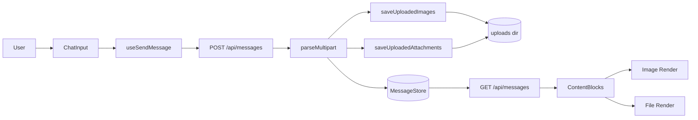
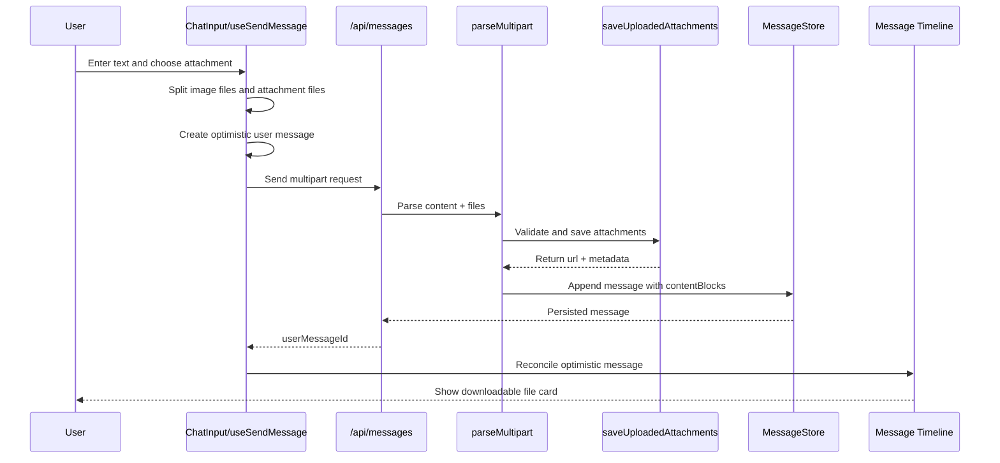
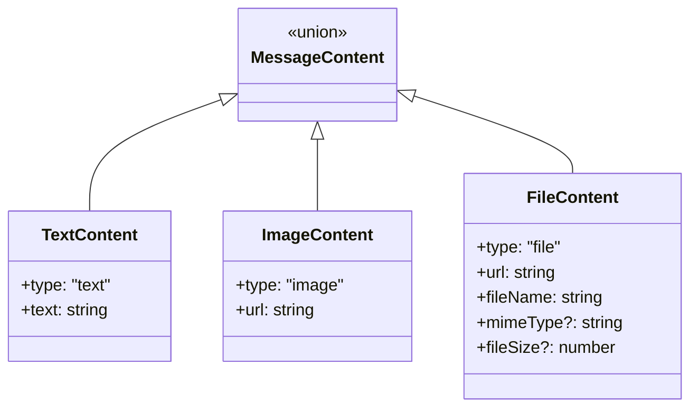
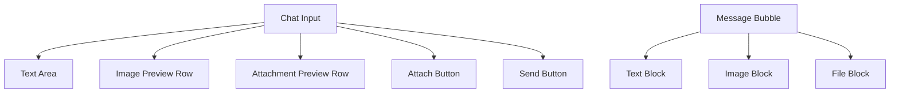

# F140: Chat Attachment Upload

> **Status**: implemented spec | **Owner**: Maine Coon | **Priority**: P1

## 1. Overview

This document describes the design of the chat attachment upload capability. The goal is to extend the existing image upload flow so that chat messages can also carry common document attachments such as `pptx`, `xlsx`, `docx`, `txt`, `pdf`, and `csv`.

This feature is intentionally scoped as a first-step delivery:

- upload attachment files in chat
- write files to the existing upload directory
- store file URL and metadata in `contentBlocks`
- render file blocks in message history
- support download from chat

This feature does **not** attempt to make models read, parse, summarize, or reason over the uploaded documents.

## 2. Background

The existing chat system already supports image upload. That flow has several useful properties:

- the entry point is unified in `POST /api/messages`
- files are sent using multipart form data
- uploaded files are written to a local uploads directory
- message history stores file references in `contentBlocks`
- frontend rendering reads `contentBlocks` and displays the corresponding UI

The requirement behind this feature is straightforward: users want to send work artifacts inside a conversation in the same way they currently send screenshots or images. Typical artifacts include product documents, spreadsheets, slide decks, reports, and raw text files.

Without this capability, users must either:

- manually paste file paths into the chat
- use external links
- move outside the chat workflow entirely

That creates friction and breaks the continuity of the conversation.

## 3. Requirement Analysis

## 3.1 Business Goal

Enable users to send standard office and text attachments directly in chat while preserving the existing messaging architecture and minimizing impact to image upload behavior.

## 3.2 Core Requirements

The system must support the following:

1. Users can choose supported attachments from the chat input.
2. Users can send attachments together with text and images in one message.
3. The backend stores uploaded attachments in a server-side directory.
4. The backend persists attachment references into message `contentBlocks`.
5. The frontend renders uploaded attachments in the message bubble.
6. Users can download uploaded attachments from the chat history.

## 3.3 Supported File Types

The first version supports:

- `application/pdf`
- `application/vnd.openxmlformats-officedocument.wordprocessingml.document`
- `application/vnd.openxmlformats-officedocument.spreadsheetml.sheet`
- `application/vnd.openxmlformats-officedocument.presentationml.presentation`
- `text/plain`
- `text/csv`

User-facing extensions:

- `.pdf`
- `.docx`
- `.xlsx`
- `.pptx`
- `.txt`
- `.csv`

## 3.4 Non-Goals

This phase does not include:

- model-side file parsing
- server-side content extraction
- OCR
- semantic search over attachments
- online preview pages
- attachment permission isolation per user or thread
- malware scanning or content moderation pipeline

## 4. Scenario Analysis

## 4.1 Primary Scenarios

### Scenario A: Upload an attachment in an existing thread

The user selects a `pdf` or `xlsx` file from the chat input and sends it with or without text. The message is stored and rendered as a file card.

### Scenario B: Send mixed media in one message

The user sends:

- text
- two images
- one attachment

The system must preserve ordering and produce one user message with multiple `contentBlocks`.

### Scenario C: Create a new thread and send the first message with attachments

The user starts from the new-thread page, selects a file, and sends the first message. The thread is created first, then the pending draft is sent with the attachment preserved.

### Scenario D: Reload and replay history

When the page reloads or the user reopens the thread, the message history should still render the file blocks correctly using the persisted message payload.

## 4.2 Edge Scenarios

- unsupported file type selected
- total upload count exceeds limit
- file too large
- only attachments, no text
- send fails after optimistic rendering
- user removes attachments before send

## 5. Constraints

The design was intentionally constrained to minimize risk and implementation cost.

### Constraint A: Reuse the current message sending endpoint

The solution must continue using `POST /api/messages` rather than introducing a separate attachment upload API.

### Constraint B: Preserve image behavior

Image upload must continue working exactly as before, including:

- multipart handling
- optimistic rendering
- storage pattern
- frontend preview behavior

### Constraint C: Minimize protocol change

The message schema should evolve through `contentBlocks`, not through a parallel message storage mechanism.

### Constraint D: No model-side integration

Attachments are stored and shown in chat only. They are not passed as readable context to the model in this phase.

## 6. Architecture Impact Analysis

The feature extends the current chat pipeline rather than introducing a new subsystem.

## 6.1 Impacted Layers

- `packages/shared`
  - add `FileContent` type
  - extend message schema validation
- `packages/api`
  - parse attachment parts from multipart requests
  - validate and store attachments
  - add file blocks into `contentBlocks`
- `packages/web`
  - select and preview attachments
  - send attachments via multipart
  - optimistically render file blocks
  - render persisted file blocks from history

## 6.2 Non-Impacted Layers

These parts intentionally remain unchanged:

- model routing
- agent invocation flow
- thread storage model
- message retrieval API shape
- websocket delivery lifecycle

## 6.3 Architecture Diagram



## 7. Technology Choice

## 7.1 Options Considered

### Option 1: Extend existing multipart message flow

Add a new multipart field `attachments` to the existing `/api/messages` pipeline.

### Option 2: Introduce a dedicated attachment upload endpoint

First upload files using a new endpoint, then send message payload containing uploaded file references.

### Option 3: Store attachments in rich blocks rather than `contentBlocks`

Use `extra.rich.blocks` instead of extending `MessageContent`.

## 7.2 Decision

We chose **Option 1**.

## 7.3 Why This Option Won

- lowest implementation cost
- strongest reuse of existing image upload path
- smallest behavioral change for frontend and backend
- no second-step orchestration between upload and send
- no need to invent a second rendering storage model

## 7.4 Tradeoffs

Pros:

- simple
- incremental
- easy to test
- easy to reason about

Cons:

- uploads remain tied to message submission
- attachment delivery still inherits current public `/uploads` serving model
- future secure download controls will require another evolution step

## 8. Functional Design

## 8.1 Overall Design

The feature uses one unified send path:

1. user picks files in chat input
2. frontend separates image files from attachment files
3. frontend sends one multipart request to `/api/messages`
4. backend parses text, image files, and attachment files
5. backend stores files on disk
6. backend constructs `contentBlocks`
7. frontend renders message blocks from history and optimistic state

## 8.2 End-to-End Flow

```mermaid
flowchart TD
    A[User selects files] --> B{File classifier}
    B -->|image| C[images[]]
    B -->|attachment| D[attachments[]]
    C --> E[Build FormData]
    D --> E
    E --> F["POST /api/messages"]
    F --> G[parseMultipart]
    G --> H[Save image files]
    G --> I[Save attachment files]
    H --> J[Create image contentBlocks]
    I --> K[Create file contentBlocks]
    J --> L[Persist message]
    K --> L
    L --> M[Return userMessageId]
    M --> N[Render chat message]
```

## 8.3 Sequence Diagram



## 9. Detailed Design

## 9.1 Frontend Input Design

The chat input supports selecting both images and attachments through a single file picker.

### File classification rules

- if `file.type.startsWith('image/')`, treat as image
- otherwise if MIME or extension is in the allowed attachment set, treat as attachment

### Limits

- max total uploads per message: `5`
- images and attachments share the same total count budget
- pasted content remains image-only in this version

### Preview behavior

- images use the existing image preview component
- attachments use a lightweight file preview list
- users can remove selected files before sending

## 9.2 Frontend Send Logic

The send hook keeps its existing positional calling pattern and only appends the attachment array as the last optional argument.

```ts
handleSend(
  content: string,
  images?: File[],
  overrideThreadId?: string,
  whisper?: WhisperOptions,
  deliveryMode?: DeliveryMode,
  sendOptions?: SendMessageOptions,
  attachments?: File[],
)
```

This avoids breaking existing call sites such as:

- normal thread send
- split-pane send
- new thread pending-send replay
- continuation / resume send paths

## 9.3 Optimistic Rendering Design

When attachments exist, the frontend constructs optimistic `contentBlocks`:

```ts
{
  type: 'file',
  url: URL.createObjectURL(file),
  fileName: file.name,
  mimeType: file.type,
  fileSize: file.size
}
```

This gives users immediate feedback before the backend returns the persisted message ID.

## 9.4 Backend Multipart Parsing Design

The backend extends multipart parsing with one additional field:

- `images`
- `attachments`

Text fields are still read as before, including:

- `content`
- `threadId`
- `idempotencyKey`
- `deliveryMode`
- whisper fields

The parser then appends:

- text block first
- image blocks second
- file blocks last

## 9.5 Backend Attachment Save Design

Attachment files are handled through a dedicated function:

- validate MIME type against allowlist
- validate count and size
- generate a safe server-side file name
- write to upload directory
- return `FileContent`

### Filename strategy

Disk file names do not trust the client-provided file name.

Example:

- original file name: `Q2-plan.exe`
- claimed MIME type: `application/pdf`
- saved file name: `file-<timestamp>-<uuid>.pdf`
- displayed file name: `Q2-plan.pdf`

This ensures the persisted file extension follows validated MIME rather than arbitrary user input.

## 9.6 New Thread Pending Send Compatibility

The new-thread page temporarily stores the initial outbound message before the actual thread exists.

That pending payload was extended to include:

- `images`
- `attachments`

This guarantees the first message in a newly created thread can preserve attachments correctly.

## 10. Interface Design

## 10.1 Send Message API

### Endpoint

`POST /api/messages`

### Request Mode

- `application/json` for text-only messages
- `multipart/form-data` for messages with files

### Multipart Fields

| Field | Type | Required | Notes |
|---|---|---:|---|
| `content` | string | yes | message text |
| `threadId` | string | no | target thread |
| `images` | file[] | no | image files |
| `attachments` | file[] | no | document files |
| `idempotencyKey` | string | no | dedupe key |
| `deliveryMode` | string | no | queue/force flow |
| `visibility` | string | no | whisper support |
| `whisperTo` | string[] | no | whisper recipients |

### Example Multipart Intent

```text
content = "Please check the document"
threadId = "thread_123"
images = [image1.png]
attachments = [spec.pdf, data.xlsx]
```

## 10.2 Read Message API

### Endpoint

`GET /api/messages`

### Response Change

No response contract change is required beyond extending the `contentBlocks` union with a `file` block.

## 10.3 Public File Access

Current access path:

```text
/uploads/<server-generated-file-name>
```

The frontend resolves relative upload URLs using the existing API base URL logic.

## 11. Data Structure Design

## 11.1 Shared Content Model

```ts
type MessageContent = TextContent | ImageContent | FileContent;
```

## 11.2 FileContent Definition

```ts
interface FileContent {
  type: 'file';
  url: string;
  fileName: string;
  mimeType?: string;
  fileSize?: number;
}
```

## 11.3 Example Stored Message

```json
{
  "id": "msg_1001",
  "type": "user",
  "content": "Please check this file",
  "contentBlocks": [
    {
      "type": "text",
      "text": "Please check this file"
    },
    {
      "type": "file",
      "url": "/uploads/file-1712745600000-a1b2c3d4.pdf",
      "fileName": "requirements.pdf",
      "mimeType": "application/pdf",
      "fileSize": 245760
    }
  ],
  "timestamp": 1712745600000
}
```

## 11.4 Type Diagram



## 12. UI Design

## 12.1 Input Area

The input area keeps the existing interaction model:

- one attach button
- shared file picker
- one send action

The only behavioral extension is that selected files are split into:

- image preview area
- attachment preview area

## 12.2 Attachment Preview

The preview uses a lightweight card list:

- extension badge
- file name
- file size
- remove button

This mirrors the clarity of image preview without introducing a complex viewer.

## 12.3 Message Bubble Rendering

Persisted file blocks render as file cards:

- extension badge
- file name
- size and MIME info
- download affordance

## 12.4 UI Structure Diagram



## 13. Reliability and Availability Design

## 13.1 Reliability Goals

- do not break existing image upload behavior
- preserve message history replay compatibility
- preserve new-thread first-message flow
- avoid object URL leaks in optimistic UI

## 13.2 Reliability Design

### A. Shared `contentBlocks` storage model

By storing attachments in the same structure as text and images, we avoid introducing a second message rendering path.

### B. Optimistic blob cleanup

Frontend store logic was extended so that `file` blocks participate in blob URL cleanup just like `image` blocks.

### C. Append-only API evolution

The send hook evolved by appending `attachments` as the last optional argument. This reduces breakage risk across the codebase.

### D. Shared upload limit

A single cap over images + attachments ensures predictable upload behavior and avoids explosive combinations.

## 13.3 Availability Design

- user gets immediate preview before upload
- optimistic message appears before server acknowledgement
- persisted history renders the same attachment semantics after reload
- no new service dependency is introduced

## 14. Security Design

Although the first delivery explicitly deprioritized advanced security hardening, the design still includes baseline controls and future evolution guidance.

## 14.1 Current Baseline Controls

- MIME allowlist
- file count limit
- file size limit
- server-generated disk file names
- sanitized display names
- extension derived from validated MIME rather than trusted client file name

## 14.2 Current Security Boundary

Files are currently served through public upload URLs:

- no per-user download authorization
- no signed URL mechanism
- no thread-scoped access control

This is acceptable for the first phase only under the current product assumption that upload URLs are treated as non-isolated assets.

## 14.3 Future Security Evolution

Recommended next-stage hardening:

1. authenticated download endpoint
2. thread-level authorization on file access
3. malware scanning
4. content moderation / DLP
5. object storage + signed URLs
6. upload rate limiting and abuse monitoring

## 15. Observability and Test Strategy

## 15.1 Backend Validation

The backend test plan covers:

- attachment save success
- extension spoofing regression
- multipart parsing into `file` blocks

## 15.2 Frontend Validation

The frontend test plan covers:

- multipart send path for attachments
- optimistic rendering with `file` blocks
- upload-state behavior compatibility

## 15.3 Implemented Validation Status

The implemented feature was validated with:

- API build success
- focused API tests passing for multipart and upload logic
- focused web tests passing for upload feedback and attachment send behavior

Note:

The repository-wide web `tsc` command still reports unrelated existing type errors outside the scope of this feature. Those errors are not introduced by this work.

## 16. Implementation Mapping

The feature was implemented across these main files:

### Shared

- `packages/shared/src/types/message.ts`
- `packages/shared/src/types/index.ts`
- `packages/shared/src/schemas/message.schema.ts`
- `packages/shared/src/schemas/index.ts`

### API

- `packages/api/src/routes/image-upload.ts`
- `packages/api/src/routes/parse-multipart.ts`
- `packages/api/test/image-upload.test.js`
- `packages/api/test/parse-multipart.test.js`

### Web

- `packages/web/src/stores/chat-types.ts`
- `packages/web/src/stores/chatStore.ts`
- `packages/web/src/hooks/useSendMessage.ts`
- `packages/web/src/hooks/__tests__/useSendMessage-upload-state.test.ts`
- `packages/web/src/components/ChatInput.tsx`
- `packages/web/src/components/MobileInputToolbar.tsx`
- `packages/web/src/components/AttachmentPreview.tsx`
- `packages/web/src/components/ContentBlocks.tsx`
- `packages/web/src/components/ContentFileBlock.tsx`
- `packages/web/src/components/ChatContainer.tsx`
- `packages/web/src/components/NewThreadContainer.tsx`
- `packages/web/src/components/SplitPaneView.tsx`

## 17. Risks and Follow-Up

## 17.1 Known Risks

- public `/uploads` path does not enforce attachment access control
- attachment MIME policy is static and code-level, not configuration-driven
- pasted attachments are not supported
- no attachment previewer beyond download card

## 17.2 Recommended Next Steps

1. extract upload policy into configuration
2. add authenticated download path
3. add attachment analytics and audit logging
4. consider model-readable document support as a separate phase

## 18. Summary

This feature extends the existing image upload architecture into a generalized chat attachment upload capability with minimal disruption. It preserves the current message contract style, keeps the implementation understandable, and delivers immediate practical value for conversation-centric workflows involving office documents and text files.

It is intentionally a narrow first phase, but it creates a stable foundation for future capabilities such as secure download, richer preview, and eventually model-aware document handling.
