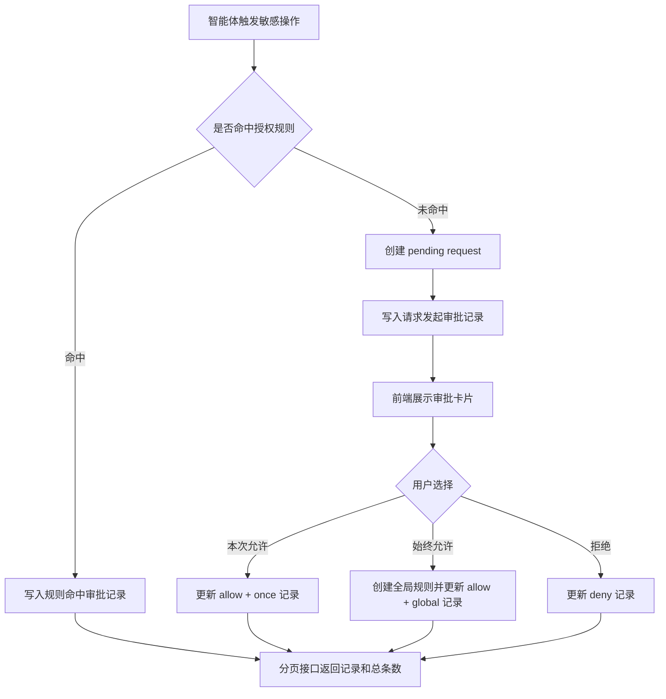
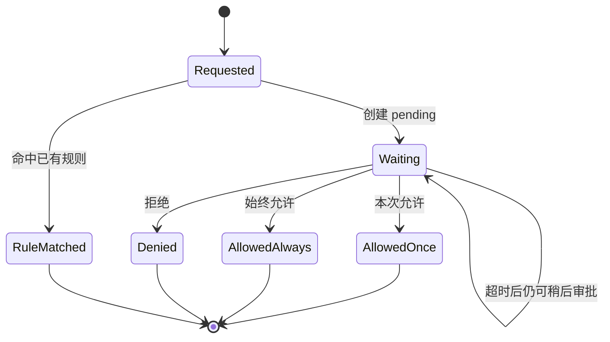
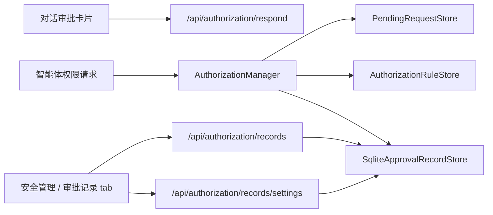
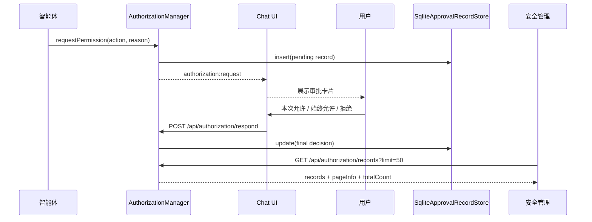
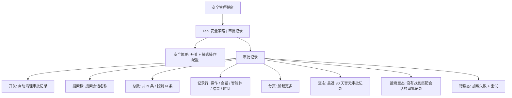

# 安全护栏审批记录展示设计

## 1. 需求简介

### 1.1 需求背景

当前敏感操作审批链路已经存在：后端通过 `packages/api/src/domains/agents/services/auth/AuthorizationManager.ts` 创建权限请求和处理用户响应，前端通过 `packages/web/src/components/AuthorizationCard.tsx` 在对话里展示“本次允许 / 总是允许 / 拒绝”，安全管理入口位于 `packages/web/src/components/SecurityManagementModal.tsx`。

现状的问题是：审批过程只在当前对话交互中可见，安全管理页面只能配置审批护栏和敏感操作策略，不能回看用户对敏感操作的审批记录。用户需要一个可追溯页面，查看哪些敏感操作被发起、来自哪个会话、最终在对话中如何审批、什么时候审批。

本设计目标是补齐审批记录能力，并在安全管理弹窗中新增一个独立 tab 展示记录。非目标是不改变敏感操作识别规则、不重做权限审批卡片、不改变 Jiuwen/RelayClaw 的运行时权限策略编辑能力。

当前代码事实：

1. 审批请求创建与响应主链路在 `packages/api/src/domains/agents/services/auth/AuthorizationManager.ts`。
2. 当前授权数据已有 pending、rule、audit 三类 store；Redis key 位于 `packages/api/src/domains/agents/services/stores/redis-keys/authorization-keys.ts`。
3. 当前 Redis pending request 会保存 `context`，Redis audit 会保存 `reason`，但本需求新增的 SQLite 审批记录不照搬这些内容字段。
4. 项目已经引入 `@office-claw/sqlite-adapter`，且 `packages/api/package.json` 的 build 链路包含该包；桌面端新增 SQLite 审批记录 store 不需要从零引入 SQLite 生态。
5. 前端安全管理入口在 `packages/web/src/components/SecurityManagementModal.tsx`，聊天审批卡片在 `packages/web/src/components/AuthorizationCard.tsx`。

### 1.2 需求场景分析

1. 用户在对话中审批了敏感操作，之后需要回到安全管理查看本次操作名称、发起会话、审批选择和时间。
2. 用户或管理员排查风险操作时，需要确认某个敏感操作是被“本次允许”“始终允许”还是“拒绝”。
3. 后端可能记录规则自动命中的审批结果，但前端默认不展示自动命中记录，避免把“用户实际审批”列表变成策略命中日志。

成功标准：

1. 安全管理中新增 `审批记录` tab。
2. 桌面端审批记录持久化到本地 SQLite；默认开启自动清理，仅保留最近 30 天。
3. 每条记录至少展示敏感操作名称、发起会话、智能体、审批结果、发起时间、审批时间。
4. 审批记录支持按会话名称搜索，帮助用户从最近记录中定位某次对话。
5. 查询接口使用游标分页，默认每页 50 条，最大每页 200 条，并返回总条数。
6. 审批记录只保存操作事实、轻量会话元数据和脱敏截断后的操作摘要，不保存 `context`、`reason`、`respondReason`、完整工具输入、完整命令参数、执行结果、文件内容或对话内容。
7. 后端记录保留结构化操作信息，前端按产品口径隐藏规则自动命中的记录。

### 1.3 对现有功能影响分析

影响范围：

1. 后端 `AuthorizationManager`：需要在权限请求创建、用户响应、规则命中等节点补齐可追溯记录。
2. 后端审批记录存储：桌面端新增 SQLite 审批记录 store，统一承载 30 天自动清理、长期保留、分页和总数查询。
3. 后端 `authorizationRoutes`：新增或扩展审批记录查询接口，避免前端直接拼装低层 audit event。
4. 前端 `SecurityManagementModal`：新增 tab 导航、审批记录列表、会话名称搜索、总条数展示和分页加载。
5. 测试：补充后端查询接口、SQLite 写入时机、前端 tab 展示和空态测试。

不影响范围：

1. 不改变现有 `/api/authorization/respond` 审批响应语义。
2. 不改变聊天中的 `AuthorizationCard` 三个按钮及其 scope 映射。
3. 不改变 `/api/config/relayclaw/security` 安全策略配置接口。
4. 不迁移历史审计数据；上线前已有记录如果缺少创建事件，可以按最终事件降级展示。

### 1.4 架构影响分析（包括版本兼容性）

本需求属于“已有审批链路的审计视图补全”。桌面端以本地 SQLite 作为审批记录主存储，原因是项目已存在 `@office-claw/sqlite-adapter` 和 `better-sqlite3` 依赖，且审批记录需要分页、按会话名称搜索、统计总数和可选长期保留。Redis 仍可继续服务现有 pending、rule 等运行态存储，但不作为桌面端审批记录长期存储的主路径。

兼容性：

1. 旧版本没有审批记录查询接口，前端需要只调用新接口；后端升级前不会显示审批记录。
2. 已有 pending、rule、audit event 结构保持兼容；SQLite 审批记录表作为新增持久化视图，不要求迁移历史 Redis audit。
3. 自动清理开关默认开启，开启时 SQLite 查询和清理均按 30 天保留期处理；关闭时不按时间清理。
4. 旧版本没有 SQLite 审批记录数据；上线前已有记录如果需要兼容展示，可按后续迁移任务单独处理，MVP 不做历史补偿。

### 1.5 技术选型

1. 存储：桌面端新增本地 SQLite 审批记录表，建议文件路径为 `data/security-approval-records.sqlite`，与 evidence/memory 数据分离。
2. 查询：后端新增面向 UI 的审批记录查询接口，把审批链路事件写入为结构化操作记录。
3. 前端：沿用 React + `apiFetch` + 现有弹窗样式，安全管理内使用 tab 切换，不引入新路由。
4. 展示：使用表格/列表密集展示，适配安全管理弹窗的管理属性，不做营销式页面。

## 2. 方案设计

### 2.1 设计约束

1. 兼容性约束：不得改变现有审批响应接口和聊天审批卡片行为。
2. 安全与权限约束：审批记录只保存操作事实、`threadTitle` 这类轻量会话元数据，以及脱敏截断后的 `operationSummary`，不保存完整内容相关字段。
3. 性能与成本约束：列表查询必须分页/限量，不能每次前端打开弹窗拉取全部记录。
4. 发布与回滚约束：前端 tab 可在接口失败时只展示错误态，不影响安全策略配置 tab 使用。
5. 现有代码边界：后端查询逻辑放在 authorization 路由或相邻 service，前端展示逻辑从 `SecurityManagementModal` 拆出，避免继续扩大单文件复杂度。

### 2.2 整体设计方案

后端把审批过程记录为本地 SQLite 中的一条结构化审批记录。一次敏感操作请求在发起时写入或创建记录，用户审批后更新最终结果；规则自动命中也可以写入记录，但默认不在前端展示。查询接口统一从 SQLite 读取，按会话名称搜索、游标分页并返回总条数。

前端安全管理弹窗增加两个 tab：

1. `安全策略`：保留现有审批护栏、工作空间读写信任、敏感操作策略配置。
2. `审批记录`：展示用户审批结果，默认过滤掉规则自动命中的记录；开启自动清理时展示最近 30 天，关闭自动清理时展示全部已保存记录。

后端可以返回规则自动命中记录，前端默认不展示。未来如果需要“策略命中日志”或“全部审计”，可以在同一接口上增加筛选开关。自动清理开关只控制保留策略，不改变存储位置：开启和关闭都写同一个 SQLite 审批记录库。

关键设计决策：

1. 存储统一：桌面端审批记录统一存 SQLite，自动清理开关只影响保留策略，不切换存储后端。
2. 查询统一：前端只调用 `/api/authorization/records`，不感知 Redis、SQLite 或底层 audit event。
3. 内容最小化：审批记录不保存完整上下文，仅保存 `operationSummary` 这类脱敏摘要。
4. 搜索收敛：MVP 只支持会话名称搜索，避免把审批记录页做成复杂审计后台。
5. 分页强制：页面查询必须分页，接口默认 50、最大 200，并返回 `totalCount`。

### 2.3 方案详细设计

#### 2.3.1 总体详细设计流程

端到端流程如下：



审批记录状态如下：



组件关系如下：



关键时序如下：



界面结构如下：



#### 2.3.2 功能原理

核心机制：

1. 敏感操作触发权限请求时，后端创建 `PendingRequestRecord`，同时写入一条 `decision=pending` 的 SQLite 审批记录。
2. 用户点击 `本次允许` 时，`respondScope=once`，最终记录展示为“本次允许”。
3. 用户点击 `总是允许` 时，`respondScope=global`，最终记录展示为“始终允许”，并继续按现有逻辑创建持久化 allow rule。
4. 用户点击 `拒绝` 时，最终记录展示为“拒绝”。
5. 规则自动命中时，后端可记录 `matchedRuleId`，接口返回但前端默认过滤。

主流程：

1. 智能体请求执行敏感操作。
2. 后端检查授权规则。
3. 未命中规则时创建 pending request，推送前端审批卡片，并写入“已发起”审批记录。
4. 用户在对话中审批。
5. 后端更新 pending record、更新最终审批记录、必要时创建授权规则。
6. 安全管理 `审批记录` tab 查询记录接口并展示。

边界条件：

1. 用户未在 120 秒内审批：当前接口可能返回 `pending` 给智能体，但记录仍处于“待审批”。
2. 用户稍后审批：最终事件补写后，审批记录从“待审批”变为最终结果。
3. 重复响应：沿用 pending store 的 CAS/状态检查，只有第一次成功响应进入最终记录。
4. 旧数据缺少发起记录：查询接口用最终记录的 `createdAt` 作为降级发起时间。
5. 自动规则命中：后端返回 `approvalSource=rule` 或 `matchedRuleId`，前端默认不展示。

异常处理：

1. SQLite 审批记录写入失败不应阻断实际审批，但需要记录 warn 日志，避免权限链路因记录存储短暂异常不可用。
2. 审批记录查询失败只影响 `审批记录` tab，不能影响 `安全策略` tab。
3. 前端列表接口失败时展示错误态和重试按钮。

#### 2.3.3 接口设计

本需求需要前后端分离实现，因此接口层采用“后端提供业务记录、前端只消费业务记录”的契约。前端不直接读取 `/api/authorization/audit`，也不自行按 `requestId` 拼装事件，避免前端理解底层审计事件语义。

##### 2.3.3.1 后端接口职责

后端负责：

1. 从 SQLite 审批记录库读取结构化操作记录。
2. 按自动清理设置决定查询范围：开启时限制最近 30 天，关闭时查询全部已保存记录。
3. 统一处理会话名称搜索、游标分页、总条数和字段默认值。
4. 输出稳定枚举和展示文案。
5. 返回 `approvalSource=rule` 的记录，但允许前端通过参数或本地过滤隐藏。

前端负责：

1. 按接口响应渲染列表。
2. 格式化时间。
3. 使用 `approvalLabel` 展示审批结果，不再重复推导 `scope + decision`。
4. 默认过滤或请求排除 `approvalSource=rule` 的记录。
5. 提供按会话名称搜索的输入框，把关键词传给后端。
6. 处理加载态、空态、错误态和重试。

##### 2.3.3.2 审批记录查询接口

建议新增查询接口：

```http
GET /api/authorization/records?limit=50&cursor=xxx&threadQuery=xxx&includeRuleMatched=false
```

请求参数：

| 参数 | 类型 | 默认值 | 说明 |
|---|---|---|---|
| `limit` | number | `50` | 每页返回条数，最大 `200` |
| `cursor` | string | 无 | 可选，不透明游标，用于加载下一页 |
| `threadQuery` | string | 无 | 可选，按会话名称模糊搜索；可兼容匹配 `threadId` |
| `includeRuleMatched` | boolean | `false` | 是否返回规则自动命中记录；前端默认传 `false` 或省略 |

参数规则：

1. `limit <= 0` 或非数字时使用默认值 `50`。
2. `limit > 200` 时后端按 `200` 截断。
3. `cursor` 必须由服务端生成，客户端不解析其内容；非法游标返回 `400`。
4. `threadQuery` 去除首尾空白后为空时视为未传。
5. `threadQuery` 只用于会话维度搜索，MVP 不支持敏感操作名称、审批结果、智能体筛选。
6. 开启自动清理时查询最近 30 天；关闭自动清理时查询 SQLite 中全部已保存记录。

响应示例：

```json
{
  "records": [
    {
      "id": "audit_001",
      "requestId": "req_123",
      "invocationId": "inv_123",
      "agentId": "codex",
      "threadId": "thread_abc",
      "threadTitle": "整理 Windows 安装包发布问题",
      "action": "shell_command",
      "operationSummary": "执行命令：corepack pnpm --dir packages/api run build",
      "decision": "allow",
      "approvalLabel": "本次允许",
      "scope": "once",
      "approvalSource": "user",
      "requestedAt": 1778840000000,
      "decidedAt": 1778840005000,
      "decidedBy": "user-1",
      "matchedRuleId": null
    }
  ],
  "pageInfo": {
    "hasMore": true,
    "nextCursor": "eyJiZWZvcmVUaW1lIjoxNzc4ODQwMDAwMDAwfQ"
  },
  "totalCount": 328,
  "retention": {
    "autoCleanupEnabled": true,
    "retentionDays": 30
  }
}
```

字段说明：

| 字段 | 类型 | 前端是否展示 | 说明 |
|---|---|---|---|
| `id` | string | 否 | 审批记录 ID，用于游标和排查 |
| `requestId` | string | 否 | 审批请求 ID，用于排查和测试定位 |
| `invocationId` | string | 否 | 所属 invocation ID |
| `agentId` | string | 是 | 发起敏感操作的智能体 ID；前端可映射为展示名 |
| `threadId` | string | 是 | 发起审批的会话 ID |
| `threadTitle` | string / null | 是 | 发起审批时的会话名称快照；为空时前端降级展示 `threadId` |
| `action` | string | 是 | 敏感操作名称 |
| `operationSummary` | string / null | 是 | 脱敏截断后的操作摘要，用于说明敏感操作具体做了什么 |
| `decision` | `allow` / `deny` / `pending` | 可选 | 机器可读结果 |
| `approvalLabel` | string | 是 | 后端生成的展示文案 |
| `scope` | `once` / `thread` / `global` / null | 可选 | 用户审批范围；待审批和规则命中可为空 |
| `approvalSource` | `user` / `rule` | 否 | 记录来源；前端默认只展示 `user` |
| `requestedAt` | number | 是 | 发起时间，Unix epoch ms |
| `decidedAt` | number / null | 是 | 审批时间；待审批为空 |
| `decidedBy` | string / null | 否 | 审批人标识；默认不展示 |
| `matchedRuleId` | string / null | 否 | 规则自动命中时返回 |

不返回字段：

| 字段 | 说明 |
|---|---|
| `context` | 可能包含工具输入、命令参数、文件路径或业务内容，不进入审批记录接口 |
| `reason` | 可能包含内容上下文，审批记录页不展示、不长期保存 |
| `respondReason` | 可能包含用户输入备注或内容上下文，不进入审批记录接口 |
| 完整 tool input / 完整命令参数 / 执行结果 / 文件内容 / 对话内容 | 明确不保存到 SQLite 审批记录 |

`operationSummary` 规则：

1. 由后端基于敏感操作类型生成，写入前完成脱敏和截断。
2. 最大长度建议 500 字符。
3. 可以包含“执行命令：pnpm test”“读取文件：packages/api/src/...”“写入文件：docs/...”这类操作摘要。
4. 不保存 stdout/stderr、完整 tool input JSON、完整 shell command 上下文、文件内容或对话内容。
5. 对 token、password、api key、secret 等敏感片段进行掩码处理。

摘要生成建议：

| 操作类型 | `operationSummary` 示例 | 不保存内容 |
|---|---|---|
| 终端命令 | `执行命令：corepack pnpm --dir packages/api run build` | stdout/stderr、完整环境变量、完整上下文 |
| 文件读取 | `读取文件：packages/api/src/...` | 文件正文 |
| 文件写入 | `写入文件：docs/superpowers/specs/...` | 写入内容全文 |
| 网络访问 | `访问网络：api.example.com` | 请求体、响应体、凭据 |
| 规则命中 | `命中授权规则：shell_command` | 规则外的上下文输入 |

枚举与文案映射由后端保证：

| 条件 | `decision` | `scope` | `approvalSource` | `approvalLabel` |
|---|---|---|---|---|
| 用户本次允许 | `allow` | `once` | `user` | `本次允许` |
| 用户会话内允许 | `allow` | `thread` | `user` | `本会话允许` |
| 用户始终允许 | `allow` | `global` | `user` | `始终允许` |
| 用户拒绝 | `deny` | `once` / `thread` / `global` | `user` | `拒绝` |
| 等待审批 | `pending` | null | `user` | `待审批` |
| 规则自动允许 | `allow` | null | `rule` | `规则自动允许` |
| 规则自动拒绝 | `deny` | null | `rule` | `规则自动拒绝` |

响应错误：

| HTTP 状态码 | 场景 | 响应 |
|---|---|---|
| `401` | 缺少身份头 | `{ "error": "Identity required (X-Office-Claw-User header)" }` |
| `400` | 参数格式非法且无法降级 | `{ "error": "Invalid query", "details": [...] }` |
| `500` | SQLite 审批记录读取失败 | `{ "error": "Failed to load authorization records" }` |

参数非法时优先采用容错默认值；只有类型结构无法解析、或后续增加复杂参数时才返回 `400`。

##### 2.3.3.3 审批记录设置接口

安全管理页面需要展示和修改自动清理开关。建议新增设置接口：

```http
GET /api/authorization/records/settings
PUT /api/authorization/records/settings
```

设置模型：

```ts
interface SecurityApprovalRecordSettings {
  autoCleanupEnabled: boolean; // 默认 true
  retentionDays: number;       // 默认 30，MVP 固定 30
}
```

`PUT` 请求体：

```json
{
  "autoCleanupEnabled": true
}
```

规则：

1. 默认开启自动清理，保留最近 30 天审批记录。
2. 用户关闭自动清理后，不按时间删除 SQLite 中的审批记录。
3. 开关只影响保留策略，不改变存储位置，开启和关闭都使用同一个 SQLite 审批记录库。
4. 即使关闭自动清理，也建议保留硬上限保护，例如 100000 条，避免本地磁盘无限增长。
5. 页面应提供“手动清空审批记录”入口；该能力可作为后续接口 `DELETE /api/authorization/records` 扩展。
6. 设置保存位置应复用现有安全配置或用户配置机制；不得把开关硬编码在前端。

##### 2.3.3.4 前端数据类型契约

前端建议在安全管理相关组件旁定义窄类型，避免把后端 audit event 类型泄漏进 UI：

```ts
type ApprovalDecision = 'allow' | 'deny' | 'pending';
type ApprovalScope = 'once' | 'thread' | 'global';
type ApprovalSource = 'user' | 'rule';

interface SecurityApprovalRecord {
  id: string;
  requestId: string;
  invocationId: string;
  agentId: string;
  threadId: string;
  threadTitle?: string | null;
  action: string;
  operationSummary?: string | null;
  decision: ApprovalDecision;
  approvalLabel: string;
  approvalSource: ApprovalSource;
  requestedAt: number;
  decidedAt?: number | null;
  scope?: ApprovalScope | null;
  decidedBy?: string | null;
  matchedRuleId?: string | null;
}

interface SecurityApprovalRecordsResponse {
  records: SecurityApprovalRecord[];
  pageInfo: {
    hasMore: boolean;
    nextCursor?: string;
  };
  totalCount: number;
  retention: {
    autoCleanupEnabled: boolean;
    retentionDays: number | null;
  };
}
```

前端调用约定：

```http
GET /api/authorization/records?limit=50&cursor=xxx&threadQuery=xxx&includeRuleMatched=false
```

加载时机：

1. 打开安全管理弹窗时只加载安全策略 tab 所需数据。
2. 首次切换到 `审批记录` tab 时加载审批记录。
3. 用户输入会话名称搜索词并提交或防抖完成后重新请求。
4. 用户点击“加载更多”时带上 `pageInfo.nextCursor` 请求下一页。
5. 用户点击重试按钮时重新请求。

前端渲染规则：

1. 列表只渲染 `approvalSource === "user"` 的记录；如果接口默认已过滤，前端仍保留一次防御性过滤。
2. `decidedAt` 为空时审批时间显示 `--`。
3. 发起会话优先展示 `threadTitle`，为空时展示 `threadId`；如果同时展示次级文本，可以用 `threadId` 辅助排查。
4. `agentId` 默认展示原值；如果 `useAgentData` 可命中 displayName，可以展示 displayName。
5. 顶部展示 `totalCount`：无搜索时展示“共 N 条”，有搜索时展示“找到 N 条”。
6. `operationSummary` 作为纯文本摘要展示，超长由前端截断，不使用 HTML 渲染。

##### 2.3.3.5 后端查询规则

后端查询规则：

1. SQLite 写入审批记录时保存 `threadTitle` 快照，用于展示和会话名称搜索。
2. 开启自动清理时，查询条件包含 `eventTime >= now - 30 days`；关闭时不加时间窗口。
3. `includeRuleMatched=false` 时只返回 `approvalSource=user` 的记录，总条数也按同一条件统计。
4. `threadQuery` 对 `threadTitle` 做大小写不敏感的包含匹配；`threadTitle` 为空时可兼容匹配 `threadId`。
5. 排序按 `eventTime DESC, id DESC`，其中 `eventTime = decidedAt ?? requestedAt`。
6. 游标使用后端不透明字符串，建议包含上一页最后一条记录的 `eventTime` 和 `id`，用于稳定翻页。
7. 每次列表查询同时返回当前条件下的 `totalCount`。

后端与前端分工边界：

1. 后端负责业务语义和数据裁剪：`approvalLabel`、`approvalSource`、自动清理时间窗口、分页游标、总条数、条数上限。
2. 前端负责视觉表达：tab、会话搜索框、列表、时间格式化、空态、错误态。
3. 前端不得依赖底层 audit event 的数量和顺序。
4. 后端不得依赖前端过滤来保护敏感上下文，默认响应不包含原始 `context`。

保留现有接口：

```http
GET /api/authorization/audit
```

该接口继续作为低层审计事件查询，不作为安全管理页面的直接数据源。

#### 2.3.4 界面设计

安全管理弹窗新增 tab：

1. `安全策略`：现有内容全部保留。
2. `审批记录`：新增会话名称搜索框和记录列表。

搜索设计：

1. 搜索框 placeholder 使用“搜索会话名称”。
2. 搜索范围仅限会话名称；会话名称缺失时后端可降级匹配 `threadId`。
3. MVP 不提供敏感操作名称搜索、审批结果筛选、智能体筛选，避免记录页变成复杂审计后台。
4. 清空搜索框后恢复默认列表；自动清理开启时默认列表是最近 30 天，关闭时是全部已保存记录。

设置设计：

1. 在 `审批记录` tab 顶部提供“自动清理审批记录”开关，默认开启。
2. 开启时展示说明：“仅保留最近 30 天的审批记录。”
3. 关闭时展示说明：“将持续保留本机审批记录，直到手动清理。”
4. 顶部展示总条数：无搜索时“共 N 条”，搜索后“找到 N 条”。

审批记录列表字段：

| 列 | 内容 |
|---|---|
| 敏感操作 | `action`，下面可用小字展示 `operationSummary` |
| 发起会话 | 优先展示 `threadTitle`，为空时展示 `threadId` |
| 智能体 | `agentId` 或前端可解析的智能体展示名 |
| 审批结果 | `approvalLabel` |
| 发起时间 | `requestedAt` 本地格式化 |
| 审批时间 | `decidedAt`；待审批时展示 `--` |

状态设计：

1. 加载态：展示现有 `CenteredLoadingState`。
2. 空态：自动清理开启时展示“最近 30 天暂无审批记录”；关闭时展示“暂无审批记录”。
3. 错误态：展示错误文案和重试按钮。
4. 分页：默认每页 50 条，通过“加载更多”或滚动加载使用 `nextCursor` 请求下一页。
5. 自动规则命中记录：后端返回时前端默认过滤，不在列表展示。
6. 搜索无结果：展示“没有找到匹配会话的审批记录”，并保留清空搜索入口。

#### 2.3.5 数据结构设计

现有 Redis `AuthorizationAuditEntry` 包含 `reason` 等字段，但本需求的 SQLite 审批记录表不应照搬全量审计事件。桌面端审批记录只保存操作事实、会话名称快照和脱敏截断后的操作摘要。

建议 SQLite 表名：

```sql
authorization_approval_records
```

建议字段：

| 字段 | 位置 | 说明 |
|---|---|---|
| `id` | SQLite 主键 | 审批记录 ID |
| `requestId` | SQLite 字段 | 审批请求 ID |
| `invocationId` | SQLite 字段 | 所属 invocation ID |
| `agentId` | SQLite 字段 | 发起敏感操作的智能体 ID |
| `threadId` | SQLite 字段 | 发起审批的会话 ID |
| `threadTitle` | SQLite 字段 | 发起审批时的会话名称快照，用于展示和搜索 |
| `action` | SQLite 字段 | 敏感操作名称 |
| `operationSummary` | SQLite 字段 | 脱敏截断后的操作摘要，最大建议 500 字符 |
| `decision` | SQLite 字段 | `allow` / `deny` / `pending` |
| `scope` | SQLite 字段 | `once` / `thread` / `global` / null |
| `approvalSource` | SQLite 字段 | `user` / `rule` |
| `requestedAt` | SQLite 字段 | 请求发起时间 |
| `decidedAt` | SQLite 字段 | 用户审批时间；待审批为空 |
| `decidedBy` | SQLite 字段 | 审批人标识 |
| `matchedRuleId` | SQLite 字段 | 规则自动命中时的规则 ID |
| `eventTime` | SQLite 字段 | `decidedAt ?? requestedAt`，用于排序和游标 |
| `createdAt` | SQLite 字段 | 记录创建时间 |

明确不保存字段：

1. `context`
2. `reason`
3. `respondReason`
4. 完整 tool input
5. 完整命令参数
6. stdout/stderr 或工具执行结果
7. 文件内容
8. 对话内容

存储保留策略：

1. 桌面端统一写入 SQLite，不因自动清理开关改变存储位置。
2. 默认开启自动清理，保留最近 30 天。
3. 关闭自动清理后不按时间清理，但保留硬上限保护，建议 100000 条。
4. 查询接口默认返回 50 条，最大返回 200 条。
5. 建议索引：`eventTime DESC, id DESC`、`approvalSource + eventTime`、`threadTitle`。

建议表结构草案：

```sql
CREATE TABLE IF NOT EXISTS authorization_approval_records (
  id TEXT PRIMARY KEY,
  request_id TEXT NOT NULL,
  invocation_id TEXT NOT NULL,
  agent_id TEXT NOT NULL,
  thread_id TEXT NOT NULL,
  thread_title TEXT,
  action TEXT NOT NULL,
  operation_summary TEXT,
  decision TEXT NOT NULL,
  scope TEXT,
  approval_source TEXT NOT NULL,
  requested_at INTEGER NOT NULL,
  decided_at INTEGER,
  decided_by TEXT,
  matched_rule_id TEXT,
  event_time INTEGER NOT NULL,
  created_at INTEGER NOT NULL
);

CREATE INDEX IF NOT EXISTS idx_approval_records_event_time
  ON authorization_approval_records(event_time DESC, id DESC);

CREATE INDEX IF NOT EXISTS idx_approval_records_source_time
  ON authorization_approval_records(approval_source, event_time DESC, id DESC);

CREATE INDEX IF NOT EXISTS idx_approval_records_thread_title
  ON authorization_approval_records(thread_title);
```

## 3. 可靠可用性设计

1. 审批记录写入 best-effort：审批主链路优先，SQLite 写入失败只记录后端 warn，不阻断用户审批。
2. 查询接口幂等：同一查询条件和游标多次查询返回稳定结果。
3. 重复审批防护：继续依赖 pending store 的 status 检查或 Redis CAS，保证只有一个最终响应生效。
4. 降级展示：旧数据缺少发起事件时，使用最终事件 `createdAt` 作为 `requestedAt`。
5. 前端隔离：`审批记录` tab 失败不影响 `安全策略` tab 的加载和保存。
6. 自动清理隔离：开关只影响 SQLite 审批记录保留策略，不影响 pending request、authorization rule 或实际审批行为。
7. 可诊断性：后端记录 requestId、threadId、agentId，便于从页面记录追踪到后端日志。

降级与回滚：

1. SQLite 初始化失败时，审批记录 tab 展示错误态；审批主链路继续使用现有 pending/rule 流程。
2. `/api/authorization/records` 失败时只影响审批记录展示，不影响安全策略读取、保存和聊天审批卡片。
3. 自动清理设置接口失败时，前端回滚开关显示状态，并提示用户重试。
4. 版本回滚后，SQLite 文件保留在本地，不影响旧版本运行；旧版本不会读取该文件。
5. 后续如需要迁移表结构，使用显式 schema version，避免启动时对未知结构做破坏性修改。

## 4. 安全隐私设计

审批记录本身属于安全审计数据，不能当普通 UI 日志处理。

威胁场景：

1. `reason`、`context` 或完整命令参数中可能包含文件路径、token、业务内容。
2. `decidedBy` 暴露审批用户标识。
3. `threadTitle` 和 `threadId` 可关联用户会话上下文。
4. `operationSummary` 如果不脱敏，可能把命令里的密钥、账号或长路径落到长期存储。
5. 自动规则命中记录如果直接展示，可能让用户误以为自己逐条审批过这些操作。

缓解措施：

1. SQLite 审批记录不保存 `context`、`reason`、`respondReason`、完整工具输入、完整命令参数、执行结果、文件内容或对话内容。
2. `operationSummary` 必须在后端生成时脱敏和截断，最大建议 500 字符。
3. 列表只展示必要字段，`threadTitle` 和 `operationSummary` 按纯文本展示并限制长度，不使用 HTML 注入。
4. 后端返回规则自动命中记录，但前端默认过滤，避免混淆“用户审批”和“规则命中”。
5. 审批记录接口继续要求 `X-Office-Claw-User` / `X-User-Id` 身份头，保持与现有 authorization 路由一致。
6. 30 天默认保留期降低长期暴露面；用户关闭自动清理时，设置文案需明确记录会长期保留在本机。

验证方式：

1. 测试 `threadTitle` 中包含特殊字符时前端按文本展示。
2. 测试无身份头访问记录接口返回 401。
3. 测试 `approvalSource=rule` 的记录默认不出现在前端列表。
4. 测试 SQLite 审批记录不写入 `context`、`reason`、`respondReason`。
5. 测试 `operationSummary` 会截断并掩码 token/password/api key 等敏感片段。

## 5. 性能成本设计

后端成本：

1. 每次敏感操作请求新增一次 SQLite 写入或更新；相对审批链路本身成本较低。
2. 查询接口需要执行分页查询和 `COUNT(*)`；桌面端数据规模下可接受，但必须加索引。
3. `threadQuery` 直接基于 SQLite 中的 `threadTitle` 快照查询，避免边分页边联查 thread store。
4. 自动清理开启时可在启动时或写入后执行 30 天前记录清理。

前端成本：

1. 安全管理打开时，只有切换到 `审批记录` tab 才加载记录，避免每次打开安全策略都额外请求。
2. 默认渲染 50 条以内，加载更多追加下一页，避免弹窗内大列表卡顿。
3. 搜索请求建议做 300ms 左右防抖，避免用户输入过程中频繁请求。

容量建议：

1. API 默认返回 50，最大 200。
2. 自动清理开启时默认保留 30 天。
3. 自动清理关闭时建议保留 100000 条硬上限保护；达到上限时可拒绝继续写入、提示用户清理，或按最旧记录淘汰，具体策略实现前需确认产品口径。

## 6. 实施计划

1. 后端阶段一：新增 SQLite 审批记录表和 store，字段只包含操作事实、`threadTitle` 快照、`operationSummary`、分页排序字段，不保存完整内容字段。
2. 后端阶段二：在 request 创建、用户响应、规则命中节点写入或更新 SQLite 审批记录；保留现有 pending/rule 行为不变。
3. 后端阶段三：新增 `/api/authorization/records` 分页查询接口，完成 `limit/cursor/threadQuery/includeRuleMatched/totalCount/retention` 契约。
4. 后端阶段四：新增 `/api/authorization/records/settings`，支持“自动清理审批记录”开关，默认开启且保留 30 天。
5. 后端阶段五：实现 `operationSummary` 生成、截断和脱敏规则，覆盖 shell/file/network 等常见敏感操作。
6. 前后端联调点一：后端提供固定 mock 数据或测试环境数据，前端按 `SecurityApprovalRecordsResponse` 对接，不依赖真实敏感操作触发。
7. 前端阶段一：拆分安全管理 UI，增加 `安全策略 / 审批记录` tab，并保持安全策略原行为不变。
8. 前端阶段二：新增审批记录列表组件、会话名称搜索框、自动清理开关、总条数展示和加载更多，默认请求 `includeRuleMatched=false`。
9. 前后端联调点二：用真实审批卡片分别验证“本次允许 / 始终允许 / 拒绝 / 待审批”四类记录。
10. 补充测试：后端 SQLite store、route、settings、分页游标、自动清理、摘要脱敏；前端 tab、加载态、空态、错误态、搜索、分页和渲染。

## 7. 验证方案

单元测试：

1. `AuthorizationManager` 创建权限请求时写入 pending 审批记录。
2. 用户响应后同一 requestId 可更新为最终审批记录。
3. 规则命中记录返回 `approvalSource=rule` 或 `matchedRuleId`。
4. SQLite store 不保存 `context`、`reason`、`respondReason`。
5. 写入记录时保存 `threadTitle` 快照，缺失时保存 `null`。
6. `operationSummary` 生成时会截断并掩码 token/password/api key/secret。

接口测试：

1. 无身份头访问 `/api/authorization/records` 返回 401。
2. 自动清理开启时默认只返回最近 30 天内记录。
3. 自动清理关闭时查询全部已保存记录，但仍分页返回。
4. `limit` 超过 200 时被限制。
5. `includeRuleMatched=false` 时不返回规则自动命中记录。
6. 返回字段满足 `SecurityApprovalRecordsResponse` 契约，不暴露原始 `context`。
7. `threadQuery` 能按会话名称模糊匹配，且不匹配敏感操作名称或审批结果。
8. 响应返回 `pageInfo.hasMore`、`pageInfo.nextCursor` 和 `totalCount`。
9. 非法 cursor 返回 `400`。
10. 设置接口默认返回 `autoCleanupEnabled=true`、`retentionDays=30`。

前端测试：

1. 安全管理展示 `安全策略` 与 `审批记录` tab。
2. 切换到 `审批记录` 后请求记录接口。
3. 用户审批记录展示操作名、会话名称、智能体、审批结果和时间。
4. `approvalSource=rule` 的记录默认不展示。
5. 接口失败展示错误态，不影响安全策略 tab。
6. 后端返回 `decidedAt=null` 时审批时间显示 `--`。
7. 后端返回空 records 时按自动清理状态展示空态文案。
8. 输入会话名称搜索词后请求带上 `threadQuery`，清空后恢复默认列表。
9. 搜索无结果时展示独立搜索空态。
10. 顶部展示总条数；搜索时展示搜索命中条数。
11. 有 `hasMore=true` 时展示加载更多，并使用 `nextCursor` 请求下一页。
12. 自动清理开关默认开启，切换后调用 settings 接口并刷新列表。

前后端契约测试：

1. 使用一份固定 JSON fixture 覆盖 `allow + once`、`allow + global`、`deny`、`pending`、`rule`。
2. fixture 覆盖 `threadTitle` 有值和为空两种情况，以及分页 `pageInfo`、`totalCount`、`retention`。
3. fixture 覆盖 `operationSummary` 有值和为空两种情况。
4. fixture 不包含 `reason/context/respondReason`。
5. 后端 route 测试断言 fixture 形状，前端组件测试复用同一 fixture。
6. 若字段名调整，必须同时更新后端响应测试和前端类型/渲染测试。

手工验证：

1. 触发一个敏感操作并选择“本次允许”，在审批记录中看到“本次允许”。
2. 触发一个敏感操作并选择“始终允许”，在审批记录中看到“始终允许”，后续规则自动命中不在默认列表展示。
3. 触发一个敏感操作并选择“拒绝”，在审批记录中看到“拒绝”。

## 8. 风险与待确认项

风险：

1. `threadTitle` 虽然是轻量元数据，但仍可能包含用户输入内容；需要截断、纯文本渲染，并在关闭自动清理文案里说明记录会长期保存在本机。
2. `operationSummary` 如果脱敏规则不完善，仍可能保存敏感命令片段；需要把脱敏规则和测试作为后端实现的必要验收项。
3. 关闭自动清理后数据长期增长，需要硬上限或手动清理能力兜底，避免本地 SQLite 文件无限增长。
4. SQLite 写入失败不能阻断审批主链路，但会造成记录缺失；需要 warn 日志和后续诊断信息。
5. 前端安全管理弹窗已有较多逻辑，新增 tab 时应拆分组件，避免继续扩大单文件复杂度。

待确认：

1. SQLite 文件路径最终是否使用 `data/security-approval-records.sqlite`；本设计推荐单独文件。
2. 关闭自动清理后的硬上限策略：达到上限后拒绝写入、提示用户清理，还是淘汰最旧记录。
3. 是否需要导出审批记录；本次设计暂不包含。
4. 是否需要按敏感操作名称或审批结果筛选；MVP 仅支持会话名称搜索，后续按实际使用增加筛选。
