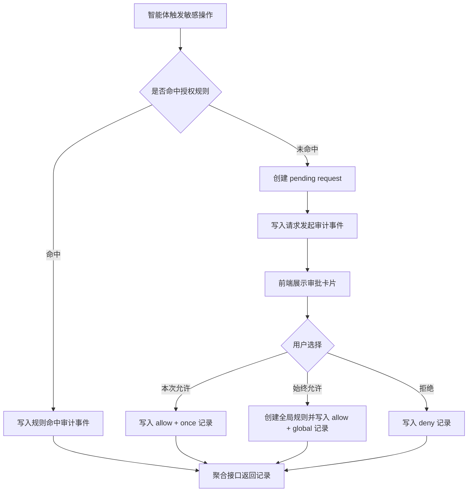
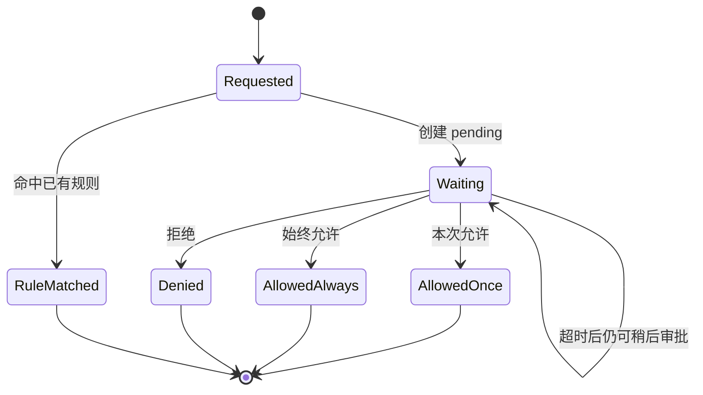
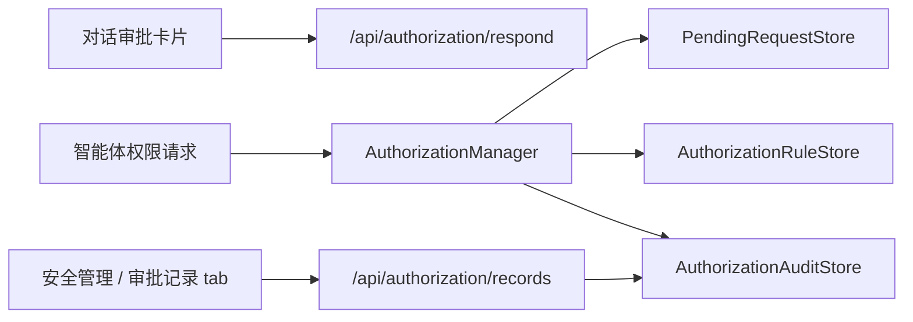
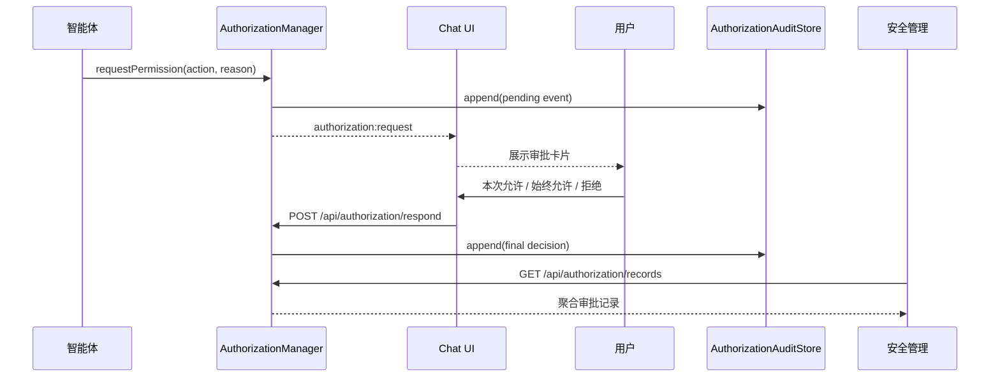
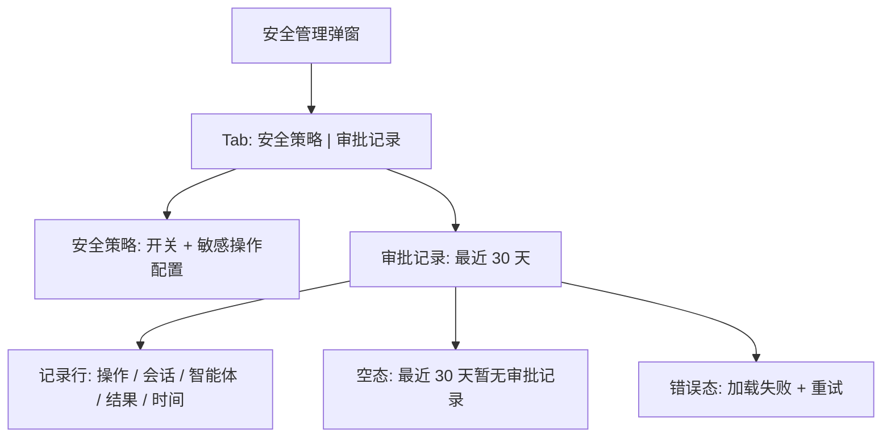

# 安全护栏审批记录展示设计

## 1. 需求简介

### 1.1 需求背景

当前敏感操作审批链路已经存在：后端通过 `packages/api/src/domains/agents/services/auth/AuthorizationManager.ts` 创建权限请求和处理用户响应，前端通过 `packages/web/src/components/AuthorizationCard.tsx` 在对话里展示“本次允许 / 总是允许 / 拒绝”，安全管理入口位于 `packages/web/src/components/SecurityManagementModal.tsx`。

现状的问题是：审批过程只在当前对话交互中可见，安全管理页面只能配置审批护栏和敏感操作策略，不能回看用户对敏感操作的审批记录。用户需要一个可追溯页面，查看最近一段时间内哪些敏感操作被发起、来自哪个会话、最终在对话中如何审批、什么时候审批。

本设计目标是补齐审批记录能力，并在安全管理弹窗中新增一个独立 tab 展示记录。非目标是不改变敏感操作识别规则、不重做权限审批卡片、不改变 Jiuwen/RelayClaw 的运行时权限策略编辑能力。

### 1.2 需求场景分析

1. 用户在对话中审批了敏感操作，之后需要回到安全管理查看本次操作名称、发起会话、审批选择和时间。
2. 用户或管理员排查风险操作时，需要确认某个敏感操作是被“本次允许”“始终允许”还是“拒绝”。
3. 后端可能记录规则自动命中的审批结果，但前端默认不展示自动命中记录，避免把“用户实际审批”列表变成策略命中日志。

成功标准：

1. 安全管理中新增 `审批记录` tab。
2. 审批记录默认展示最近 30 天内用户在对话中实际审批过的记录。
3. 每条记录至少展示敏感操作名称、发起会话、智能体、审批结果、发起时间、审批时间。
4. 后端记录保留完整信息，前端按产品口径隐藏规则自动命中的记录。

### 1.3 对现有功能影响分析

影响范围：

1. 后端 `AuthorizationManager`：需要在权限请求创建、用户响应、规则命中等节点补齐可追溯记录。
2. 后端 `AuthorizationAuditStore` / `RedisAuthorizationAuditStore`：沿用现有审计存储，但需要明确 30 天默认保留期和查询聚合方式。
3. 后端 `authorizationRoutes`：新增或扩展审批记录查询接口，避免前端直接拼装低层 audit event。
4. 前端 `SecurityManagementModal`：新增 tab 导航和审批记录列表。
5. 测试：补充后端聚合接口、审计写入时机、前端 tab 展示和空态测试。

不影响范围：

1. 不改变现有 `/api/authorization/respond` 审批响应语义。
2. 不改变聊天中的 `AuthorizationCard` 三个按钮及其 scope 映射。
3. 不改变 `/api/config/relayclaw/security` 安全策略配置接口。
4. 不迁移历史审计数据；上线前已有记录如果缺少创建事件，可以按最终事件降级展示。

### 1.4 架构影响分析（包括版本兼容性）

本需求属于“已有审批链路的审计视图补全”。架构上不新增独立数据库或外部依赖，仍沿用当前授权系统中的 pending、rule、audit 三类 store。

兼容性：

1. 旧版本没有审批记录聚合接口，前端需要只调用新接口；后端升级前不会显示审批记录。
2. 已有 audit event 结构保持兼容，新增字段必须 optional，避免破坏现有 store hydrate/serialize。
3. Redis 审计默认保留期从当前实现口径调整为 30 天时，只影响新写入 key 的 TTL；已有 key 不做批量改写。
4. 内存 store 没有 TTL 能力，保留期由查询接口按 `createdAt` 过滤实现。

### 1.5 技术选型

1. 存储：沿用 `AuthorizationAuditStore`，不新建审批记录表，减少持久化边界。
2. 聚合：后端新增面向 UI 的审批记录查询接口，把底层 event 聚合为一条业务记录。
3. 前端：沿用 React + `apiFetch` + 现有弹窗样式，安全管理内使用 tab 切换，不引入新路由。
4. 展示：使用表格/列表密集展示，适配安全管理弹窗的管理属性，不做营销式页面。

## 2. 方案设计

### 2.1 设计约束

1. 兼容性约束：不得改变现有审批响应接口和聊天审批卡片行为。
2. 安全与权限约束：审批记录包含敏感操作名称、原因、线程 ID、用户 ID 等信息，默认不展示原始 `context`。
3. 性能与成本约束：列表查询应分页/限量，不能每次前端打开弹窗拉取无限 audit。
4. 发布与回滚约束：前端 tab 可在接口失败时只展示错误态，不影响安全策略配置 tab 使用。
5. 现有代码边界：后端聚合逻辑放在 authorization 路由或相邻 helper，前端展示逻辑从 `SecurityManagementModal` 拆出，避免继续扩大单文件复杂度。

### 2.2 整体设计方案

后端把审批过程记录为审计事件，聚合接口返回“审批记录”业务视图。一次敏感操作请求至少可能产生两个事件：请求创建事件和最终审批事件。聚合接口按 `requestId` 合并这些事件，形成一条记录，返回给安全管理页面。

前端安全管理弹窗增加两个 tab：

1. `安全策略`：保留现有审批护栏、工作空间读写信任、敏感操作策略配置。
2. `审批记录`：展示最近 30 天的用户审批结果，默认过滤掉规则自动命中的记录。

后端可以返回规则自动命中记录，前端默认不展示。未来如果需要“策略命中日志”或“全部审计”，可以在同一接口上增加筛选开关。

### 2.3 方案详细设计

#### 2.3.1 功能原理

核心机制：

1. 敏感操作触发权限请求时，后端创建 `PendingRequestRecord`，同时写入一条 `decision=pending` 的 audit event。
2. 用户点击 `本次允许` 时，`respondScope=once`，最终记录展示为“本次允许”。
3. 用户点击 `总是允许` 时，`respondScope=global`，最终记录展示为“始终允许”，并继续按现有逻辑创建持久化 allow rule。
4. 用户点击 `拒绝` 时，最终记录展示为“拒绝”。
5. 规则自动命中时，后端可记录 `matchedRuleId`，接口返回但前端默认过滤。

主流程：

1. 智能体请求执行敏感操作。
2. 后端检查授权规则。
3. 未命中规则时创建 pending request，推送前端审批卡片，并写入“已发起”审计事件。
4. 用户在对话中审批。
5. 后端更新 pending record、写入最终审计事件、必要时创建授权规则。
6. 安全管理 `审批记录` tab 查询聚合接口并展示。

边界条件：

1. 用户未在 120 秒内审批：当前接口可能返回 `pending` 给智能体，但记录仍处于“待审批”。
2. 用户稍后审批：最终事件补写后，聚合记录从“待审批”变为最终结果。
3. 重复响应：沿用 pending store 的 CAS/状态检查，只有第一次成功响应进入最终记录。
4. 旧数据缺少 pending event：聚合接口用最终事件的 `createdAt` 作为降级发起时间。
5. 自动规则命中：后端返回 `approvalSource=rule` 或 `matchedRuleId`，前端默认不展示。

异常处理：

1. audit 写入失败不应阻断实际审批，但需要记录 warn 日志，避免权限链路因审计存储短暂异常不可用。
2. 审批记录查询失败只影响 `审批记录` tab，不能影响 `安全策略` tab。
3. 前端列表接口失败时展示错误态和重试按钮。

#### 2.3.2 接口设计

本需求需要前后端分离实现，因此接口层采用“后端聚合、前端只消费业务记录”的契约。前端不直接读取 `/api/authorization/audit`，也不自行按 `requestId` 拼装事件，避免前端理解底层审计事件语义。

##### 2.3.2.1 后端接口职责

后端负责：

1. 从 audit store 读取底层事件。
2. 按 `requestId` 聚合为业务记录。
3. 统一裁剪时间范围、返回条数和字段默认值。
4. 输出稳定枚举和展示文案。
5. 返回 `approvalSource=rule` 的记录，但允许前端通过参数或本地过滤隐藏。

前端负责：

1. 按接口响应渲染列表。
2. 格式化时间。
3. 使用 `approvalLabel` 展示审批结果，不再重复推导 `scope + decision`。
4. 默认过滤或请求排除 `approvalSource=rule` 的记录。
5. 处理加载态、空态、错误态和重试。

##### 2.3.2.2 审批记录查询接口

建议新增聚合接口：

```http
GET /api/authorization/records?days=30&limit=200&includeRuleMatched=false
```

请求参数：

| 参数 | 类型 | 默认值 | 说明 |
|---|---|---|---|
| `days` | number | `30` | 查询最近多少天 |
| `limit` | number | `200` | 返回条数，建议最大 `500` |
| `threadId` | string | 无 | 可选，按会话过滤 |
| `agentId` | string | 无 | 可选，按智能体过滤 |
| `includeRuleMatched` | boolean | `false` | 是否返回规则自动命中记录；前端默认传 `false` 或省略 |

参数规则：

1. `days <= 0` 或非数字时使用默认值 `30`。
2. `limit <= 0` 或非数字时使用默认值 `200`。
3. `limit > 500` 时后端按 `500` 截断。
4. `threadId` 和 `agentId` 都是精确匹配，不做模糊搜索。
5. MVP 不提供分页游标；如果 200/500 条不足，再扩展 `cursor` 或 `before`。

响应示例：

```json
{
  "records": [
    {
      "requestId": "req_123",
      "invocationId": "inv_123",
      "agentId": "codex",
      "threadId": "thread_abc",
      "action": "shell_command",
      "reason": "工具 `shell_command` 需要授权才能执行",
      "decision": "allow",
      "approvalLabel": "本次允许",
      "scope": "once",
      "approvalSource": "user",
      "requestedAt": 1778840000000,
      "decidedAt": 1778840005000,
      "decidedBy": "user-1",
      "matchedRuleId": null
    }
  ],
  "retentionDays": 30,
  "limit": 200,
  "hasMore": false
}
```

字段说明：

| 字段 | 类型 | 前端是否展示 | 说明 |
|---|---|---|---|
| `requestId` | string | 否 | 审批请求 ID，用于排查和测试定位 |
| `invocationId` | string | 否 | 所属 invocation ID |
| `agentId` | string | 是 | 发起敏感操作的智能体 ID；前端可映射为展示名 |
| `threadId` | string | 是 | 发起审批的会话 ID |
| `action` | string | 是 | 敏感操作名称 |
| `reason` | string | 是 | 请求原因；列表中可摘要展示 |
| `decision` | `allow` / `deny` / `pending` | 可选 | 机器可读结果 |
| `approvalLabel` | string | 是 | 后端生成的展示文案 |
| `scope` | `once` / `thread` / `global` / null | 可选 | 用户审批范围；待审批和规则命中可为空 |
| `approvalSource` | `user` / `rule` | 否 | 记录来源；前端默认只展示 `user` |
| `requestedAt` | number | 是 | 发起时间，Unix epoch ms |
| `decidedAt` | number / null | 是 | 审批时间；待审批为空 |
| `decidedBy` | string / null | 否 | 审批人标识；默认不展示 |
| `matchedRuleId` | string / null | 否 | 规则自动命中时返回 |

枚举与文案映射由后端保证：

| 条件 | `decision` | `scope` | `approvalSource` | `approvalLabel` |
|---|---|---|---|---|
| 用户本次允许 | `allow` | `once` | `user` | `本次允许` |
| 用户会话内允许 | `allow` | `thread` | `user` | `本会话允许` |
| 用户始终允许 | `allow` | `global` | `user` | `始终允许` |
| 用户拒绝 | `deny` | `once` / `thread` / `global` | `user` | `拒绝` |
| 等待审批 | `pending` | null | `user` | `待审批` |
| 规则自动允许 | `allow` | null | `rule` | `规则自动允许` |
| 规则自动拒绝 | `deny` | null | `rule` | `规则自动拒绝` |

响应错误：

| HTTP 状态码 | 场景 | 响应 |
|---|---|---|
| `401` | 缺少身份头 | `{ "error": "Identity required (X-Office-Claw-User header)" }` |
| `400` | 参数格式非法且无法降级 | `{ "error": "Invalid query", "details": [...] }` |
| `500` | 审计存储读取失败 | `{ "error": "Failed to load authorization records" }` |

参数非法时优先采用容错默认值；只有类型结构无法解析、或后续增加复杂参数时才返回 `400`。

##### 2.3.2.3 前端数据类型契约

前端建议在安全管理相关组件旁定义窄类型，避免把后端 audit event 类型泄漏进 UI：

```ts
type ApprovalDecision = 'allow' | 'deny' | 'pending';
type ApprovalScope = 'once' | 'thread' | 'global';
type ApprovalSource = 'user' | 'rule';

interface SecurityApprovalRecord {
  requestId: string;
  invocationId: string;
  agentId: string;
  threadId: string;
  action: string;
  reason: string;
  decision: ApprovalDecision;
  approvalLabel: string;
  approvalSource: ApprovalSource;
  requestedAt: number;
  decidedAt?: number | null;
  scope?: ApprovalScope | null;
  decidedBy?: string | null;
  matchedRuleId?: string | null;
}

interface SecurityApprovalRecordsResponse {
  records: SecurityApprovalRecord[];
  retentionDays: number;
  limit: number;
  hasMore: boolean;
}
```

前端调用约定：

```http
GET /api/authorization/records?days=30&limit=200&includeRuleMatched=false
```

加载时机：

1. 打开安全管理弹窗时只加载安全策略 tab 所需数据。
2. 首次切换到 `审批记录` tab 时加载审批记录。
3. 用户点击重试按钮时重新请求。
4. 如果后续增加筛选条件，每次条件变化重新请求。

前端渲染规则：

1. 列表只渲染 `approvalSource === "user"` 的记录；如果接口默认已过滤，前端仍保留一次防御性过滤。
2. `decidedAt` 为空时审批时间显示 `--`。
3. `reason` 作为纯文本展示，超长截断，不使用 `dangerouslySetInnerHTML`。
4. `threadId` 默认展示原值；如果本地线程缓存可命中标题，可以展示标题并在次级文本显示 `threadId`。
5. `agentId` 默认展示原值；如果 `useAgentData` 可命中 displayName，可以展示 displayName。

##### 2.3.2.4 后端聚合规则

后端聚合算法：

1. 查询最近 `days` 范围内的 audit event，扫描上限建议 `5000`。
2. 按 `requestId` 分组；没有 `requestId` 的规则命中记录可使用 audit entry `id` 作为内部分组 key。
3. 组内最早的 `pending` event 作为 `requestedAt`。
4. 组内最新的非 `pending` event 作为最终审批结果。
5. 如果没有非 `pending` event，记录保持 `decision=pending`。
6. 如果缺少 pending event，使用组内最早 event 的 `createdAt` 作为 `requestedAt`。
7. 如果存在 `matchedRuleId`，标记 `approvalSource=rule`。
8. 结果按 `decidedAt ?? requestedAt` 倒序排列。

后端与前端分工边界：

1. 后端负责业务语义和数据裁剪：`approvalLabel`、`approvalSource`、时间窗口、条数上限。
2. 前端负责视觉表达：tab、列表、时间格式化、空态、错误态。
3. 前端不得依赖底层 audit event 的数量和顺序。
4. 后端不得依赖前端过滤来保护敏感上下文，默认响应不包含原始 `context`。

保留现有接口：

```http
GET /api/authorization/audit
```

该接口继续作为低层审计事件查询，不作为安全管理页面的直接数据源。

#### 2.3.3 界面设计

安全管理弹窗新增 tab：

1. `安全策略`：现有内容全部保留。
2. `审批记录`：新增记录列表。

审批记录列表字段：

| 列 | 内容 |
|---|---|
| 敏感操作 | `action`，下面可用小字展示 `reason` 摘要 |
| 发起会话 | `threadId`；如果前端已有线程标题缓存，可展示标题并保留 threadId |
| 智能体 | `agentId` 或前端可解析的智能体展示名 |
| 审批结果 | `approvalLabel` |
| 发起时间 | `requestedAt` 本地格式化 |
| 审批时间 | `decidedAt`；待审批时展示 `--` |

状态设计：

1. 加载态：展示现有 `CenteredLoadingState`。
2. 空态：展示“最近 30 天暂无审批记录”。
3. 错误态：展示错误文案和重试按钮。
4. 分页：MVP 可使用接口 limit 返回最近 200 条；如果产品需要翻页，再扩展 cursor/page。
5. 自动规则命中记录：后端返回时前端默认过滤，不在列表展示。

#### 2.3.4 数据结构设计

现有 `AuthorizationAuditEntry` 已包含：

1. `requestId`
2. `invocationId`
3. `agentId`
4. `threadId`
5. `action`
6. `reason`
7. `decision`
8. `scope`
9. `decidedBy`
10. `decidedAt`
11. `matchedRuleId`
12. `createdAt`

建议新增或明确字段：

| 字段 | 位置 | 说明 |
|---|---|---|
| `approvalSource` | 聚合响应字段 | `user` 或 `rule`，可由 `matchedRuleId` 推导，也可显式返回 |
| `approvalLabel` | 聚合响应字段 | 后端统一映射文案，减少前端重复判断 |
| `requestedAt` | 聚合响应字段 | request 创建时间，优先取 pending audit event |

存储保留策略：

1. Redis audit 默认 TTL 调整为 30 天。
2. 内存 store 不做 TTL，查询接口用 `createdAt >= now - 30 days` 过滤。
3. 最大条数建议暂时沿用当前 `DEFAULT_MAX = 5000`，避免容量语义变化太大。
4. 查询接口默认返回 200 条，最大返回 500 条；如果 5000 条不足以覆盖 30 天高频场景，再单独评估持久化容量。

## 3. 可靠可用性设计

1. 审计写入 best-effort：审批主链路优先，审计写入失败只记录后端 warn，不阻断用户审批。
2. 聚合接口幂等：同一组 audit event 多次查询返回一致记录。
3. 重复审批防护：继续依赖 pending store 的 status 检查或 Redis CAS，保证只有一个最终响应生效。
4. 降级展示：旧数据缺少发起事件时，使用最终事件 `createdAt` 作为 `requestedAt`。
5. 前端隔离：`审批记录` tab 失败不影响 `安全策略` tab 的加载和保存。
6. 可诊断性：后端记录 requestId、threadId、agentId，便于从页面记录追踪到后端日志。

## 4. 安全隐私设计

审批记录本身属于安全审计数据，不能当普通 UI 日志处理。

威胁场景：

1. `reason` 或 `context` 中可能包含文件路径、命令参数、业务内容。
2. `decidedBy` 暴露审批用户标识。
3. `threadId` 可关联用户会话上下文。
4. 自动规则命中记录如果直接展示，可能让用户误以为自己逐条审批过这些操作。

缓解措施：

1. 前端默认不展示原始 `context`。
2. 列表只展示必要字段，长 reason 截断并保留换行安全渲染，不使用 HTML 注入。
3. 后端返回规则自动命中记录，但前端默认过滤，避免混淆“用户审批”和“规则命中”。
4. 审批记录接口继续要求 `X-Office-Claw-User` / `X-User-Id` 身份头，保持与现有 authorization 路由一致。
5. 30 天默认保留期降低长期暴露面。

验证方式：

1. 测试 reason 中包含特殊字符时前端按文本展示。
2. 测试无身份头访问记录接口返回 401。
3. 测试 `approvalSource=rule` 的记录默认不出现在前端列表。

## 5. 性能成本设计

后端成本：

1. 每次敏感操作请求新增一次 audit 写入；相对审批链路本身成本较低。
2. 聚合接口需要从 audit store 读取最近记录并按 requestId 分组，必须限制扫描量。
3. Redis 当前 `list` 实现按 zset 逆序读取，建议接口扫描上限不超过 5000 条。

前端成本：

1. 安全管理打开时，只有切换到 `审批记录` tab 才加载记录，避免每次打开安全策略都额外请求。
2. 默认渲染 200 条以内，避免弹窗内大列表卡顿。

容量建议：

1. 存储最大条数先沿用 5000。
2. API 默认返回 200，最大 500。
3. 30 天内如果实际审批量超过 5000，应再评估是否需要分页 cursor 或单独持久化表。

## 6. 图片与图示补充

### 6.1 流程图



### 6.2 状态图



### 6.3 架构图



### 6.4 时序图



### 6.5 界面示意图



## 7. 实施计划

1. 后端阶段一：补齐审计事件，在 request 创建时记录 pending event；在用户响应时保留最终事件；规则命中保留 `matchedRuleId`。
2. 后端阶段二：新增 `/api/authorization/records` 聚合接口，完成参数校验、默认值、返回模型、错误码和 30 天过滤。
3. 前后端联调点一：后端提供固定 mock 数据或测试环境数据，前端按 `SecurityApprovalRecordsResponse` 对接，不依赖真实敏感操作触发。
4. 前端阶段一：拆分安全管理 UI，增加 `安全策略 / 审批记录` tab，并保持安全策略原行为不变。
5. 前端阶段二：新增审批记录列表组件，按接口契约展示字段，默认请求 `includeRuleMatched=false`。
6. 前后端联调点二：用真实审批卡片分别验证“本次允许 / 始终允许 / 拒绝 / 待审批”四类记录。
7. 补充测试：后端 manager、route、Redis store TTL/查询；前端 tab、加载态、空态、错误态、过滤和渲染。

## 8. 验证方案

单元测试：

1. `AuthorizationManager` 创建权限请求时写入 pending audit。
2. 用户响应后同一 requestId 可聚合为最终审批记录。
3. 规则命中记录返回 `approvalSource=rule` 或 `matchedRuleId`。

接口测试：

1. 无身份头访问 `/api/authorization/records` 返回 401。
2. 默认只返回最近 30 天内记录。
3. `limit` 超过最大值时被限制。
4. 旧数据缺少 pending event 时仍可降级返回。
5. `includeRuleMatched=false` 时不返回规则自动命中记录。
6. 返回字段满足 `SecurityApprovalRecordsResponse` 契约，不暴露原始 `context`。

前端测试：

1. 安全管理展示 `安全策略` 与 `审批记录` tab。
2. 切换到 `审批记录` 后请求记录接口。
3. 用户审批记录展示操作名、会话、智能体、审批结果和时间。
4. `approvalSource=rule` 的记录默认不展示。
5. 接口失败展示错误态，不影响安全策略 tab。
6. 后端返回 `decidedAt=null` 时审批时间显示 `--`。
7. 后端返回空 records 时展示“最近 30 天暂无审批记录”。

前后端契约测试：

1. 使用一份固定 JSON fixture 覆盖 `allow + once`、`allow + global`、`deny`、`pending`、`rule`。
2. 后端 route 测试断言 fixture 形状，前端组件测试复用同一 fixture。
3. 若字段名调整，必须同时更新后端响应测试和前端类型/渲染测试。

手工验证：

1. 触发一个敏感操作并选择“本次允许”，在审批记录中看到“本次允许”。
2. 触发一个敏感操作并选择“始终允许”，在审批记录中看到“始终允许”，后续规则自动命中不在默认列表展示。
3. 触发一个敏感操作并选择“拒绝”，在审批记录中看到“拒绝”。

## 9. 风险与待确认项

风险：

1. 当前 audit store 最大条数 5000，30 天内高频审批场景可能被容量淘汰；MVP 先沿用，后续用真实数据评估。
2. 如果直接展示 `reason`，可能包含路径或命令参数；需要保证纯文本渲染和长度控制。
3. 前端安全管理弹窗已有较多逻辑，新增 tab 时应拆分组件，避免继续扩大单文件复杂度。

待确认：

1. 发起会话是否只展示 `threadId`，还是必须展示线程标题；如果要展示标题，需要决定由后端联查 thread store，还是前端用已有线程缓存补全。
2. 是否需要导出审批记录；本次设计暂不包含。
3. 是否需要按敏感操作名称、会话或审批结果筛选；MVP 可先展示最近记录，后续按实际使用增加筛选。
