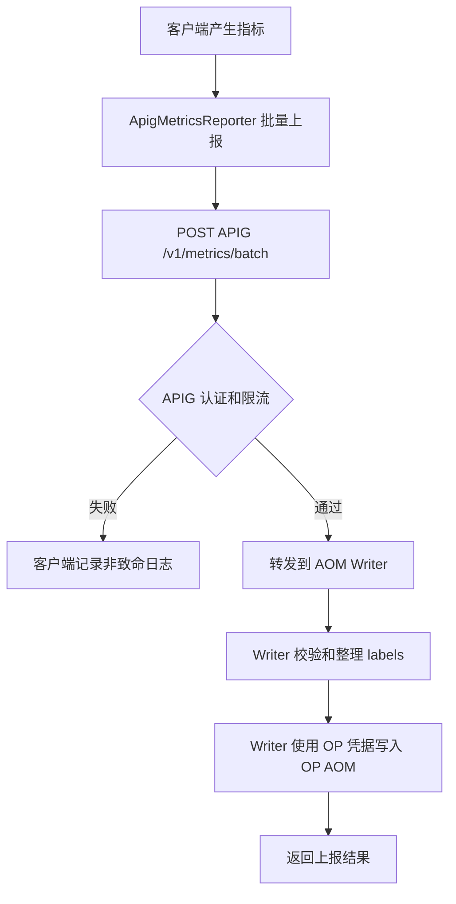

# OP 账户统一 AOM 上报 APIG 方案设计文档

## 1. 需求简介

### 1.1 需求背景

当前 OfficeClaw 的 AOM 上报是在本地完成的：[packages/api/src/index.ts](../../packages/api/src/index.ts) 登录成功后初始化 Metrics Provider，[packages/green-package/api/src/metrics-plugin.ts](../../packages/green-package/api/src/metrics-plugin.ts) 从当前用户登录态里读取华为云 AK/SK/STS/project_id，再通过 [packages/green-package/api/src/metrics/aom-access-code-client.ts](../../packages/green-package/api/src/metrics/aom-access-code-client.ts) 获取 AOM access_code，最后由 [packages/api/src/services/metrics/aom-reporter.ts](../../packages/api/src/services/metrics/aom-reporter.ts) 写入 AOM。

因此现在的结果是：`agentarts_claw_user_login` 和 `gen_ai_client_token_usage` 这两个指标会写到用户自己的 AOM project。新需求是把所有用户的指标统一写到 OP 账户的 AOM，便于运营侧统一查看登录量、token 消耗、版本分布和模型使用情况。

新的方案不把 OP AOM 凭据发到客户端，而是让客户端把指标发到华为云 APIG。APIG 后面再接一个 AOM Writer，由 AOM Writer 使用 OP 账户凭据写入 OP AOM。

参考资料：

- [docs/aom-usermanual-zh-pdf.pdf](../aom-usermanual-zh-pdf.pdf)：AOM 支持 Remote Write 上报，并使用 Access Code 作为调用凭据。
- [docs/qs-apig-pdf.pdf](../qs-apig-pdf.pdf)：APIG 支持创建 API、发布 API、APP 认证和 AppCode 调用。
- [docs/bestpractice-apig-pdf.pdf](../bestpractice-apig-pdf.pdf)：APIG 支持后端服务转发、自定义认证、JWT 认证和流量控制。

### 1.2 需求场景分析

- 运营侧需要在 OP AOM 中统一查看所有用户的登录量和 token 用量。
- 客户端不能保存 OP AOM access_code、AK/SK 或 project_id。
- 所有用户统一上报到 OP AOM 后，需要避免 labels 太乱或高基数字段导致查询和成本问题。

成功标准：

- 新老用户升级到该版本后，默认都把指标上报到 APIG 统一入口。
- OP AOM 能看到现有两个指标：`agentarts_claw_user_login`、`gen_ai_client_token_usage`。
- 客户端安装目录、日志、环境变量里没有 OP AOM 凭据。
- APIG 或 AOM Writer 不可用时，不影响用户登录和对话。

### 1.3 对现有功能影响分析

本地指标采集逻辑基本不变，还是原来的两个指标：

- 登录成功后上报 `agentarts_claw_user_login`。
- token 用量由 `TokenUsageReporter` 定时上报 `gen_ai_client_token_usage`。

核心变化只有一个：**上报出口从用户 AOM 改成 APIG**。

旧链路：

```text
客户端 -> 用户 AOM
```

新链路：

```text
客户端 -> APIG -> AOM Writer -> OP AOM
```

原有 `aom` provider 可作为开发或特殊私有化场景的保底能力保留，但正式发布路径中新老用户都应默认启用新的 `central-aom-apig` provider，并统一写入 OP AOM。

### 1.4 架构影响分析（包括版本兼容性）

客户端需要新增一个轻量 provider/reporter，用于把现有指标发送到 APIG。它不再读取用户 AOM AK/SK，不再获取 access_code，也不再本地拼 AOM remote-write 地址。

云端需要配置 APIG，并准备一个 APIG 后端 AOM Writer。Writer 可以是 FunctionGraph，也可以是现有云端服务里的一个接口。

版本兼容：

- 目标态：新用户和历史用户在升级/覆盖安装到该版本后，都默认走 `central-aom-apig`，统一上报到 OP AOM。
- 存量老版本客户端本身不具备 APIG 上报能力，需要通过版本升级获得新的 provider/reporter。
- 覆盖安装时应优先使用新版本默认上报策略，避免历史 `.env` 中的 `OFFICE_CLAW_METRICS_PROVIDER=aom` 让普通用户继续写到用户自己的 AOM。
- 仅在开发调试、企业私有化或应急回退场景下，才允许显式切回 `aom` 或 `noop`。
- 如果 APIG 不可用，客户端只记录非致命日志，不影响主流程。

### 1.5 技术选型

推荐方案：

```text
OfficeClaw 客户端 -> 华为云 APIG -> AOM Writer -> OP AOM
```

选择这个方案的原因：

- APIG 负责公网入口、HTTPS、认证、限流和转发。
- AOM Writer 负责使用 OP AOM 凭据写入 OP AOM。
- OP AOM 凭据只在云端，不进入客户端。
- 本地只改上报出口，指标采集点不需要重做。

## 2. 方案设计

### 2.1 设计约束

- 不把 OP AOM access_code、AK/SK、project_id 写入客户端。
- 第一阶段只迁移现有两个指标，不扩展新指标。
- 写入 OP AOM 前要控制 labels，避免明文用户信息和完整 session/thread id。
- 原有 `aom` provider 保留为开发/私有化/应急回退能力，但普通新老用户默认不再使用。

### 2.2 整体设计方案

客户端新增 `central-aom-apig` provider。它的职责很简单：告诉 metrics 服务“把指标发到 APIG”。


APIG 对外暴露的是 OfficeClaw 自己的指标上报接口，例如：

```http
POST https://metrics-api.example.com/v1/metrics/batch
```

它不是把 OP AOM 原始接口直接暴露给客户端。客户端也不需要知道 OP AOM 的 endpoint、projectId 或 access_code。

### 2.3 方案详细设计

#### 2.3.1 总体详细设计流程



#### 2.3.2 本地改动

本地改动集中在 metrics 出口：

- 新增 `central-aom-apig` provider。
- 新增 `ApigMetricsReporter`，把现有 `MetricValue[]` 发送到 APIG。
- 默认配置从旧的 `aom` 切到 `central-aom-apig`。

本地不再做这些事情：

- 不再读取用户 AOM AK/SK/STS 来上报统一指标。
- 不再调用 AOM API 获取或创建 access_code。
- 不再本地拼 `aom-access.{region}.myhuaweicloud.com` remote-write 地址。
- 不再持有 OP AOM 凭据。

现有指标采集点保持不变：

- `agentarts_claw_user_login`
- `gen_ai_client_token_usage`

#### 2.3.3 云端配置

APIG 侧：

- 创建 API：`POST /v1/metrics/batch`。
- 开启 HTTPS。
- 配置认证，MVP 可以先用 APP 认证；正式建议使用短期 JWT 或自定义认证。
- 配置基础流控，防止异常客户端刷接口。
- 后端指向 AOM Writer。

AOM Writer 侧：

- 接收 APIG 转发的 JSON 指标。
- 校验只允许两个指标名。
- 过滤 labels，只保留版本、平台、匿名用户、模型、智能体等必要维度。
- 使用 OP AOM access_code 或 OP 云端凭据写入 OP AOM。
- 记录必要日志，但不记录用户明文身份、prompt、response、token 等敏感信息。

#### 2.3.4 接口设计

客户端请求 APIG：

```http
POST /v1/metrics/batch
Content-Type: application/json
Authorization: Bearer <短期 metrics token>
```

请求体示例：

```json
{
  "schemaVersion": 1,
  "app": {
    "name": "office-claw",
    "version": "0.3.3",
    "platform": "windows"
  },
  "identity": {
    "userIdHash": "sha256:...",
    "tenantId": "default"
  },
  "metrics": [
    {
      "name": "gen_ai_client_token_usage",
      "value": 12345,
      "timestamp": 1781097600000,
      "labels": {
        "model": "qwen3-32b",
        "agent": "logic-master",
        "provider": "huawei-maas"
      }
    }
  ]
}
```

客户端环境变量建议：

| 配置项 | 说明 |
| --- | --- |
| `OFFICE_CLAW_METRICS_PROVIDER=central-aom-apig` | 启用 APIG 上报 |
| `OFFICE_CLAW_METRICS_APIG_URL=https://.../v1/metrics/batch` | APIG 指标入口 |
| `OFFICE_CLAW_METRICS_BATCH_INTERVAL_MS=60000` | 批量上报间隔 |

不应配置在客户端：

- OP AOM access_code
- OP AK/SK
- OP project_id

#### 2.3.5 指标和 labels

第一阶段只上报两个指标：

| 指标 | 含义 |
| --- | --- |
| `agentarts_claw_user_login` | 用户登录事件 |
| `gen_ai_client_token_usage` | token 用量 |

建议保留的 labels：

- `app`
- `env`
- `version`
- `platform`
- `user_id_hash`
- `tenant_id`
- `model`
- `agent`
- `provider`

不建议进入 AOM labels：

- 明文 userId、手机号、邮箱。
- prompt、response。
- 完整 threadId、完整 sessionId。
- access token、AK/SK、access_code。

## 3. 可靠可用性设计

- 客户端请求 APIG 超时或失败时，只记录日志，不影响登录和对话。
- `429/5xx/timeout` 可以后续做简单退避重试。
- AOM Writer 写 OP AOM 失败时，建议云端记录失败日志，必要时做重试。
- 第一阶段可以接受少量指标丢失，不把指标上报做成阻塞主流程的强一致链路。

## 4. 安全隐私设计

核心原则：**OP AOM 凭据只在云端，不能进入客户端。**

安全要求：

- 客户端只调用 APIG，不直接调用 OP AOM。
- APIG 需要开启 HTTPS、认证和基础限流。
- AOM Writer 只接受白名单指标和 labels。
- 用户身份使用 hash，不写明文手机号、邮箱或账号。
- 日志不记录 OP AOM 凭据、不记录 prompt/response。

需要注意：如果 APIG 使用 AppCode，并且 AppCode 被打进客户端，仍然有被提取风险。因此 AppCode 适合 MVP 或内测；正式环境建议改成登录后下发短期 metrics token，或使用 APIG 自定义认证/JWT 认证。

## 5. 性能成本设计

客户端仍然按批量方式上报，默认 60 秒一次，成本很低。

主要成本在云端：

- APIG 请求量。
- AOM Writer 转换和写入成本。
- OP AOM 存储和查询成本。

控制成本的关键是 labels 不要乱。尤其不要把完整 sessionId/threadId 作为高频 labels，否则 OP AOM 查询会变慢，存储也会膨胀。

## 6. 实施计划

1. 云端先配置 APIG 和 AOM Writer 测试链路。
2. 本地新增 `central-aom-apig` provider 和 `ApigMetricsReporter`。
3. 新安装包和覆盖安装后的默认策略都切到 `central-aom-apig`，让新老用户统一上报 OP AOM。
4. 保留 `aom` 和 `noop` 作为开发/私有化/应急回退入口，不作为普通用户默认路径。
5. 在 OP AOM 看板验证登录指标和 token 用量指标。

## 7. 验证方案

- 客户端登录后，OP AOM 能看到 `agentarts_claw_user_login`。
- 完成一次对话后，OP AOM 能看到 `gen_ai_client_token_usage`。
- 断开 APIG 后，客户端不弹窗、不影响对话。
- 检查客户端安装目录、日志、环境变量中没有 OP AOM access_code、OP AK/SK。
- 普通新老用户升级后默认走 `central-aom-apig`；仅在显式配置回退时，原有 `aom` provider 才会继续使用。

## 8. 风险与待确认项

- 待确认：APIG 正式认证方式是 AppCode、JWT 还是自定义认证。
- 待确认：AOM Writer 放在 FunctionGraph 还是现有云端服务。
- 待确认：OP AOM access_code 由运维预创建，还是由 Writer 自动获取。
- 风险：AppCode 打包进客户端会被提取，正式环境不建议长期使用。
- 风险：labels 不治理会导致 OP AOM 指标混乱和成本升高。
- 风险：指标上报失败可能丢数据，第一阶段建议接受少量丢失，不阻塞主流程。
