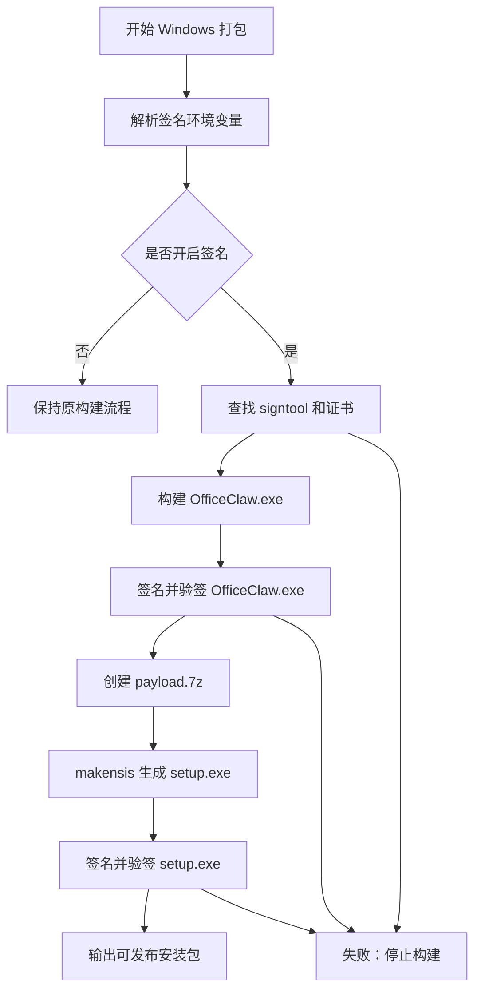
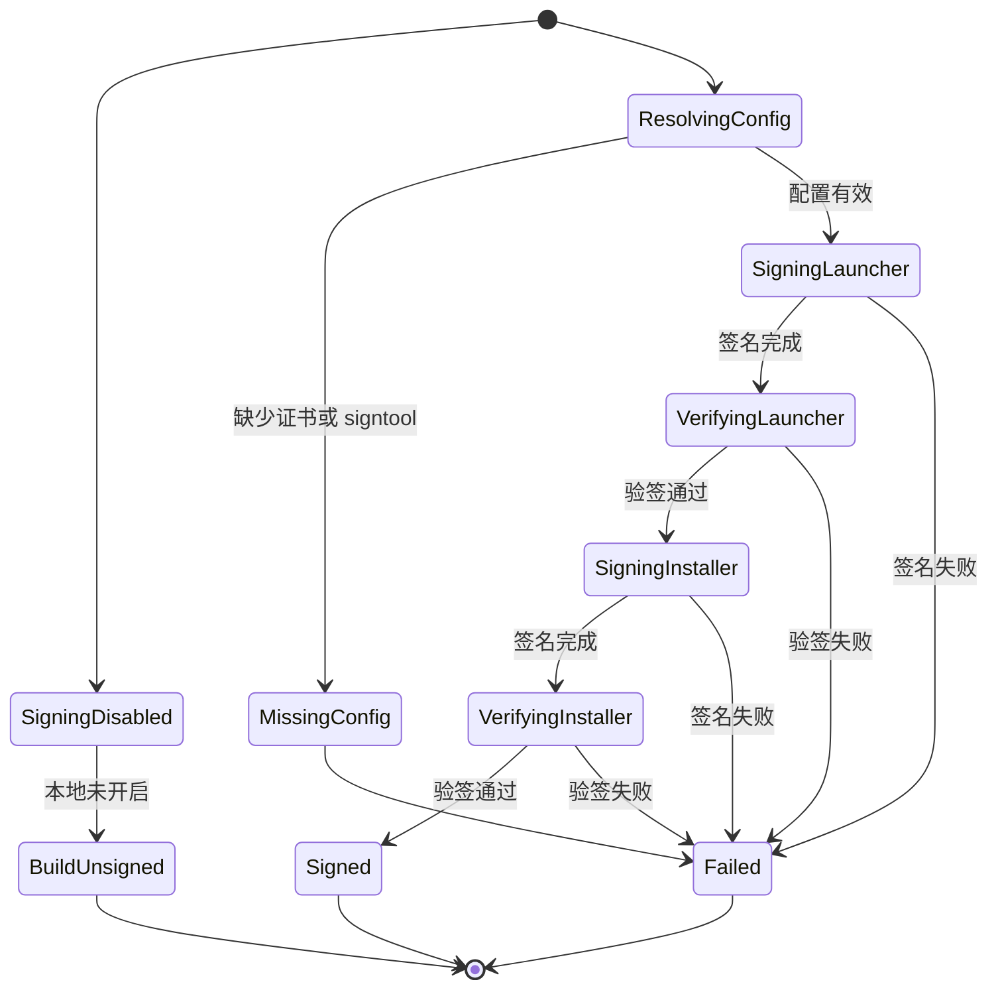
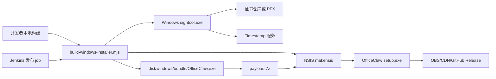
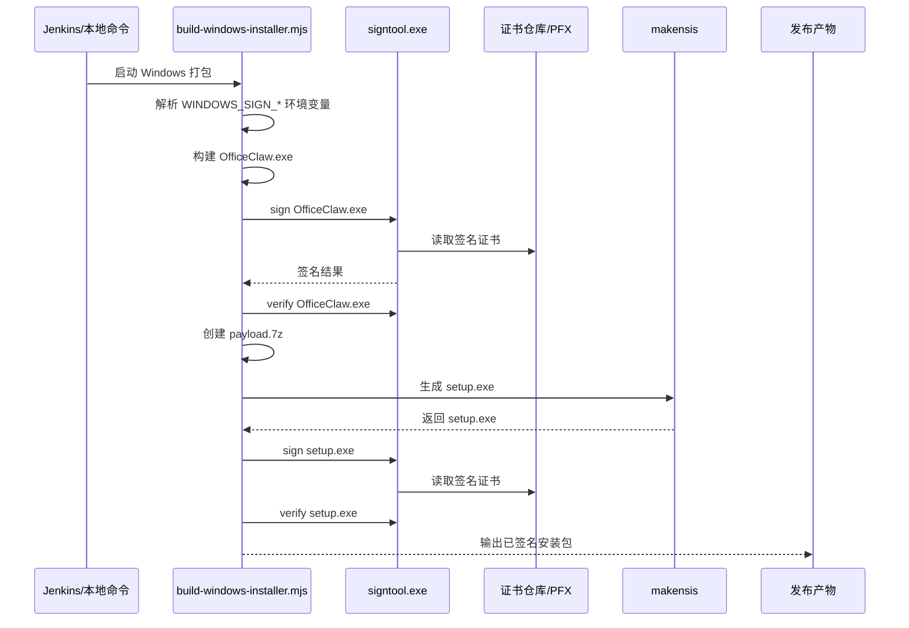
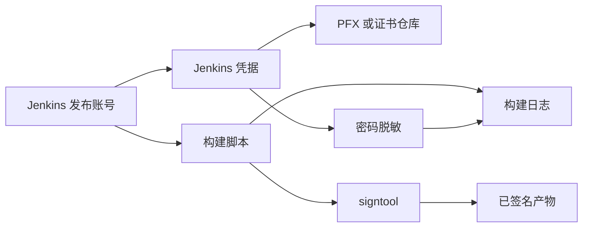

# Windows 安装包代码签名需求设计文档

## 1. 需求简介

### 1.1 需求背景

OfficeClaw Windows 安装包当前由 `scripts/build-windows-installer.mjs` 生成，最终产物是 NSIS 安装器 `OfficeClaw-<version>-windows-x64-setup.exe`。安装包内还包含安装后真正运行的桌面启动器 `dist/windows/bundle/OfficeClaw.exe`、Node runtime、Python runtime、Redis、WebView2 bootstrapper、VC++ Redistributable、脚本和业务代码。

商业化发布后，未签名或签名不可信的 Windows 安装包容易在浏览器下载、Windows SmartScreen、Defender、UAC 和企业安全软件中被识别为未知来源应用。用户侧最明显的问题是：下载阶段被浏览器提示风险，运行安装包时显示未知发布者，或者企业安全软件无法按发布者身份放行。

本需求的目标是建立 Windows 发布产物的代码签名闭环：

- 对安装包外层 `setup.exe` 签名，改善下载和安装入口的可信度。
- 对安装包内的 `OfficeClaw.exe` 签名，改善安装后启动程序的可信度。
- 在正式发布流水线中强制签名和校验，避免未签名产物被上传。
- 本地开发默认不强制签名，避免影响日常打包。

本需求不承诺完全消除浏览器下载拦截。SmartScreen 和浏览器下载保护还依赖证书信誉、下载域名信誉、文件下载量、发布时间和安全厂商云端判断。代码签名是商业发布的必要条件，但不是唯一条件。

### 1.2 需求场景分析

- 普通用户下载安装：用户从官网、GitHub Release、OBS/CDN 或企业下载页下载安装包。浏览器和 Windows 会优先检查外层安装包签名、下载来源和文件信誉。
- 安装后首次启动：用户安装完成后运行的是安装目录中的 `OfficeClaw.exe`。如果只签外层安装包，不签内层主程序，安装后仍可能出现未知发布者或安全软件拦截。
- Jenkins 正式发布：正式包应由 CI 自动签名和校验，证书材料由 Jenkins 凭据系统提供，不能依赖工程师本地手工签名。
- 企业客户分发：企业 IT 可以基于公司发布者证书、文件签名状态或 hash 做白名单和审计。

成功标准：

- 启用签名时，`OfficeClaw.exe` 和最终 `setup.exe` 均能通过 `Get-AuthenticodeSignature` 校验。
- 正式发布签名失败、证书缺失或 `signtool` 不可用时，构建必须失败并阻断上传。
- 不设置签名环境变量时，本地 `pnpm package:windows` 或脚本打包仍保持原有行为。

### 1.3 对现有功能影响分析

对安装器运行时逻辑无直接影响。签名发生在构建阶段，不改变 NSIS 安装页面、安装目录、回滚逻辑、WebView2/VC++ 安装逻辑和用户配置保留策略。

对构建链路有影响：

- `scripts/build-windows-installer.mjs` 增加签名配置解析、`signtool` 查找、签名和校验步骤。
- `--nsis-only` 模式会在重新打包前签名现有 `bundle/OfficeClaw.exe`，再生成 `payload.7z` 和最终安装包。
- `--launcher-only` 模式会在重建启动器后签名 `OfficeClaw.exe`。
- 完整打包模式会先签名 `OfficeClaw.exe`，再创建 payload，最后签名 `setup.exe`。

对测试有影响：

- `packages/api/test/windows-offline-installer.test.js` 需要覆盖签名开关、证书模式和关键签名顺序，防止后续改动漏签内层启动器或最终安装包。

### 1.4 架构影响分析（包括版本兼容性）

涉及模块：

- 构建入口：`scripts/build-windows-installer.mjs`
- 安装器模板：`packaging/windows/installer.nsi`
- Windows 桌面启动器产物：`dist/windows/bundle/OfficeClaw.exe`
- 最终安装包产物：`dist/windows/OfficeClaw-<version>-windows-x64-setup.exe`
- 构建测试：`packages/api/test/windows-offline-installer.test.js`
- Jenkins 发布 job：提供证书、`signtool` 和签名开关

版本兼容性：

- Windows 10/11 均支持 Authenticode 签名验证。
- 老版本 Windows 10 可能缺少部分根证书更新，正式证书链仍需要在目标系统上验证。
- 自签名证书只适合本地验证，不适合商业分发。
- 旧安装包不受影响；该能力只影响启用签名后的新构建产物。
- 旧 Jenkins job 如果不设置签名环境变量，仍可构建，但正式发布 job 应设置 `WINDOWS_SIGNING_REQUIRED=1`。

### 1.5 技术选型

签名工具沿用 Windows 官方 `signtool.exe`，原因是它是 Authenticode 签名的标准工具，支持证书仓库、PFX 文件、RFC 3161 时间戳和验签。

证书来源支持两种：

- Thumbprint 模式：适合 Jenkins Windows 构建机预安装正式代码签名证书。
- PFX 模式：适合通过 Jenkins secret file 注入证书文件和 secret text 注入密码。

时间戳使用 RFC 3161 timestamp URL。时间戳的作用是让签名在证书过期后仍可证明签名发生于证书有效期内。

## 2. 方案设计

### 2.1 设计约束

- 兼容性约束：未设置签名环境变量时，保持本地构建不受影响。
- 安全与权限约束：证书私钥、PFX 密码不能写入仓库，不能打印到日志。
- 发布与回滚约束：签名发生在上传前；签名失败不生成可发布状态。
- 构建顺序约束：内层 `OfficeClaw.exe` 必须在创建 `payload.7z` 前签名，否则安装包内仍是未签名 exe。
- 现有代码边界：第一阶段只改构建脚本和测试，不改 NSIS 安装时逻辑。

### 2.2 整体设计方案

整体方案是在 Windows 构建脚本内增加“签名配置解析 -> 签名 -> 验签”的构建阶段能力。签名逻辑集中在 `scripts/build-windows-installer.mjs`，由环境变量控制是否开启，避免把发布证书和本地开发流程耦合。

构建阶段签两个文件：

1. `dist/windows/bundle/OfficeClaw.exe`
   - 完整打包和 `--launcher-only` 模式下，启动器构建完成后立即签名。
   - `--nsis-only` 模式下，对已有 bundle 内的启动器重新签名。
   - 签名后再创建 `payload.7z`，确保安装包内的启动器已签名。

2. `dist/windows/OfficeClaw-<version>-windows-x64-setup.exe`
   - `makensis` 生成最终安装包后签名。
   - 签名后立即验签，验签通过后才允许后续发布上传。

### 2.3 方案详细设计

#### 2.3.1 功能原理

核心机制：

- 通过 `WINDOWS_SIGNING_ENABLED` 判断是否开启签名。
- 通过 `WINDOWS_SIGNING_REQUIRED` 表示正式发布强制签名。该变量为真时，即使未显式设置 `WINDOWS_SIGNING_ENABLED`，也按开启签名处理。
- 通过 `findSignTool()` 获取 `signtool.exe`。
- 通过 `resolveWindowsSigningConfig()` 解析证书来源、timestamp URL、签名描述和证书仓库。
- 通过 `signWindowsExecutable()` 调用 `signtool sign`。
- 通过 `verifyWindowsSignature()` 调用 `signtool verify /pa /tw`。

主流程：

```text
解析参数
-> 解析签名配置
-> 构建或复用 bundle
-> 构建 OfficeClaw.exe
-> 签名 OfficeClaw.exe
-> 验证 OfficeClaw.exe
-> 创建 payload.7z
-> makensis 生成 setup.exe
-> 签名 setup.exe
-> 验证 setup.exe
-> 输出可发布安装包
```

边界条件：

- 未开启签名：打印跳过日志，继续构建。
- 开启签名但非 Windows：构建失败。
- 找不到 `signtool.exe`：构建失败。
- 未配置 thumbprint 或 PFX：构建失败。
- PFX 文件不存在或密码缺失：构建失败。
- 签名或验签命令返回非 0：构建失败。

异常处理：

- PFX 密码在错误日志中必须脱敏。
- 签名失败后不应继续进入上传阶段。
- `--bundle-only` 只生成离线 bundle，不生成最终安装包；该模式可签 `OfficeClaw.exe`，但没有 `setup.exe` 可签。

#### 2.3.2 接口设计

环境变量接口：

| 变量 | 示例 | 说明 |
| --- | --- | --- |
| `WINDOWS_SIGNING_ENABLED` | `1` | 开启 Windows 签名 |
| `WINDOWS_SIGNING_REQUIRED` | `1` | 正式发布强制签名 |
| `WINDOWS_SIGNTOOL_PATH` | `C:\...\signtool.exe` | 指定 `signtool.exe` 路径 |
| `WINDOWS_SIGN_TIMESTAMP_URL` | `http://timestamp.digicert.com` | RFC 3161 时间戳服务 |
| `WINDOWS_SIGN_DESCRIPTION` | `OfficeClaw` | 签名描述 |
| `WINDOWS_SIGN_CERT_THUMBPRINT` | `<thumbprint>` | 使用证书仓库中的证书 |
| `WINDOWS_SIGN_CERT_STORE` | `My` | 证书 store，默认 `My` |
| `WINDOWS_SIGN_CERT_STORE_LOCATION` | `CurrentUser` | `LocalMachine` 时使用机器证书仓库 |
| `WINDOWS_SIGN_CERT_PATH` | `D:\secure\officeclaw.pfx` | 使用 PFX 证书文件 |
| `WINDOWS_SIGN_CERT_PASSWORD` | Jenkins secret | PFX 密码 |

证书来源优先级：

```text
WINDOWS_SIGN_CERT_THUMBPRINT > WINDOWS_SIGN_CERT_PATH
```

Jenkins thumbprint 模式示例：

```powershell
$env:WINDOWS_SIGNING_ENABLED = "1"
$env:WINDOWS_SIGNING_REQUIRED = "1"
$env:WINDOWS_SIGNTOOL_PATH = "<signtool.exe>"
$env:WINDOWS_SIGN_TIMESTAMP_URL = "http://timestamp.digicert.com"
$env:WINDOWS_SIGN_CERT_THUMBPRINT = "<thumbprint>"
corepack pnpm package:windows
```

Jenkins PFX 模式示例：

```powershell
$env:WINDOWS_SIGNING_ENABLED = "1"
$env:WINDOWS_SIGNING_REQUIRED = "1"
$env:WINDOWS_SIGNTOOL_PATH = "<signtool.exe>"
$env:WINDOWS_SIGN_CERT_PATH = "<jenkins-secret-file>"
$env:WINDOWS_SIGN_CERT_PASSWORD = "<jenkins-secret-text>"
corepack pnpm package:windows
```

#### 2.3.3 界面设计

无产品界面变化。用户可感知结果体现在 Windows 安全提示和文件属性中：

- 安装包属性页出现“数字签名”。
- UAC 或 SmartScreen 提示中显示可信发布者。
- 安装后的 `OfficeClaw.exe` 属性页出现“数字签名”。

浏览器下载提示仍可能存在，尤其在新证书、新文件 hash、低下载量、对象存储裸链接或自签名证书场景下。

#### 2.3.4 数据结构设计

第一阶段不新增持久化数据结构。构建脚本内部使用临时配置对象：

```ts
type WindowsSigningConfig = {
  enabled: boolean;
  required: boolean;
  signToolPath?: string;
  timestampUrl?: string;
  description?: string;
  mode?: "thumbprint" | "pfx";
  thumbprint?: string;
  certStore?: string;
  certStoreLocation?: string;
  pfxPath?: string;
  pfxPassword?: string;
};
```

后续可在 Jenkins artifact 或 release metadata 中记录签名摘要：

```json
{
  "windowsSigning": {
    "enabled": true,
    "required": true,
    "mode": "thumbprint",
    "certificateThumbprintSuffix": "A1B2C3D4",
    "timestampUrl": "http://timestamp.digicert.com",
    "signedFiles": [
      "dist/windows/bundle/OfficeClaw.exe",
      "dist/windows/OfficeClaw-0.3.0-windows-x64-setup.exe"
    ]
  }
}
```

metadata 不允许记录 PFX 密码、私钥材料或完整敏感路径。

## 3. 可靠可用性设计

构建可靠性：

- 本地默认关闭签名，避免阻断普通开发构建。
- 正式发布设置 `WINDOWS_SIGNING_REQUIRED=1`，缺少证书或工具时立即失败。
- 每次签名后立即验签，避免“命令执行成功但产物不可用”的灰色状态。
- 最终安装包签名发生在 `makensis` 之后，避免签名后又被修改导致签名失效。

发布可用性：

- Jenkins 上传 OBS/CDN 前必须完成签名和验签。
- 失败时应跳过 upload stage，保留构建日志用于排查。
- 如果 timestamp 服务不可用，正式发布应失败，不建议降级为无时间戳签名。

用户可恢复性：

- 如果用户下载后仍被浏览器提示风险，支持侧应先确认下载后文件签名是否有效。
- 如果签名有效但仍被浏览器拦截，应按 SmartScreen/浏览器信誉问题处理，而不是回退安装器逻辑。
- 如果签名无效，应要求重新下载或停止发布该产物。

## 4. 安全隐私设计

安全目标：

- 证明安装包和启动器来自 OfficeClaw 官方发布链路。
- 降低中间人替换安装包、镜像站篡改、对象存储误上传未签名包的风险。
- 让企业客户可以按发布者证书进行白名单和审计。

证书保护：

- 私钥不得进入 Git 仓库。
- PFX 密码必须使用 Jenkins secret text。
- PFX 文件必须使用 Jenkins secret file 或受控证书仓库。
- 构建日志不得输出 PFX 密码。错误信息中 `/p` 后的参数必须脱敏。
- Jenkins signing job 权限应限制在发布节点和发布账号内。

威胁场景与缓解：

| 威胁场景 | 影响 | 缓解方式 |
| --- | --- | --- |
| 未签名安装包被上传 | 用户看到未知发布者，浏览器更易拦截 | `WINDOWS_SIGNING_REQUIRED=1` 阻断发布 |
| PFX 密码泄露 | 攻击者可冒用发布者签名 | Jenkins secret、日志脱敏、限制权限 |
| 安装包签名后又被修改 | 签名失效，用户下载不可用 | 签名必须在 `makensis` 后最后执行 |
| 只签外层安装器 | 安装后主程序仍可能被拦截 | 在创建 payload 前签 `OfficeClaw.exe` |
| 自签名用于公开发布 | 普通用户机器不信任 | 自签名仅用于本地验证，正式使用 OV/EV 或可信签名服务 |

隐私影响：

本需求不新增用户数据采集，不读取用户业务文件，不改变安装目录中的用户配置和数据保留策略。新增的外部网络访问主要是 timestamp 服务，由构建机在签名阶段访问，不发生在用户运行阶段。

## 5. 性能成本设计

构建时间：

- 每个 exe 增加一次签名和一次验签。
- 当前第一阶段签两个文件，预计增加几十秒以内，主要取决于 timestamp 服务网络情况。

包体积：

- Authenticode 签名会略微增加 exe 体积，通常为 KB 级或小幅增长，对安装包总体体积影响可忽略。

运行性能：

- 不改变 OfficeClaw 启动路径和运行时代码，用户侧无明显运行时性能成本。

发布成本：

- 正式商业发布需要代码签名证书或云签名服务。
- EV/OV 证书、Microsoft Trusted Signing、企业下载域名和 CDN 都可能带来额外费用。

## 6. 图片与图示补充

### 6.1 流程图



### 6.2 状态图



### 6.3 架构图



### 6.4 时序图



### 6.5 安全流图



## 7. 实施计划

1. 第一阶段：构建脚本签名闭环。
   - 新增签名配置解析。
   - 支持 thumbprint 和 PFX。
   - 签名 `OfficeClaw.exe` 和最终 `setup.exe`。
   - 签名后立即验签。
   - 增加构建脚本测试。

2. 第二阶段：Jenkins 正式发布接入。
   - 安装或指定 `signtool.exe`。
   - 配置正式代码签名证书。
   - release job 设置 `WINDOWS_SIGNING_REQUIRED=1`。
   - 上传前增加签名校验门禁。

3. 第三阶段：发布链路可信度优化。
   - 使用稳定 HTTPS 下载域名。
   - 避免直接暴露对象存储裸链接。
   - 建立误报申诉和安全软件 allowlist 文档。
   - 记录 release signing metadata。

## 8. 验证方案

单元/静态测试：

- 检查构建脚本包含 `WINDOWS_SIGNING_ENABLED`、`WINDOWS_SIGNING_REQUIRED`、`WINDOWS_SIGNTOOL_PATH`。
- 检查构建脚本包含 thumbprint 和 PFX 两种证书模式。
- 检查 `OfficeClaw.exe` 签名发生在创建 payload 前。
- 检查最终 `setup.exe` 签名发生在 `makensis` 后。

本地手工验证：

```powershell
$cert = New-SelfSignedCertificate `
  -Type CodeSigningCert `
  -Subject "CN=OfficeClaw Local Test Code Signing" `
  -CertStoreLocation "Cert:\CurrentUser\My" `
  -KeyAlgorithm RSA `
  -KeyLength 3072 `
  -HashAlgorithm SHA256 `
  -KeyExportPolicy Exportable `
  -NotAfter (Get-Date).AddYears(1)

$env:WINDOWS_SIGNING_ENABLED = "1"
$env:WINDOWS_SIGNING_REQUIRED = "1"
$env:WINDOWS_SIGN_CERT_THUMBPRINT = $cert.Thumbprint
$env:WINDOWS_SIGN_TIMESTAMP_URL = "http://timestamp.digicert.com"

node .\scripts\build-windows-installer.mjs --nsis-only
```

验签：

```powershell
Get-AuthenticodeSignature .\dist\windows\bundle\OfficeClaw.exe
Get-AuthenticodeSignature .\dist\windows\OfficeClaw-*-windows-x64-setup.exe
```

失败注入：

- 设置 `WINDOWS_SIGNING_REQUIRED=1` 但不配置证书，应构建失败。
- 设置不存在的 `WINDOWS_SIGNTOOL_PATH`，应构建失败。
- 设置错误 PFX 密码，应构建失败且日志不泄露密码。
- 人工修改已签名 exe 后再验签，应验签失败。

用户侧验证：

- 从 GitHub Release 或 HTTPS 链接下载安装包。
- 下载后检查 `Zone.Identifier` 和签名状态。
- 在未导入本地自签证书的干净 Windows 环境中验证提示表现。
- 使用正式 OV/EV 或可信签名服务后，再验证浏览器下载提示是否改善。

## 9. 风险与待确认项

风险：

- 浏览器仍拦截：代码签名只能降低未知发布者风险，不能保证 SmartScreen 立即放行。
- 自签名误判测试结果：本机信任自签证书后，结果会比普通用户环境乐观。
- timestamp 服务不可用：正式发布会失败，需要评估是否增加备用 timestamp URL。
- 证书泄露：会影响发布身份可信度，需要严格使用 Jenkins 凭据和权限隔离。
- 只在本地验证不等于正式发布验证：正式效果必须在 Jenkins、正式证书和真实下载链路上验证。

待确认项：

- 正式签名证书类型：OV、EV、Microsoft Trusted Signing 或其他云签名服务。
- Jenkins 证书接入方式：证书仓库 thumbprint 还是 PFX secret file。
- 正式下载链路：GitHub Release、OBS/CDN 裸链、绑定公司域名的 HTTPS 下载地址。
- 是否在 release metadata 中记录签名摘要。
- 是否需要第二阶段引入 payload manifest 和安装后文件完整性校验。
