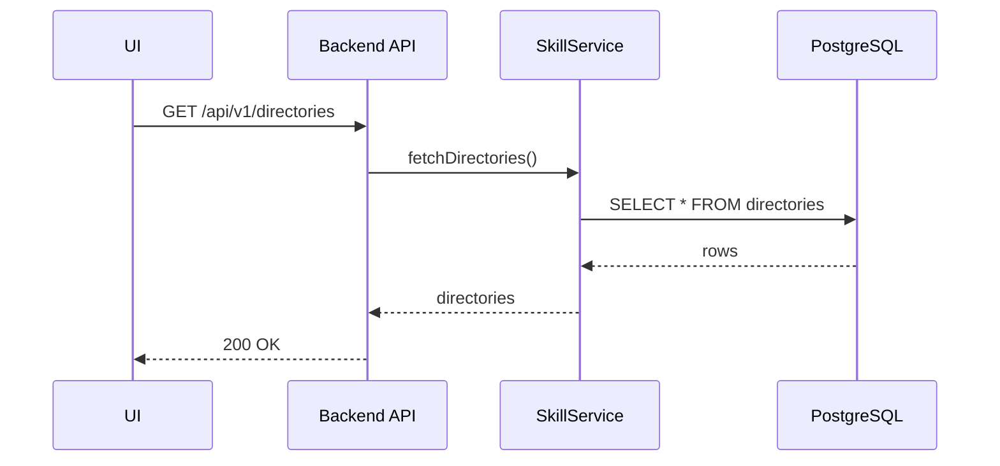
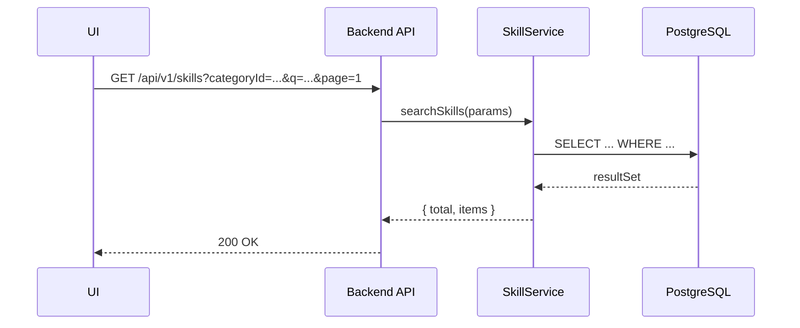
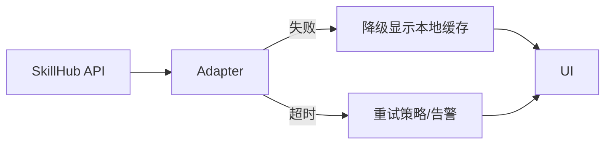

# 技能管理页改造设计文档（分类搜索 + 文件目录展示）

本设计文档针对已实现的技能管理页面，在现有能力基础上扩展“分类搜索”和“文件目录树展示”两大功能，提供从需求分析到实现细节的完整方案，便于开发、测试与上线落地。

## 1. 需求分析

### 1.1 需求背景
- 现有技能管理页已具备基本的技能列表、搜索框与简单筛选。为提升用户检索效率与浏览深度，需增加基于类别的分组检索、以及基于层级结构的文件目录展示，帮助用户快速定位到目标技能及其组织结构。
- 引入目录树与分类导航后，需保持与现有 UI 设计的一致性，且需要对大规模技能库存提供高效的分页与缓存策略，确保良好响应。

### 1.2 需求场景分析
- 场景 A：分类检索。用户通过分类筛选快速聚焦某一类技能，例如 "NLP > 文本摘要"。
- 场景 B：目录导航。左侧目录树直观展示目录结构，选中节点后中部技能列表按所选目录过滤。
- 场景 C：混合筛选。用户同时使用文本搜索、分类筛选和目录筛选以缩小范围。
- 场景 D：性能与可用性。在大量技能条目下，检索应具备快速响应、合理的分页和缓存策略，且在网络波动时提供降级策略。

### 1.3 对现有功能影响
- 数据模型与接口：需要扩展技能、目录、分类的模型，并提供新的查询条件与字段。
- UI 层：新增目录树组件、分类筛选组件及与现有列表联动的状态管理。
- 服务层：实现多源/多条件筛选的后端查询逻辑、缓存策略和幂等执行保障。
- 数据安全与日志：对新字段和筛选条件进行审计与日志记录，确保对敏感数据的访问可追踪。
- 流水线与部署：新增接口测试用例、端到端测试场景及监控指标。

### 1.4 架构影响
- 引入新的 UI 组件与后端查询维度，前后端通过清晰的 DTO 与 API 合约解耦。
- 数据层需要支持目录结构的层级关系与技能对接，目录节点可增量加载，避免一次性加载全部节点。
- 增强缓存策略：目录结构、分类列表、技能列表的缓存命中率对整体性能影响显著。
- 增强的观测性：对查询路径、目录展开、筛选条件触发的请求进行指标化监控。

## 2. 功能设计

### 2.1 约束
- 保持最小侵入：在现有技能数据模型基础上新增可选字段，不破坏现有 API。
- 性能优先：对目录树深度与技能数量较大的场景，分页、虚拟滚动与缓存策略要有效。
- UI/UX 一致性：按照现有设计语言，确保新组件风格统一、无缝融入现有页面。
- 安全与合规：涉及用户输入的搜索和筛选参数需经过输入校验，避免注入与越权访问。

### 2.2 整体方案设计
- 模块划分：
  - UI 组件：DirectoryTree（目录树）、CategoryFilter（分类筛选）、SkillList（技能列表）、Breadcrumb（路径导航）等。
  - 服务层：SkillService 提供多条件查询、目录过滤、排序和分页；DirectoryService 与 CategoryService 提供目录/分类数据。
  - 数据层：Skill、Directory、Category 三张核心表，新增缓存层用于技能与目录数据。
- 数据流与交互：前端通过统一的 API 入口，按 Category、Directory、Query 组合进行查询；服务器使用分层缓存和索引优化来提升查询性能。
- 缓存策略：技能列表与目录树数据在 Redis 中缓存，TTL 设定在 5-15 分钟，热度高的分类/目录可提升缓存命中率。
- 并发与幂等：查询接口具备幂等性，若重复请求保持幂等性；同步/导入操作单独走背端任务队列以确保稳定。

### 2.3 详细方案设计

#### 2.3.1 数据模型设计（草案）
- Directory
  - id: string
  - name: string
  - parentId: string | null
  - path: string  // 形如 "/根目录/子目录"
  - depth: int
  - createdAt: Date
  - updatedAt: Date

- Category
  - id: string
  - name: string
  - parentId: string | null
  - path: string
  - description: string | null
  - createdAt: Date
  - updatedAt: Date

- Skill
  - id: string
  - name: string
  - description: string | null
  - dirId: string | null
  - categoryIds: string[] | null
  - tags: string[] | null
  - status: string
  - origin: string
  - updateTime: Date
  - rating: number | null
  - mappings: object | null

#### 2.3.2 DTO 设计（示例）
- SkillDTO
  - id, name, description, tags, status, rating, origin, dirId, categoryIds, updateTime
- DirectoryDTO
  - id, name, depth, path, parentId, childCount
- CategoryDTO
  - id, name, parentId, path, description

#### 2.3.3 API 设计（核心端点）
- GET /api/v1/skills
  - 参数：categoryId, dirId, q, tags, status, sort, page, pageSize
  - 响应：{ total, page, pageSize, items: SkillDTO[] }
- GET /api/v1/skills/{id}
  - 参数：id（Skill ID）
  - 响应：SkillDetailDTO
- GET /api/v1/directories
  - 参数：parentId, depth
  - 响应：DirectoryDTO[]
- GET /api/v1/categories
  - 响应：CategoryDTO[]
- POST /api/v1/skills/mapping/import
  - 请求：{ mappings: [{ hubField, localField, dataType, description }], dryRun }
  - 响应：{ applied: number, warnings?: string[] }

#### 2.3.4 安全与鉴权
- 对外 API 使用 OAuth2 或 API Key；对内微服务 API 使用服务网格/组策略实现互认证。
- 参数校验使用运行时校验库，返回统一的 Problem Details 错误对象。
- 请求限流与速率限制，保护目录树深层次请求的稳定性。

#### 2.3.5 测试策略
- 单元测试：SkillService、DirectoryService、CategoryService 的边界与业务规则。
- 集成测试：API 层的端到端请求/响应、分页、排序、筛选、路径联动。
- 性能/压力测试：对目录深度大、技能条目多的场景进行基线测试。
- UI 测试：目录树展开与筛选联动、分类筛选与技能列表联动的端到端测试。

### 2.4 功能原理
- 分类筛选：客户端通过多选/文本输入生成组合查询条件，服务端对技能进行联合筛选、排序与分页。
- 目录树导航：目录节点点击触发目录条件筛选，服务端返回该节点及子节点的技能集合，前端渲染树形结构与分页数据。
- 联动更新：当选择目录/分类时，左侧树和顶部筛选器会触发新的查询请求，确保 UI 状态的一致性。
- 缓存与降级：技能列表和目录树数据在 Redis 中缓存，网络异常时优先返回最近的缓存数据并显示友好提示。
- 安全与合规：所有操作均输出审计日志，敏感字段进行脱敏，接口参数做严格校验。

### 2.5 界面设计
- 左侧目录树：DirectoryTree 组件，以树形结构呈现目录，节点可展开/折叠。
- 顶部筛选区：CategoryFilter 组件，展示分类筛选的多选标签和搜索框。
- 右上：全局搜索框（按技能名/描述/标签全文检索）。
- 主区域：SkillList/Grid，技能卡片，支持分页、排序、快速预览和进入详情。
- 面包屑导航：Breadcrumb，显示当前目录路径，支持快速返回。
- 详情/编辑：点击技能卡，展示详情页，包含映射、版本、来源、所属目录等信息，并提供映射管理入口。

### 2.6 数据结构设计（数据字典）
- Directory、Category、Skill 三大核心表的字段设计以及关系。
- DTO/Detail DTO 的字段集合及示例。

### 2.7 安全与合规
- 认证与授权、日志审计、数据脱敏、最小权限原则等要点。

### 2.8 流程图与架构图（Mermaid）
- 架构图：UI <-> Backend API <-> Service <-> DB/Cache 的多层关系
- 查询流与缓存：目录选择/筛选/搜索的请求路径、缓存命中、降级路径
- 降级路径示意图：缓存优先、必要时回退到数据库

## 3. 验收标准
- UI 分类筛选、目录导航与搜索的联动正确性、响应时间、分页正确性
- 目录树深度与技能数量下的性能表现
- 缓存命中率、降级路径的用户体验友好性
- 安全、日志、审计符合现有规范

## 4. 流程图与架构图示意（Mermaid）
- 目录加载与筛选流程

- 分类筛选与技能列表联动

- 错误处理与降级示意

## 5. 变更计划与回滚
- 先实现 UI 与后端的最小可行集（目录树 + 分类筛选 + 基础技能查询），确保不破坏现有行为。
- 逐步引入缓存、幂等、降级、并发控制、监控等非功能性需求。
- 灰度上线，提供回滚路径。

## 6. 风险与缓解
- API 变更风险：通过字段映射表与契约化接口降低耦合
- 数据一致性风险：对多源数据实施版本对齐与幂等写入
- 性能风险：缓存与分页策略，必要时对查询进行分片/并行化
- 安全风险：日志脱敏、凭证管理、最小权限

## 7. 附件/计划输出
- 最终落地时可以产出：OpenAPI 3.0 规范、DDL/迁移脚本、TypeScript DTO 与接口、前端组件草图、Mermaid 完整图表等。
