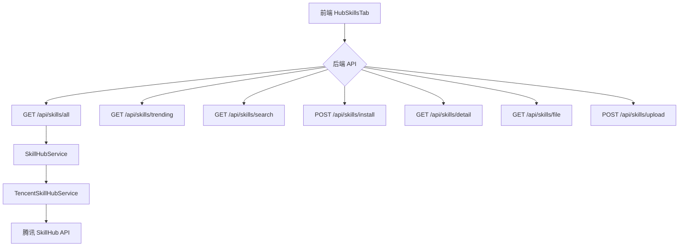
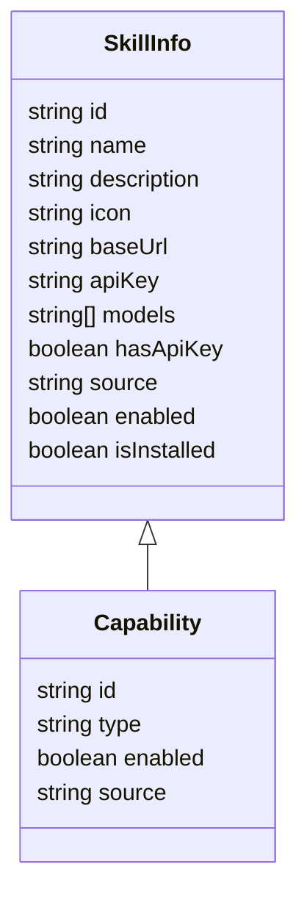

# 技能管理页面设计文档

版本：1.0
范围：基于现有实现的技能体系与接口，整理成设计文档，提供设计思路、数据模型、API 约束、UI 架构以及后续演进路线。

Author: OpenAI Assistant

---

## 1. 需求分析

- 目标
  - 提供一个统一的技能管理入口，覆盖三类技能来源：
    - 官方预置技能（cat-cafe 官方技能）
    - 通过 SkillHub 安装的外部技能
    - 本地上传/导入的本地技能
  - 保持现有能力：技能列表分页、搜索、技能详情查看、文件预览、技能安装与卸载、技能上传等。
- 现状与痛点
  - capabilites.json 与 installed-skills.json 同时维护技能元数据与安装记录。
  - 用户本地技能有时会混入在 UI 中，影响筛选与体验。
- 约束（非功能性）
  - 安全性：对路径遍历、ZIP 内容、上传内容、以及文件写入进行严格校验。
  - 兼容性：尽量向后兼容现有 UI（热门技能端点 /api/skills/trending），并使用 /api/skills/all 引入全部技能。
  - 性能：全部技能采用分页加载，避免一次性请求太多数据。

### 1.1 需求场景分析

#### 场景一：技能广场浏览
- **角色**：普通用户
- **场景**：用户打开技能广场页面，浏览可用的技能
- **流程**：
  1. 用户进入技能广场
  2. 系统加载全部技能列表（分页，每页 24 条）
  3. 用户可以滚动或点击"加载更多"查看更多技能
  4. 每个技能卡片展示：名称、描述、分类标签、star 数量、安装状态
- **期望**：页面加载流畅，分页加载无感知，技能信息展示完整

#### 场景二：技能搜索
- **角色**：普通用户
- **场景**：用户想要找到特定功能的技能
- **流程**：
  1. 用户在搜索框输入关键字（如"ppt"、"文档处理"）
  2. 按下回车键
  3. 系统调用搜索 API，返回匹配结果
  4. 显示搜索结果数量和列表
- **期望**：搜索结果准确，数量与后端一致，支持分页搜索

#### 场景三：技能安装
- **角色**：普通用户
- **场景**：用户发现一个有用的技能，想要安装到本地
- **流程**：
  1. 用户在技能卡片上点击"安装"按钮
  2. 系统调用安装 API
  3. 后端从 SkillHub 下载 ZIP，解压，写入本地目录
  4. 更新 installed-skills.json 和 capabilities.json
  5. 前端更新技能状态，显示"已安装"
- **期望**：安装过程有明确状态反馈，成功/失败都有提示

#### 场景四：技能详情查看
- **角色**：普通用户
- **场景**：用户想要查看技能的详细信息和使用说明
- **流程**：
  1. 用户点击技能的"查看详情"按钮
  2. 系统弹出详情模态框
  3. 展示 SKILL.md 内容、文件树结构、技能元数据
- **期望**：详情展示清晰，SKILL.md 正确渲染

#### 场景五：技能卸载
- **角色**：普通用户
- **场景**：用户不再需要某个已安装的技能
- **流程**：
  1. 用户在已安装技能上点击"卸载"按钮
  2. 系统调用卸载 API
  3. 后端删除本地文件、符号链接、更新记录
  4. 前端更新技能状态
- **期望**：卸载成功，技能从系统中移除

#### 场景六：本地上传技能
- **角色**：高级用户
- **场景**：用户有自己的技能包，想要导入系统
- **流程**：
  1. 用户点击"上传技能"按钮
  2. 用户提供技能名称和文件列表（JSON 格式）
  3. 系统调用上传 API
  4. 后端校验文件、写入 cat-cafe-skills/ 目录
  5. 更新 capabilities.json
- **期望**：上传过程有校验，错误信息友好

### 1.2 用例图（ASCII 版）

```
                    ┌─────────────────────────┐
                    │      普通用户          │
                    └───────────┬─────────────┘
                                │
        ┌───────────────────────┼───────────────────────┐
        │                       │                       │
        ▼                       ▼                       ▼
┌───────────────┐      ┌───────────────┐      ┌───────────────┐
│  浏览技能     │      │  搜索技能     │      │  查看详情    │
│ (分页/加载)   │      │  (关键字搜索)  │      │ (SKILL.md)   │
└───────┬───────┘      └───────┬───────┘      └───────┬───────┘
        │                     │                       │
        ▼                     │                       │
┌───────────────┐             │                       │
│  安装技能     │◄────────────┘                       │
└───────┬───────┘                                     │
        │                                             │
        ▼                                             │
┌───────────────┐                                     │
│  卸载技能     │─────────────────────────────────────┘
└───────────────┘

                    ┌─────────────────────────┐
                    │      高级用户           │
                    └───────────┬─────────────┘
                                │
                                ▼
                    ┌───────────────────────────┐
                    │   本地上传技能            │
                    │   (JSON 格式文件导入)    │
                    └───────────────────────────┘
```

### 1.3 架构影响分析

#### 1.3.1 受影响的模块

| 模块 | 影响程度 | 说明 |
|------|----------|------|
| 前端 HubSkillsTab | 高 | 核心展示组件，需要支持分页、搜索、状态管理 |
| 前端 HubCapabilityTab | 中 | 能力中心，已有的技能管理，可能需要统一数据源 |
| 后端 /api/skills/* | 高 | 新增 /api/skills/all 端点，修改搜索逻辑 |
| 后端 capabilities.json | 中 | 技能元数据存储，需要支持 source 字段区分 |
| 后端 installed-skills.json | 中 | 安装记录管理 |
| 文件系统 cat-cafe-skills/ | 中 | 技能实际存储目录 |

#### 1.3.2 数据流变化

**现有数据流：**
```
用户 → HubSkillsTab → /api/skills/trending → TencentSkillHubService → 腾讯 API
```

**新增/修改后数据流：**
```
用户 → HubSkillsTab ──→ /api/skills/all (全部技能，分页)
         │                    │
         │              TencentSkillHubService → 腾讯 API
         │
         └─→ /api/skills/search (搜索)
         │
         └─→ /api/skills/install (安装)
         │
         └─→ /api/skills/detail (详情)
         │
         └─→ /api/skills/upload (上传)
```

#### 1.3.3 依赖关系

```
┌────────────────────────────────────────────────────────────┐
│                        前端                                │
│  ┌──────────────────┐    ┌──────────────────┐             │
│  │  HubSkillsTab   │    │ HubCapabilityTab │             │
│  └────────┬─────────┘    └────────┬─────────┘             │
│           │                      │                        │
│           └──────────┬───────────┘                        │
│                      ▼                                    │
│            ┌─────────────────┐                            │
│            │   apiFetch     │                            │
│            └────────┬────────┘                            │
└─────────────────────┼─────────────────────────────────────┘
                      │
┌─────────────────────┼─────────────────────────────────────┐
│                     ▼           后端                       │
│            ┌─────────────────┐                            │
│            │   skills.ts   │  (路由层)                   │
│            └────────┬────────┘                            │
│                     │                                      │
│     ┌───────────────┼───────────────┐                      │
│     ▼               ▼               ▼                      │
│ ┌────────┐   ┌────────────┐   ┌────────────┐              │
│ │SkillHub│   │SkillInstall│   │Capabilities│              │
│ │Service │   │ Manager    │   │   .ts     │              │
│ └───┬────┘   └─────┬──────┘   └─────┬──────┘              │
│     │              │                │                      │
│     ▼              ▼                ▼                      │
│ TencentSkillHub   文件系统      JSON 存储                 │
│ Service                                               │
└─────────────────────────────────────────────────────────┘
```

### 1.5 时序图

#### 1.5.1 整体功能流程时序图（完整链路）

```
┌─────────┐     ┌──────────┐     ┌──────────┐     ┌─────────────┐     ┌──────────────┐     ┌──────────┐
│ 用户   │     │前端Hub   │     │ API路由   │     │ SkillHubSvc │     │ 文件系统    │     │ 腾讯API  │
│        │     │SkillsTab │     │ skills.ts │     │             │     │ cat-cafe-sk │     │          │
└────┬────┘     └────┬─────┘     └────┬─────┘     └──────┬──────┘     └──────┬───────┘     └──────┬───────┘
     │               │                │                │                │                │
     │ ════════════════════════════════════════════════════════════════════════════════════════ │
     │                                 1. 页面初始化加载                                          │
     │ ════════════════════════════════════════════════════════════════════════════════════════ │
     │ 1.1 进入技能广场                                                             │
     │──────────────>│                                                                │
     │               │                                                                │
     │               │ 1.2 useEffect 触发 loadSkills(1)                               │
     │               │────────────────────────────────>│                                │
     │               │                │                │                                │
     │               │                │                │ 1.3 GET /api/skills/all      │
     │               │                │                │────────────────────────────────>│
     │               │                │                │                │                │
     │               │                │                │                │  1.4 GET /api/skills?page=1
     │               │                │                │                │────────────────────────────────>│
     │               │                │                │                │                │
     │               │                │                │                │  1.5 返回技能列表               │
     │               │                │                │                │<────────────────────────────────│
     │               │                │                │                │                │
     │               │                │  1.6 返回 {skills:[], total, page, hasMore}   │
     │               │                │<────────────────────────────────│                │
     │               │                │                │                │                │
     │               │ 1.7 返回技能列表+分页信息                                     │
     │               │<────────────────────────────────│                                │
     │               │                │                │                │                │
     │  1.8 渲染技能卡片列表                                                        │
     │<──────────────│                │                │                │                │
     │               │                │                │                │                │
     │ ════════════════════════════════════════════════════════════════════════════════════════ │
     │                                 2. 分页加载（加载更多）                                │
     │ ════════════════════════════════════════════════════════════════════════════════════════ │
     │ 2.1 点击"加载更多"                                                          │
     │──────────────>│                                                                │
     │               │                                                                │
     │               │ 2.2 handleLoadMore -> loadSkills(currentPage+1, true)          │
     │               │────────────────────────────────>│                                │
     │               │                │                │                                │
     │               │                │                │ 2.3 GET /api/skills/all?page=2 │
     │               │                │                │────────────────────────────────>│
     │               │                │                │                │                │
     │               │                │                │                │  2.4 返回下一页数据            │
     │               │                │                │                │<────────────────────────────────│
     │               │                │                │                │                │
     │               │ 2.5 合并 prev.skills + new.skills                              │
     │               │────────────────────────────────>│                                │
     │               │                │                │                │                │
     │  2.6 渲染新增的技能卡片                                                      │
     │<──────────────│                │                │                │                │
     │               │                │                │                │                │
     │ ════════════════════════════════════════════════════════════════════════════════════════ │
     │                                 3. 搜索功能流程                                      │
     │ ════════════════════════════════════════════════════════════════════════════════════════ │
     │ 3.1 输入搜索关键字                                                            │
     │──────────────>│                                                                │
     │               │                                                                │
     │ 3.2 按回车键                                                                  │
     │──────────────>│                                                                │
     │               │                                                                │
     │               │ 3.3 handleSearch(query) -> setIsSearching(true)               │
     │               │────────────────────────────────>│                                │
     │               │                │                │                                │
     │               │                │                │ 3.4 GET /api/skills/search?keyword=xxx │
     │               │                │                │────────────────────────────────>│
     │               │                │                │                │                │
     │               │                │                │                │  3.5 GET /api/skills?keyword=xxx  │
     │               │                │                │                │────────────────────────────────>│
     │               │                │                │                │                │
     │               │                │                │                │  3.6 返回搜索结果               │
     │               │                │                │                │<────────────────────────────────│
     │               │                │                │                │                │
     │               │                │  3.7 返回搜索结果                                  │
     │               │                │<────────────────────────────────│                │
     │               │                │                │                │                │
     │               │ 3.8 显示搜索结果                                                │
     │               │<────────────────────────────────│                                │
     │               │                │                │                │                │
     │  3.9 渲染搜索结果列表                                                        │
     │<──────────────│                │                │                │                │
     │               │                │                │                │                │
     │ ════════════════════════════════════════════════════════════════════════════════════════ │
     │                                 4. 技能安装流程                                      │
     │ ════════════════════════════════════════════════════════════════════════════════════════ │
     │ 4.1 点击技能卡片的"安装"按钮                                                │
     │──────────────>│                                                                │
     │               │                                                                │
     │               │ 4.2 setInstallStatus(skill, 'installing')                     │
     │               │────────────────────────────────>│                                │
     │               │                │                │                │                │
     │               │                │                │ 4.3 POST /api/skills/install │
     │               │                │                │────────────────────────────────>│
     │               │                │                │                │                │
     │               │                │                │  4.4 fetchSkillAllFiles(owner,repo,skill) │
     │               │                │                │────────────────────────────────>│
     │               │                │                │                │                │
     │               │                │                │                │  4.5 GET /api/v1/download?slug=xxx │
     │               │                │                │                │────────────────────────────────>│
     │               │                │                │                │                │
     │               │                │                │                │  4.6 返回 ZIP 文件              │
     │               │                │                │                │<────────────────────────────────│
     │               │                │                │                │                │
     │               │                │                │  4.7 JSZip 解压校验 SKILL.md   │
     │               │                │                │────────────────────────────────>│
     │               │                │                │                │                │
     │               │                │                │  4.8 写入 cat-cafe-skills/{skill}/ │
     │               │                │                │────────────────────────────────>│
     │               │                │                │                │                │
     │               │                │                │  4.9 更新 installed-skills.json │
     │               │                │                │────────────────────────────────>│
     │               │                │                │                │                │
     │               │                │  4.10 返回安装结果 {success: true}              │
     │               │                │<────────────────────────────────│                │
     │               │                │                │                │                │
     │               │ 4.11 markSkillInstalled(slug) -> 更新 isInstalled=true       │
     │               │<────────────────────────────────│                                │
     │               │                │                │                │                │
     │  4.12 更新UI显示"已安装"按钮                                                │
     │<──────────────│                │                │                │                │
     │               │                │                │                │                │
     │ ════════════════════════════════════════════════════════════════════════════════════════ │
     │                                 5. 技能详情查看流程                                  │
     │ ════════════════════════════════════════════════════════════════════════════════════════ │
     │ 5.1 点击技能"查看详情"                                                      │
     │──────────────>│                                                                │
     │               │                                                                │
     │               │ 5.2 GET /api/skills/detail?name=xxx                          │
     │               │────────────────────────────────>│                                │
     │               │                │                │                │                │
     │               │                │                │  5.3 读取 cat-cafe-skills/{name}/ │
     │               │                │                │────────────────────────────────>│
     │               │                │                │                │                │
     │               │                │                │                │  5.4 读取 SKILL.md 内容        │
     │               │                │                │                │────────────────────────────────>│
     │               │                │                │                │                │
     │               │                │                │  5.5 构建文件树结构              │
     │               │                │                │────────────────────────────────>│
     │               │                │                │                │                │
     │               │                │  5.6 返回 {skillInfo, fileTree, content}     │
     │               │                │<────────────────────────────────│                │
     │               │                │                │                │                │
     │               │ 5.7 显示详情模态框                                             │
     │               │<────────────────────────────────│                                │
     │               │                │                │                │                │
     │  5.8 渲染 SKILL.md + 文件树                                                 │
     │<──────────────│                │                │                │                │
     │               │                │                │                │                │
     │ ════════════════════════════════════════════════════════════════════════════════════════ │
     │                                 6. 技能上传流程                                      │
     │ ════════════════════════════════════════════════════════════════════════════════════════ │
     │ 6.1 点击"上传技能"                                                          │
     │──────────────>│                                                                │
     │               │                                                                │
     │               │ 6.2 填写技能名称+文件列表                                       │
     │──────────────>│                                                                │
     │               │                                                                │
     │               │ 6.3 POST /api/skills/upload {name, files:[...]}              │
     │               │────────────────────────────────>│                                │
     │               │                │                │                │                │
     │               │                │                │  6.4 校验skill名称 (防路径穿越) │
     │               │                │                │────────────────────────────────>│
     │               │                │                │                │                │
     │               │                │                │  6.5 创建 cat-cafe-skills/{name}/ │
     │               │                │                │────────────────────────────────>│
     │               │                │                │                │                │
     │               │                │                │  6.6 写入上传的文件               │
     │               │                │                │────────────────────────────────>│
     │               │                │                │                │                │
     │               │                │                │  6.7 更新 capabilities.json      │
     │               │                │                │────────────────────────────────>│
     │               │                │                │                │                │
     │               │                │  6.8 返回 {success: true}                    │
     │               │                │<────────────────────────────────│                │
     │               │                │                │                │                │
     │               │ 6.9 显示上传成功                                               │
     │               │<────────────────────────────────│                                │
     │               │                │                │                │                │
     │  6.10 刷新技能列表                                                           │
     │──────────────>│                │                │                │                │
     │               │                │                │                │                │
     │ ════════════════════════════════════════════════════════════════════════════════════════ │
     │                                 7. 技能卸载流程                                      │
     │ ════════════════════════════════════════════════════════════════════════════════════════ │
     │ 7.1 点击已安装技能的"卸载"                                                  │
     │──────────────>│                                                                │
     │               │                                                                │
     │               │ 7.2 POST /api/skills/uninstall {name}                          │
     │               │────────────────────────────────>│                                │
     │               │                │                │                │                │
     │               │                │                │  7.3 检查是否在 installed-skills.json │
     │               │                │                │────────────────────────────────>│
     │               │                │                │                │                │
     │               │                │                │  7.4 删除 cat-cafe-skills/{name}/ │
     │               │                │                │────────────────────────────────>│
     │               │                │                │                │                │
     │               │                │                │  7.5 删除符号链接               │
     │               │                │                │────────────────────────────────>│
     │               │                │                │                │                │
     │               │                │                │  7.6 更新 installed-skills.json │
     │               │                │                │────────────────────────────────>│
     │               │                │                │                │                │
     │               │                │  7.7 返回 {success: true}                     │
     │               │                │<────────────────────────────────│                │
     │               │                │                │                │                │
     │               │ 7.8 更新UI移除技能                                            │
     │               │<────────────────────────────────│                                │
     │               │                │                │                │                │
     │  7.9 刷新列表显示                                                            │
     │<──────────────│                │                │                │                │
     │               │                │                │                │                │
```

#### 1.5.2 技能列表加载时序图

```
┌─────────┐     ┌──────────┐     ┌──────────┐     ┌─────────────┐     ┌──────────────┐
│ 用户   │     │前端组件  │     │ API路由   │     │ SkillHubSvc │     │ 腾讯API     │
└────┬────┘     └────┬─────┘     └────┬─────┘     └──────┬──────┘     └──────┬───────┘
     │               │                │                │                │
     │ 1.进入页面    │                │                │                │
     │──────────────>│                │                │                │
     │               │                │                │                │
     │               │ 2.GET /api/skills/all?page=1   │                │
     │               │────────────────────────────────>│                │
     │               │                │                │                │
     │               │                │  3.调用 listAllSkills            │
     │               │                │────────────────────────────────>│
     │               │                │                │                │
     │               │                │                │  4.GET /api/skills?page=1&pageSize=24
     │               │                │                │──────────────────────────>│
     │               │                │                │                │
     │               │                │                │  5.返回技能列表           │
     │               │                │                │<──────────────────────────│
     │               │                │                │                │
     │               │                │  6.返回数据   │                │
     │               │                │<────────────────────────────────│
     │               │                │                │                │
     │               │ 7.返回技能列表 │                │                │
     │               │<────────────────────────────────│                │
     │               │                │                │                │
     │  8.渲染技能列表│                │                │                │
     │<──────────────│                │                │                │
     │               │                │                │                │
```

#### 1.5.2 技能搜索时序图

```
┌─────────┐     ┌──────────┐     ┌──────────┐     ┌─────────────┐     ┌──────────────┐
│ 用户   │     │前端组件  │     │ API路由   │     │ SkillHubSvc │     │ 腾讯API     │
└────┬────┘     └────┬─────┘     └────┬─────┘     └──────┬──────┘     └──────┬───────┘
     │               │                │                │                │
     │ 1.输入关键字  │                │                │                │
     │──────────────>│                │                │                │
     │               │                │                │                │
     │               │ 2.按回车搜索   │                │                │
     │               │────────────────────────────────>│                │
     │               │                │                │                │
     │               │                │  3.调用 searchSkills(keyword)    │
     │               │                │────────────────────────────────>│
     │               │                │                │                │
     │               │                │                │  4.GET /api/skills?keyword=xxx
     │               │                │                │──────────────────────────>│
     │               │                │                │                │
     │               │                │                │  5.返回搜索结果           │
     │               │                │                │<──────────────────────────│
     │               │                │                │                │
     │               │                │  6.返回数据   │                │
     │               │                │<────────────────────────────────│
     │               │                │                │                │
     │               │ 7.返回搜索结果 │                │                │
     │               │<────────────────────────────────│                │
     │               │                │                │                │
     │  8.渲染搜索结果│                │                │                │
     │<──────────────│                │                │                │
     │               │                │                │                │
```

#### 1.5.3 技能安装时序图

```
┌─────────┐     ┌──────────┐     ┌──────────┐     ┌─────────────┐     ┌──────────────┐
│ 用户   │     │前端组件  │     │ API路由   │     │ SkillInstall│     │ 腾讯API     │
└────┬────┘     └────┬─────┘     └────┬─────┘     └──────┬──────┘     └──────┬───────┘
     │               │                │                │                │
     │ 1.点击安装    │                │                │                │
     │──────────────>│                │                │                │
     │               │                │                │                │
     │               │ 2.POST /api/skills/install    │                │
     │               │────────────────────────────────>│                │
     │               │                │                │                │
     │               │                │  3.调用 fetchSkillAllFiles      │
     │               │                │────────────────────────────────>│
     │               │                │                │                │
     │               │                │                │  4.GET /api/v1/download
     │               │                │                │────────────────────────────────>│
     │               │                │                │                │
     │               │                │                │  5.返回ZIP文件            │
     │               │                │                │<────────────────────────────────│
     │               │                │                │                │
     │               │                │  6.解压/校验SKILL.md            │
     │               │                │────────────────────────────────>│
     │               │                │                │                │
     │               │                │  7.写入cat-cafe-skills/目录      │
     │               │                │────────────────────────────────>│
     │               │                │                │                │
     │               │                │  8.更新installed-skills.json    │
     │               │                │────────────────────────────────>│
     │               │                │                │                │
     │               │                │  9.返回安装结果                  │
     │               │                │<────────────────────────────────│
     │               │                │                │                │
     │               │ 10.返回安装成功│                │                │
     │               │<────────────────────────────────│                │
     │               │                │                │                │
     │  11.更新UI   │                │                │                │
     │<──────────────│                │                │                │
     │               │                │                │                │
     │  显示"已安装" │                │                │                │
     │<──────────────│                │                │                │
```

#### 1.5.4 技能上传时序图

```
┌─────────┐     ┌──────────┐     ┌──────────┐     ┌─────────────┐     ┌──────────────┐
│ 用户   │     │前端组件  │     │ API路由   │     │ Skills路由  │     │  文件系统   │
└────┬────┘     └────┬─────┘     └────┬─────┘     └──────┬──────┘     └──────┬───────┘
     │               │                │                │                │
     │ 1.填写技能名+文件│            │                │                │
     │──────────────>│                │                │                │
     │               │                │                │                │
     │               │ 2.POST /api/skills/upload      │                │
     │               │────────────────────────────────>│                │
     │               │                │                │                │
     │               │                │  3.校验skill名称              │
     │               │                │────────────────────────────────>│
     │               │                │                │                │
     │               │                │  4.创建cat-cafe-skills/{name}  │
     │               │                │────────────────────────────────>│
     │               │                │                │                │
     │               │                │  5.写入文件到目录               │
     │               │                │────────────────────────────────>│
     │               │                │                │                │
     │               │                │  6.更新capabilities.json        │
     │               │                │────────────────────────────────>│
     │               │                │                │                │
     │               │                │  7.返回上传成功                 │
     │               │                │<────────────────────────────────│
     │               │                │                │                │
     │               │ 8.返回成功    │                │                │
     │               │<────────────────────────────────│                │
     │               │                │                │                │
     │  9.显示成功   │                │                │                │
     │<──────────────│                │                │                │
     │               │                │                │                │
```

#### 1.5.5 技能详情查看时序图

```
┌─────────┐     ┌──────────┐     ┌──────────┐     ┌─────────────┐     ┌──────────────┐
│ 用户   │     │前端组件  │     │ API路由   │     │ Skills路由  │     │  文件系统   │
└────┬────┘     └────┬─────┘     └────┬─────┘     └──────┬──────┘     └──────┬───────┘
     │               │                │                │                │
     │ 1.点击查看详情│                │                │                │
     │──────────────>│                │                │                │
     │               │                │                │                │
     │               │ 2.GET /api/skills/detail?name=xxx             │
     │               │────────────────────────────────>│                │
     │               │                │                │                │
     │               │                │  3.读取cat-cafe-skills/{name}/ │
     │               │                │────────────────────────────────>│
     │               │                │                │                │
     │               │                │  4.读取SKILL.md内容           │
     │               │                │────────────────────────────────>│
     │               │                │                │                │
     │               │                │  5.构建文件树                  │
     │               │                │────────────────────────────────>│
     │               │                │                │                │
     │               │                │  6.返回技能详情+文件树          │
     │               │                │<────────────────────────────────│
     │               │                │                │                │
     │               │ 7.返回详情    │                │                │
     │               │<────────────────────────────────│                │
     │               │                │                │                │
     │  8.显示详情弹窗│                │                │                │
     │<──────────────│                │                │                │
     │               │                │                │                │
```

### 1.6 技术选型

#### 1.4.1 前端技术栈

| 技术 | 选型 | 理由 |
|------|------|------|
| 框架 | React + TypeScript | 现有项目技术栈，保持一致 |
| 状态管理 | useState + useCallback | 轻量级，足够满足分页/搜索需求 |
| API 调用 | apiFetch (已有) | 统一封装，支持认证和错误处理 |
| UI 组件 | 现有 CSS Modules + UI Token | 保持一致的设计语言 |

#### 1.4.2 后端技术栈

| 技术 | 选型 | 理由 |
|------|------|------|
| 框架 | Fastify | 现有项目技术栈 |
| 技能服务 | TencentSkillHubService | 已有实现，封装腾讯 API |
| 技能安装 | SkillInstallManager | 已有实现 ZIP 下载/解压/写入 |
| 数据存储 | JSON 文件 (capabilities.json, installed-skills.json) | 现有实现，轻量且足够 |
| 缓存 | 内存缓存 (Map) | 短期缓存，减少重复请求 |

#### 1.4.3 API 设计原则

1. **RESTful 风格**：使用标准 HTTP 方法 GET/POST/DELETE
2. **分页参数**：统一使用 `page` 和 `limit` 参数
3. **错误处理**：统一返回 `{ error: string }` 结构
4. **认证**：敏感操作（安装/卸载/上传）需要身份认证

#### 1.4.4 关键设计决策

| 决策点 | 选型 | 权衡 |
|--------|------|------|
| 分页大小 | 24 条/页 | 平衡加载速度和用户体验 |
| 搜索方式 | 后端搜索 + 前端回车触发 | 避免频繁请求，支持精确搜索 |
| 缓存策略 | 5 分钟 TTL | 减少重复请求，但保证数据新鲜度 |
| 安全策略 | 严格路径校验 + SKILL.md 强制校验 | 安全性优先，牺牲一定灵活性 |

---

## 2. 方案设计

### 2.1 架构与模块划分
- 前端
  - HubSkillsTab：核心组件，展示技能卡片、分页、搜索、安装状态等。
  - SkillDetailModal：技能详情模态框（可复用，展示 SKILL.md、文件树等）
  - SkillCard/SkillItem：单个技能的 UI 展示单元
  - 三类来源在 UI 上统一呈现，通过 `source` 字段区分：`cat-cafe`、`external`、`local`。
- 后端
  - SkillHubService：对外暴露技能服务接口（分页、热门、搜索、下载、上传等）
  - TencentSkillHubService：对腾讯 SkillHub 的具体实现（搜索、热门、ZIP 下载）
  - 路由层：/api/skills/all、/api/skills/trending、/api/skills/search、/api/skills/install、/api/skills/detail、/api/skills/file、/api/skills/upload
  - 安全策略：统一在服务层实现输入校验、ZIP 内容校验、路径穿越防护、文件写入边界检查。
- 数据
  - capabilities.json：能力的真相源，记录技能的 id、type、enabled、source 等字段。
  - installed-skills.json：SkillHub 安装记录。
  - cat-cafe-skills/：技能实际目录，官方技能与外部 SkillHub 安装合并后的目录。

### 2.2 关键数据模型（简化视图）
- SkillHubSkill（统一外部形态，来自 SkillHub 的映射）
  - id, slug, name, description, tags, repo, owner, createdAt
- SkillInfo（前后端交互最小单位）
  - id, name, description, icon, baseUrl, apiKey, models, hasApiKey, source, enabled, isInstalled
- Capability（capabilities.json 条目示意）
  - id, type: 'skill', enabled, source: 'cat-cafe' | 'external' | 'local', 以及扩展字段

### 2.3 端点设计与契约
- GET /api/skills/all
  - 输入：page, limit（默认 page=1, limit=24）
  - 输出：{ skills: SkillInfo[], total: number, page: number, hasMore: boolean }
  - 逻辑：从 SkillHub 全量列表拉取，标注 isInstalled（通过 installed-skills.json / capabilities.json 的记录）
- GET /api/skills/trending
  - 维持现状，返回热门技能并附带 isInstalled
- GET /api/skills/search
  - 输入：keyword, page, limit
  - 输出：分页结果，与 all 结构一致
- POST /api/skills/install
  - 参数：owner, repo, skill
  - 过程：下载 ZIP → 解压 → 校验 SKILL.md → 写入本地技能目录 → 更新 installed-skills.json 与 capabilities.json
- GET /api/skills/detail
  - 目的：查看已安装技能的详细信息（含目录树）
- GET /api/skills/file
  - 作用：预览技能目录中的文件
- POST /api/skills/upload
  - 作用：本地导入技能，写入 cat-cafe-skills/ 并注册到能力表
- 其它端点
  - /api/capabilities（能力总览，用于能力中心）
- UI 与 UX
  - 将三类来源统一在一个入口，使用筛选/标签/颜色区分来源
  - 提供“加载更多”分页、搜索、详情弹窗的统一体验

### 2.4 UI 组件设计（简述）
- HubSkillsTab：
  - 列表网格（卡片）展示技能
  - 顶部全局搜索框，大类筛选器
  - 加载状态、安装状态指示
- SkillDetailModal：
  - 显示技能描述、类别、图标、SKILL.md 内容、目录树
- SkillCard：
  - 显示名称、描述、分类、图标、是否已安装、操作按钮

### 2.5 交互设计要点
- 安全：对于 skill 名称、路径和 ZIP 内容执行严格的输入校验和访问控制
- 兼容性：保留现有热门接口 /api/skills/trending，新增 /api/skills/all 不破坏现有逻辑
- 可扩展性：后续可将全部技能与热门技能并行，或通过筛选器进行切换

---
## 3. 可靠可用性设计

### 3.1 稳定性与鲁棒性
- 分页加载：默认 24 条，避免单次拉取导致 UI 卡顿
- 下载与解析失败回滚：安装失败时回滚到上一步，给出清晰错误信息
- 缓存策略：对 /api/skills/all 的下载结果进行 TTL 缓存，减少重复请求
- 错误与健康监控：对 API 错误统一兜底，前端显示友好错误提示

### 3.2 安全与合规
- 路径穿越与非法路径检查、ZIP 内容校验、SKILL.md 校验
- 上传大小与安全性控制，日志和审计
- 认证与授权：涉及安装/删除/上传等敏感操作需鉴权

### 3.3 回滚与演进
- 数据结构向后兼容，新增字段默认空值即可
- 变更采用增量迁移，避免破坏现有能力
- 新功能以特性分支实现，逐步合并/回滚

---
## 4. 数据与 API 示例

### 4.1 SkillInfo 示例
```json
{
  "id": "skill-1",
  "name": "skill-1",
  "description": "描述",
  "icon": "/uploads/skill1.png",
  "baseUrl": "https://example.com",
  "apiKey": "xxxxx",
  "models": ["model-a"],
  "hasApiKey": true,
  "source": "external",
  "enabled": true,
  "isInstalled": false
}
```

### 4.2 Capabilities.json 示例
```json
{
  "version": 1,
  "capabilities": [
    {
      "id": "cat-cafe-collab",
      "type": "mcp",
      "enabled": true,
      "source": "cat-cafe"
    },
    {
      "id": "adaptive-reasoning",
      "type": "skill",
      "enabled": true,
      "source": "cat-cafe"
    },
    {
      "id": "skill-1",
      "type": "skill",
      "enabled": true,
      "source": "external"
    }
  ]
}
```

### 4.3 端点请求/响应示例
- GET /api/skills/all?page=1&limit=24
  - 请求需要认证，响应包含技能列表与分页信息
- GET /api/skills/trending
- GET /api/skills/search?keyword=alpha&page=1&limit=20
- POST /api/skills/install
- GET /api/skills/detail?name=my-skill
- POST /api/skills/upload

---
## 5. 里程碑与演进路线

- 里程碑 1：完成 /api/skills/all、/api/skills/trending 的端到端测试用例
- 里程碑 2：实现 /api/skills/search 的分页与过滤覆盖边界
- 里程碑 3：完善 SkillDetailModal 的 UI/UX，确保能够直观查看 SKILL.md 与文件树
- 里程碑 4：实现本地上传的批量导入或增量导入策略
- 里程碑 5：完善安全审计与日志，提供可观测性指标

---
## 6. 附录

- Mermaid 图表：系统架构与数据流


- 数据结构图（简化版）


---
此文档可直接用于设计评审、PR 评审清单和落地实现。若需要，我可以把这份文档导出成可下载的 PDF 或添加图片的正式排版版本。请告诉我你偏好的输出格式（MD/PDF/both）以及是否要把示例代码块进一步扩展成可直接粘贴到代码中的片段。 
