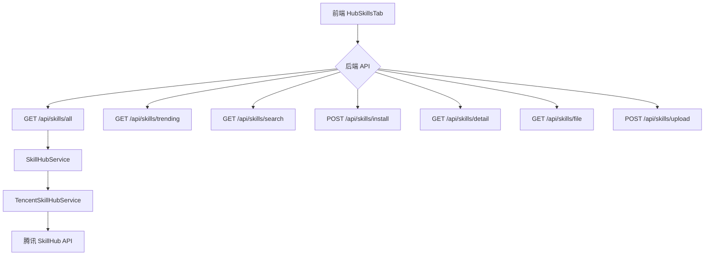
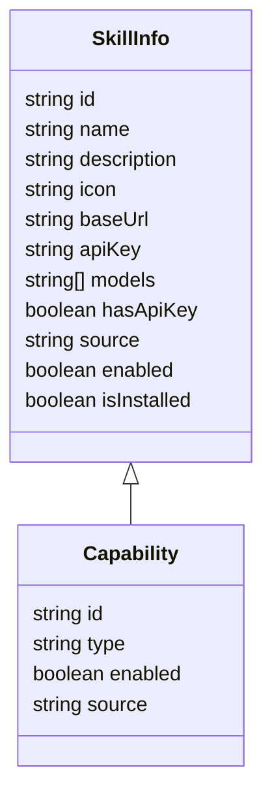

# 技能管理页面设计文档

版本：1.0
范围：基于现有实现的技能体系与接口，整理成设计文档，提供设计思路、数据模型、API 约束、UI 架构以及后续演进路线。

Author: OpenAI Assistant

---

## 1. 需求分析

- 目标
  - 提供一个统一的技能管理入口，覆盖三类技能来源：
    - 官方预置技能（cat-cafe 官方技能）
    - 通过 SkillHub 安装的外部技能
    - 本地上传/导入的本地技能
  - 保持现有能力：技能列表分页、搜索、技能详情查看、文件预览、技能安装与卸载、技能上传等。
- 现状与痛点
  - capabilites.json 与 installed-skills.json 同时维护技能元数据与安装记录。
  - 用户本地技能有时会混入在 UI 中，影响筛选与体验。
- 约束（非功能性）
  - 安全性：对路径遍历、ZIP 内容、上传内容、以及文件写入进行严格校验。
  - 兼容性：尽量向后兼容现有 UI（热门技能端点 /api/skills/trending），并使用 /api/skills/all 引入全部技能。
  - 性能：全部技能采用分页加载，避免一次性请求太多数据。

---
## 2. 方案设计

### 2.1 架构与模块划分
- 前端
  - HubSkillsTab：核心组件，展示技能卡片、分页、搜索、安装状态等。
  - SkillDetailModal：技能详情模态框（可复用，展示 SKILL.md、文件树等）
  - SkillCard/SkillItem：单个技能的 UI 展示单元
  - 三类来源在 UI 上统一呈现，通过 `source` 字段区分：`cat-cafe`、`external`、`local`。
- 后端
  - SkillHubService：对外暴露技能服务接口（分页、热门、搜索、下载、上传等）
  - TencentSkillHubService：对腾讯 SkillHub 的具体实现（搜索、热门、ZIP 下载）
  - 路由层：/api/skills/all、/api/skills/trending、/api/skills/search、/api/skills/install、/api/skills/detail、/api/skills/file、/api/skills/upload
  - 安全策略：统一在服务层实现输入校验、ZIP 内容校验、路径穿越防护、文件写入边界检查。
- 数据
  - capabilities.json：能力的真相源，记录技能的 id、type、enabled、source 等字段。
  - installed-skills.json：SkillHub 安装记录。
  - cat-cafe-skills/：技能实际目录，官方技能与外部 SkillHub 安装合并后的目录。

### 2.2 关键数据模型（简化视图）
- SkillHubSkill（统一外部形态，来自 SkillHub 的映射）
  - id, slug, name, description, tags, repo, owner, createdAt
- SkillInfo（前后端交互最小单位）
  - id, name, description, icon, baseUrl, apiKey, models, hasApiKey, source, enabled, isInstalled
- Capability（capabilities.json 条目示意）
  - id, type: 'skill', enabled, source: 'cat-cafe' | 'external' | 'local', 以及扩展字段

### 2.3 端点设计与契约
- GET /api/skills/all
  - 输入：page, limit（默认 page=1, limit=24）
  - 输出：{ skills: SkillInfo[], total: number, page: number, hasMore: boolean }
  - 逻辑：从 SkillHub 全量列表拉取，标注 isInstalled（通过 installed-skills.json / capabilities.json 的记录）
- GET /api/skills/trending
  - 维持现状，返回热门技能并附带 isInstalled
- GET /api/skills/search
  - 输入：keyword, page, limit
  - 输出：分页结果，与 all 结构一致
- POST /api/skills/install
  - 参数：owner, repo, skill
  - 过程：下载 ZIP → 解压 → 校验 SKILL.md → 写入本地技能目录 → 更新 installed-skills.json 与 capabilities.json
- GET /api/skills/detail
  - 目的：查看已安装技能的详细信息（含目录树）
- GET /api/skills/file
  - 作用：预览技能目录中的文件
- POST /api/skills/upload
  - 作用：本地导入技能，写入 cat-cafe-skills/ 并注册到能力表
- 其它端点
  - /api/capabilities（能力总览，用于能力中心）
- UI 与 UX
  - 将三类来源统一在一个入口，使用筛选/标签/颜色区分来源
  - 提供“加载更多”分页、搜索、详情弹窗的统一体验

### 2.4 UI 组件设计（简述）
- HubSkillsTab：
  - 列表网格（卡片）展示技能
  - 顶部全局搜索框，大类筛选器
  - 加载状态、安装状态指示
- SkillDetailModal：
  - 显示技能描述、类别、图标、SKILL.md 内容、目录树
- SkillCard：
  - 显示名称、描述、分类、图标、是否已安装、操作按钮

### 2.5 交互设计要点
- 安全：对于 skill 名称、路径和 ZIP 内容执行严格的输入校验和访问控制
- 兼容性：保留现有热门接口 /api/skills/trending，新增 /api/skills/all 不破坏现有逻辑
- 可扩展性：后续可将全部技能与热门技能并行，或通过筛选器进行切换

---
## 3. 可靠可用性设计

### 3.1 稳定性与鲁棒性
- 分页加载：默认 24 条，避免单次拉取导致 UI 卡顿
- 下载与解析失败回滚：安装失败时回滚到上一步，给出清晰错误信息
- 缓存策略：对 /api/skills/all 的下载结果进行 TTL 缓存，减少重复请求
- 错误与健康监控：对 API 错误统一兜底，前端显示友好错误提示

### 3.2 安全与合规
- 路径穿越与非法路径检查、ZIP 内容校验、SKILL.md 校验
- 上传大小与安全性控制，日志和审计
- 认证与授权：涉及安装/删除/上传等敏感操作需鉴权

### 3.3 回滚与演进
- 数据结构向后兼容，新增字段默认空值即可
- 变更采用增量迁移，避免破坏现有能力
- 新功能以特性分支实现，逐步合并/回滚

---
## 4. 数据与 API 示例

### 4.1 SkillInfo 示例
```json
{
  "id": "skill-1",
  "name": "skill-1",
  "description": "描述",
  "icon": "/uploads/skill1.png",
  "baseUrl": "https://example.com",
  "apiKey": "xxxxx",
  "models": ["model-a"],
  "hasApiKey": true,
  "source": "external",
  "enabled": true,
  "isInstalled": false
}
```

### 4.2 Capabilities.json 示例
```json
{
  "version": 1,
  "capabilities": [
    {
      "id": "cat-cafe-collab",
      "type": "mcp",
      "enabled": true,
      "source": "cat-cafe"
    },
    {
      "id": "adaptive-reasoning",
      "type": "skill",
      "enabled": true,
      "source": "cat-cafe"
    },
    {
      "id": "skill-1",
      "type": "skill",
      "enabled": true,
      "source": "external"
    }
  ]
}
```

### 4.3 端点请求/响应示例
- GET /api/skills/all?page=1&limit=24
  - 请求需要认证，响应包含技能列表与分页信息
- GET /api/skills/trending
- GET /api/skills/search?keyword=alpha&page=1&limit=20
- POST /api/skills/install
- GET /api/skills/detail?name=my-skill
- POST /api/skills/upload

---
## 5. 里程碑与演进路线

- 里程碑 1：完成 /api/skills/all、/api/skills/trending 的端到端测试用例
- 里程碑 2：实现 /api/skills/search 的分页与过滤覆盖边界
- 里程碑 3：完善 SkillDetailModal 的 UI/UX，确保能够直观查看 SKILL.md 与文件树
- 里程碑 4：实现本地上传的批量导入或增量导入策略
- 里程碑 5：完善安全审计与日志，提供可观测性指标

---
## 6. 附录

- Mermaid 图表：系统架构与数据流


- 数据结构图（简化版）


---
此文档可直接用于设计评审、PR 评审清单和落地实现。若需要，我可以把这份文档导出成可下载的 PDF 或添加图片的正式排版版本。请告诉我你偏好的输出格式（MD/PDF/both）以及是否要把示例代码块进一步扩展成可直接粘贴到代码中的片段。 
