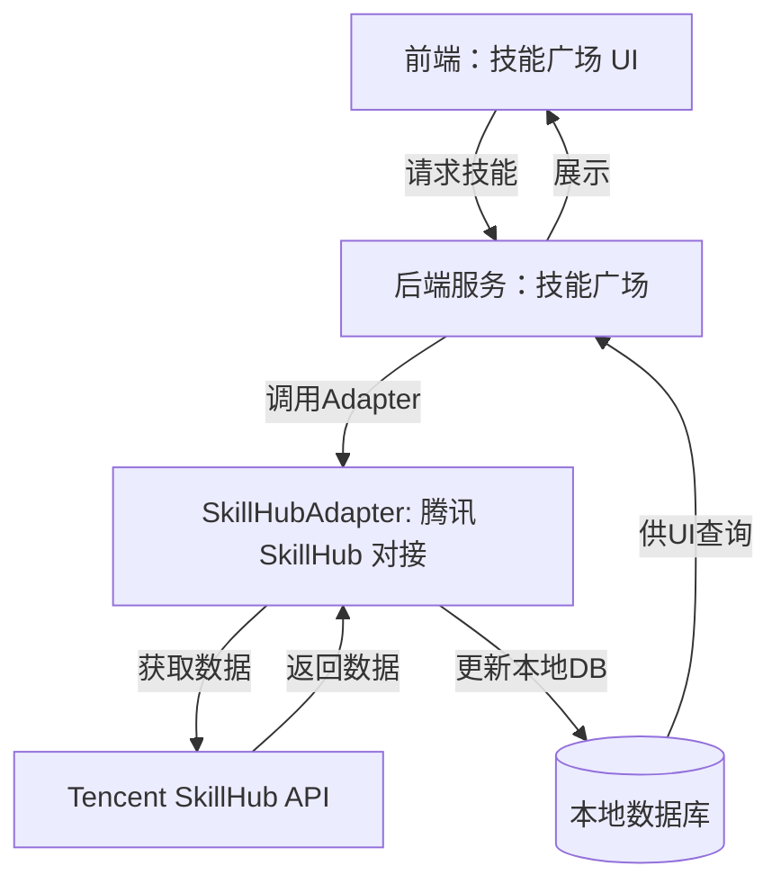
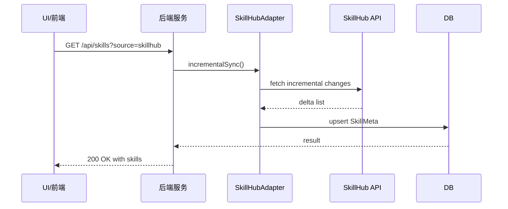
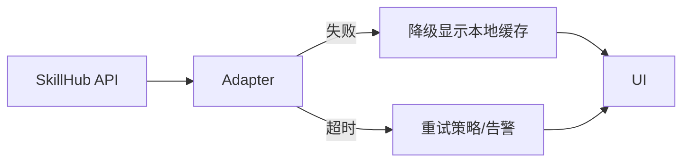

# 腾讯 SkillHub 对接：技能广场整合设计文档（高级版）

本文件在前稿基础上，提供更全面、工程落地友好的设计，包括更细粒度的数据模型、API 接口契约、架构与部署、以及完整的测试、运维与合规章节，便于后续实现、评审与追踪。

## 1. 需求分析（扩展）

- 业务目标：通过对接腾讯 SkillHub，实现技能广场的技能覆盖范围扩大、更新频率提高、以及对外部技能生态的标准化对接。
- 关键用户故事：
  1) 作为管理员，我希望 SkillHub 的技能能够被无缝发现和筛选，且来自 SkillHub 的技能能够与本地技能模型一致地展示在 UI 中。 
  2) 作为开发者/架构师，我希望对 SkillHub 的数据有明确的字段映射、版本控制和增量同步能力，以防止数据不一致。 
  3) 作为运维，我希望对接入源具备可观测性、可追溯性与降级能力，确保系统在异常情况下仍能工作。
- 受限条件：遵循现有技能广场的数据模型、鉴权策略、全局监控框架；如与 SkillHub 的变更，请以字段映射表为主的对齐机制，避免硬编码字段。
- 质量目标：实现高可用的增量同步、稳定的 UI 展现、完整的审计日志、以及可证实的回滚路径。

## 2. 术语与模型

- SkillHub：腾讯提供的外部技能市场，含技能元数据、版本、标签等信息。 
- SkillMeta：本地技能元数据模型，覆盖唯一 ID、名称、描述、版本、标签、来源、来源 ID、更新时间、状态、评分、兼容性、提供方、外部链接等字段。
- SkillSource：数据源定义，标识技能来源（如 skillhub），以及对接端点、认证方式、刷新策略等。
- SkillVersion：技能版本信息，含版本号、发布说明、发布时间、兼容引擎等。
- SkillMapping：SkillHub 字段与本地字段的映射关系，用于字段对齐与迁移。
- SyncJob：同步任务记录，含任务类型（增量/全量）、状态、开始时间、结束时间、影响行数等。
- Cache/CacheEntry：技能列表缓存条目，含缓存时间、TTL、命中/未命中统计。

## 3. 架构设计（高层）

- 组件清单
  - UI/前端：技能广场界面，支持多源筛选与来源标识。
  - Backend Core：技能广场后端服务，提供统一的技能查询、展示、插入和映射接口。
  - SkillHubAdapter：对接腾讯 SkillHub 的数据源适配层，负责 API 调用、数据转换、增量/全量同步、幂等性与降级处理。
  - SkillHub API Gateway：对外暴露 API 的网关层，处理鉴权、限流、缓存与审计。
  - 数据存储：本地数据库（技能元数据表）、缓存（内存/分布式缓存）与审计日志。
  - 运维与监控：Prometheus 指标、日志聚合、告警阈值与仪表盘。

- 数据流概览
  - SkillHubAdapter 从 SkillHub API 拉取数据 -> 转换为本地 SkillMeta 结构 -> 写入本地数据库 -> UI 通过后端 API 读取并展现，支持缓存和降级。

## 4. 数据模型与数据库设计

### 4.1 关系型模型（草案）
- SkillMeta
  - id UUID PK
  - name VARCHAR
  - description TEXT
  - version VARCHAR
  - source VARCHAR (enum: 'skillhub')
  - source_id VARCHAR
  - update_time TIMESTAMPTZ
  - status VARCHAR(32) -- 'new'|'active'|'deprecated'
  - rating DECIMAL(3,2) NULL
  - compatibility JSONB NULL
  - provider VARCHAR(256) NULL
  - url VARCHAR(1024) NULL
  - mapped BOOLEAN DEFAULT FALSE

- SkillSource
  - id UUID PK
  - name VARCHAR
  - type VARCHAR
  - endpoint VARCHAR(1024)
  - authMethod VARCHAR
  - credentialsRef VARCHAR
  - refreshInterval INT -- seconds

- SkillVersion
  - id UUID PK
  - skill_id UUID FK->SkillMeta(id)
  - version VARCHAR
  - releaseNotes TEXT
  - publishedAt TIMESTAMPTZ
  - compatibleEngine VARCHAR[] NULL

- SkillMapping
  - id UUID PK
  - hubField VARCHAR
  - localField VARCHAR
  - dataType VARCHAR

- SyncJob
  - id UUID PK
  - type VARCHAR -- 'incremental'|'full'
  - status VARCHAR
  - startedAt TIMESTAMPTZ
  - finishedAt TIMESTAMPTZ
  - totalRecords INT
  - successRecords INT
  - source VARCHAR
  - message TEXT NULL

- SkillHubCache
  - id UUID PK
  - cacheKey VARCHAR
  - data JSONB
  - createdAt TIMESTAMPTZ
  - ttl INT

### 4.2 数据字典示例（JSON 表示）
{ "skillhub": {"hubId": "skill-123", "name": "文本分析技能", "description": "...", "version": "1.2.3", "tags": ["NLP", "AI"] } }
```

## 5. 接口与契约（设计级）

### 5.1 内部服务接口（TypeScript/TS 伪代码）
interface SkillHubConfig {
  endpoint: string
  apiKey?: string
  timeoutMs?: number
}

interface FetchParams {
  since?: string // ISO 时间戳
  limit?: number
  filters?: Record<string, any>
}

interface SkillMeta {
  id?: string
  name: string
  description?: string
  version?: string
  tags?: string[]
  source: string
  source_id: string
  update_time?: string
  status?: string
  rating?: number
  compatibility?: string[]
  provider?: string
  url?: string
  mapped?: boolean
}

interface SyncResult {
  success: boolean
  inserted: number
  updated: number
  skipped: number
  errors?: string[]
}

interface SkillHubAdapter {
  initialize(cfg: SkillHubConfig): Promise<void>
  fetchSkills(p: FetchParams): Promise<SkillMeta[]>
  incrementalSync(): Promise<SyncResult>
  fullSync(): Promise<SyncResult>
  getSkill(id: string): Promise<SkillMeta | null>
}

### 5.2 外部 REST API 样例（OpenAPI 风格伪代码）
GET /api/skills?source=skillhub&query={string}
POST /api/skills/sync?source=skillhub
GET /api/skill/{id}

Response 200: { data: SkillMeta[] }
Response 202: { status: 'scheduled' }
Response 4xx/5xx: { error: string }

## 6. 数据管线与处理流程

### 6.1 增量 vs 全量策略
- 增量同步基于 SkillHub 提供的版本号、更新时间和变更日志；本地通过 SyncJob 记录变更粒度与状态。
- 全量同步用于初始导入或大范围字段结构变更时执行，执行前需锁表，以避免并发写入冲突。
- 幂等性设计：写入 SkillMeta 时使用 source_id 作为唯一键，避免重复导入。

### 6.2 缓存与降级
- 使用本地缓存 SkillHub 列表，TTL 5-15 分钟，缓存命中优先返回缓存数据，必要时回退到最近一次成功的快照。
- 当 SkillHub API 调用失败时，优先显示缓存数据，并在监控中标记为降级模式。

### 6.3 错误处理策略
- 重试策略：指数退避，最大重试次数 5 次，超过后上报告警。
- 兜底策略：数据不可用时，返回空数据集并显示友好信息。
- 断路保护：对 SkillHub API 的连续失败进行断路，防止雪崩效应。

## 7. 安全与合规

- 证书与凭证：SkillHub 访问凭证存储在受控的凭证库/环境变量中，按最小权限原则配置访问权限。
- 日志与审计：对 SkillHub 调用进行结构化日志记录，避免日志中暴露密钥；对数据变更执行审计日志。
- 数据脱敏：涉及公开字段的展示时，必要处进行脱敏处理。
- 合规性：遵循公司信息安全策略、数据最小化原则。

## 8. Observability 与 监控

- 指标（Prometheus/OpenTelemetry）
  - skillhub_sync_total{status="success|failure|partial"}
  - skillhub_sync_latency_ms
  - skillhub_api_requests_total
  - skillhub_api_errors_total
  - skillhub_cache_hits_total
  - skillhub_cache_mits_total
- 日志：结构化日志，字段包括 time, level, source, operation, statusCode, message, durationMs, requestId。
- 指标仪表盘：展示最近 24 小时的同步趋势、错误分布、延迟分布等。

## 9. 测试策略

- 单元测试：映射逻辑、字段转换、幂等性、错误场景。
- 集成测试：对接 SkillHubAdapter 与外部 API 的端到端测试，使用模拟服务（mock server）
- 合同测试：前后端 API 的稳定性测试，确保契约一致。
- 回归测试：新源加入后对现有技能广场的影响进行回归验证。
- 端到端测试：从 SkillHub 到 UI 的完整流程测试，包含缓存与降级路径。

## 10. UI 设计原则与草图描述

- 来源标识：在技能列表中清晰标注来源（SkillHub），并支持按来源筛选。
- 导入向导：提供从 SkillHub 选择技能映射到本地技能的导入向导，展示变更影响与后续流程（审核/发布等）。
- 详情页：展示 SkillHub 原始元数据、字段映射、版本历史、外部链接等。
- 统一风格：尽量保持与现有技能广场 UI 的一致性，使用相同的图标、 typography 与交互风格。

## 11. 渐进落地计划（阶段性目标）

- 阶段 1：实现 SkillHubAdapter 的骨架与数据模型映射，完成只读展现的 UI 展示。
- 阶段 2：实现增量同步与字段映射的写入本地库，记录 SyncJob。添加缓存与降级路径。
- 阶段 3：实现全量同步、导入向导、以及简单的手动触发接口。
- 阶段 4：增加监控、告警、日志与安全审计，完善测试覆盖。
- 阶段 5：灰度发布，收集使用数据，修复边缘问题。

## 12. 风险评估与对策

- API 变更风险：对 SkillHub API 的变更保持关注，配置灵活的字段映射表来适应变化。
- 数据一致性风险：增量同步需要严格的幂等写入策略与版本对比；实现严格的锁和事务控制。
- 性能风险：高并发时的 API 调用与数据写入压力，需缓存与批量写入优化。
- 安全风险：凭证泄露、日志暴露等，采取最小权限、密钥轮换和日志脱敏。

## 13. 附录：流程图与架构图（Mermaid）

### 13.1 高层系统架构图


### 13.2 增量同步流程（序列图）


### 13.3 错误处理与降级架构（简化）


## 14. 变更与回滚（策略要点）

- 代码层：实现 feature flag 控制 SkillHub 来源开关，确保稳定性与可回滚。
- 数据层：先读后写，避免在全量同步中对现有技能造成不可控影响。
- 部署：分阶段发布、灰度策略、以及快速回滚路径。
- 文档与培训：更新开发者文档、运维手册与常见问题解答。

如需要，我可以基于该高级设计，进一步输出具体的接口签名、数据库表结构的创建 SQL、以及前端组件的草图/占位代码。
