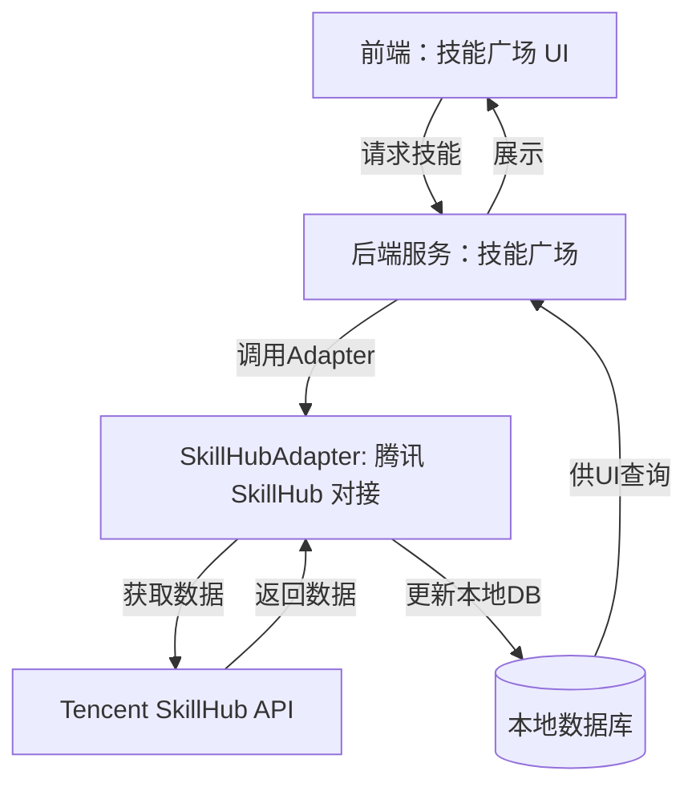
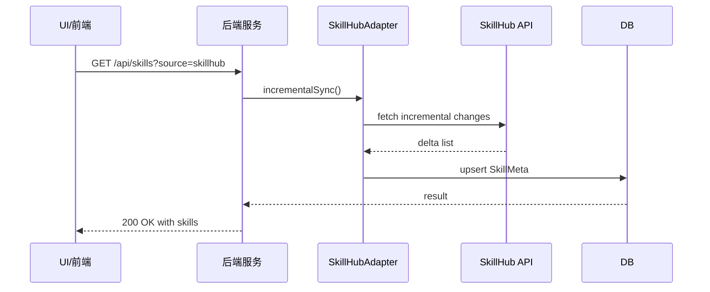
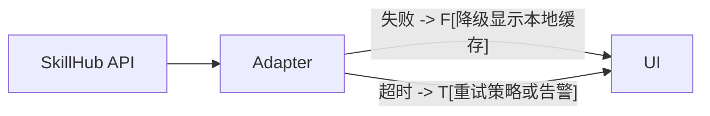

# 腾讯 SkillHub 对接：技能广场扩展设计文档

本文档描述技能广场对接腾讯 SkillHub 库的改造设计，涵盖需求分析和功能设计两大部分，并给出数据结构、接口、界面及流程/架构图草案，便于实现阶段的对齐与评审。

## 需求分析

### 需求背景
- 随着技能生态的持续扩展，单一来源的技能库已难以覆盖全量优质技能。腾讯 SkillHub 作为大型技能市场，提供丰富的第三方技能资源与标准化元信息，能够提升技能广场的覆盖面、更新频率和可维护性。
- 本改造旨在将腾讯 SkillHub 的公开技能库对接到技能广场，实现技能元数据的导入、同步与在本地场景中的统一展示与接入路径，降低本地维护成本，同时提升用户可发现性与筛选能力。

### 需求场景分析
- 场景 A：技能浏览。用户在技能广场中能够看到来自腾讯 SkillHub 的技能条目，具备与现有技能一致的展示、筛选、排序能力。
- 场景 B：技能导入与映射。系统从 SkillHub 拉取技能元数据，并映射到本地技能模型，确保后续可直接在本地进行调用、分发或审核。
- 场景 C：技能更新与同步。按预设触发条件（如定期任务、变更通知等）对 SkillHub 进行增量更新，确保技能库的新旧版本与变更可控。
- 场景 D：权限与合规。对接过程遵循现有数据安全策略，确保 API Key/凭证保管、速率限制与错误重试策略的健壮性。

### 对现有功能影响
- 数据源层：新增 SkillHub 适配器，用于与 SkillHub API 的交互。对现有技能加载、缓存和查询逻辑需要进行解耦，以支持多源数据源的并行/优先级调度。
- 查看与筛选：UI 需要对 SkillHub 来源的技能呈现一致的用户体验，包括来源标识、筛选条件、排序权重等。
- 数据模型：需要存在一个统一的本地技能元数据模型，同时允许从 SkillHub 迁入的字段映射到本地字段。
- 认证与安全：若 SkillHub 访问需要认证，需统一管理凭证、密钥及权限推断，且确保日志中不暴露敏感信息。
- 流水线与部署：新增组件的部署、监控、告警以及回滚策略的设计与实现。

### 架构影响
- 引入 SkillHubAdapter 层，作为腾讯 SkillHub 与技能广场后端的解耦器，负责对接、数据转换和增量同步。
- 数据存储层需支持多数据源的技能元数据，及其版本信息、来源标签等。
- 前端展示层需识别技能来源，支持跨源的统一展现、筛选与分页。
- 错误处理、重试与幂等性设计需统一到 Adapter 层，避免对上层造成破坏性影响。
- 日志与监控需要覆盖 SkillHub 的调用、错误、超时及速率限制等指标。

## 功能设计

### 约束
- 兼容现有技能广场的数据结构与接口，尽量实现最小侵入改动，优先实现增量同步与只读展现。
- SkillHub 访问应遵循速率限制、鉴权策略与故障兜底，支持离线缓存与降级显示。
- 数据映射需要可追溯，字段映射表应可配置，便于后续扩展到其他数据源。
- UI 不应打断现有体验，新增技能源作为可选来源出现。对来源可见性清晰标示。

### 整体方案设计
- 引入 SkillHubAdapter：负责与腾讯 SkillHub 的对接、数据获取、字段映射和增量更新逻辑。
- 与现有技能广场后端保持松耦合，SkillHubAdapter 暴露统一的接口供上层调用（如刷新、查询、过滤等）。
- 数据层设计：新增 SkillSource、SkillMeta、SkillVersion 等结构，支持多源技能的版本与来源标识。
- 缓存策略：对技能列表采用短期缓存（如 5–15 分钟）以减轻 SkillHub 的请求压力，必要时走降级路径返回部分数据。
- 安全与合规：凭证以环境变量/密钥库方式管理，日志脱敏处理，错误上报聚合到现有监控体系。
- 流程编排：提供增量更新任务、手动触发更新、以及按需全量重载三种模式。

### 详细方案设计

1. 数据模型设计
- SkillMeta: 技能的核心元数据，字段包括：id、name、description、version、tags、source、source_id、update_time、status、rating、compatibility、provider、url。
- SkillSource: 数据源标识，字段包括：id、name、type、endpoint、authMethod、credentialsRef、refreshInterval。
- SkillVersion: 版本信息，字段包括：version、releaseNotes、publishedAt、compatibleEngine。
- SkillMapping: 本地字段与 SkillHub 字段的映射表，便于字段对齐与迁移。

2. 接口设计
- Internal API（后端服务内调用）
  - SkillHubAdapter.fetchSkills(params): Promise<SkillMeta[]>
  - SkillHubAdapter.syncIncremental(): Promise<SyncResult>
  - SkillHubAdapter.refreshAll(): Promise<SyncResult>
  - SkillHubAdapter.getSkills(query): Promise<SkillMeta[]>
- 外部/上层调用接口（如前端/其他服务）
  - GET /api/skills?source=skillhub&query=...  读取 SkillHub 来源的技能列表
  - POST /api/skills/sync?source=skillhub  手动触发增量同步
  - GET /api/skill/{id}  获取某个技能的详情

3. 详细方案设计
- 数据提取：使用 SkillHub API 端点获取技能清单、元数据、版本信息，进行映射后写入本地数据库。
- 数据映射：根据 SkillMapping 将 SkillHub 字段转换为本地 SkillMeta 结构。保留来源系统字段以利后续多源整合。
- 增量同步：通过技能版本号、更新时间戳等字段检测变更，拉取自 SkillHub 的增量数据并应用到本地库。
- 错误处理：对网络异常、授权失效、数据格式变更等场景提供重试、降级和告警策略。
- 缓存与性能：对技能列表进行本地缓存，结合 TTL 与热点策略，确保高并发场景下的稳定性。
- 安全：对敏感字段进行屏蔽或脱敏，日志信息不暴露密钥等信息，凭证以加密存储或受管理的密钥库提供。
- 流程与自动化：支持定时任务触发增量同步、手动触发、变更通知执行等流程。

4. 功能原理
- 系统通过 SkillHubAdapter 与腾讯 SkillHub API 通信，获取技能元数据并在本地数据库中创建/更新 SkillMeta 实体，标记 skillhub 为来源。
- UI 层在技能广场中新增 SkillHub 来源的筛选条件，展示来自 SkillHub 的技能条目，并允许将其映射到本地技能模型。用户可像管理其他技能一样对其进行查看、筛选、收藏或使用。
- 变更在本地数据库层次通过版本号比较实现增量更新，确保数据一致性与幂等性。
- 错误与异常通过统一的错误处理组件进行收集、告警和可观测性增强。

5. 接口设计（示例）
- SkillHubAdapter
  - initialize(config: SkillHubConfig): Promise<void>
  - fetchSkills(params: FetchParams): Promise<SkillMeta[]>
  - incrementalSync(): Promise<SyncResult>
  - fullSync(): Promise<SyncResult>
  - getSkill(id: string): Promise<SkillMeta | null>

- API 路由示例（伪代码）
  - GET /api/skills?source=skillhub&query=智能
  - POST /api/skills/sync?source=skillhub
  - GET /api/skill/:id

6. 界面设计
- 新增筛选条件：来源来源 SkillHub、标签、版本状态、更新日期等。
- 列表项增强：显示来源标识、版本信息、是否已本地映射、最近更新时间。
- 详情页：展示 SkillHub 原始元数据字段、映射字段、版本历史、外部链接。
- 导入向导：从 SkillHub 选择技能后，提示映射到本地技能，并给出后续可用性影响说明。
- 交互示例：在技能详情页提供“添加到技能广场”一键操作，自动完成本地映射与后续审核流程。

7. 数据结构设计（简要）
- SkillMeta
  - id: string
  - name: string
  - description: string
  - version: string
  - tags: string[]
  - source: 'skillhub'
  - source_id: string
  - update_time: string
  - status: 'new'|'active'|'deprecated'
  - rating: number
  - compatibility: string[]
  - provider: string
  - url: string

- SkillSource
  - id: string
  - name: string
  - type: string
  - endpoint: string
  - authMethod: string
  - credentialsRef: string
  - refreshInterval: number

- SkillVersion
  - version: string
  - releaseNotes: string
  - publishedAt: string
  - compatibleEngine: string

- SkillMapping
  - localField: string
  - hubField: string

## 流程图与架构图

1) 高层系统架构（Mermaid）

2) 增量同步流程（序列图，Mermaid）

3) 错误处理与降级（简要示意，Mermaid）

## 变更计划与回滚
- 先实现 SkillHubAdapter 的接口骨架，确保本地数据库结构与现有技能模型对齐；
- 逐步引入前端来源筛选与技能清单展现，先以只读模式呈现 SkillHub 的数据；
- 若遇到对接失败或性能问题，快速回滚到原有技能广场状态，禁用 SkillHub 来源直至稳定。

## 风险与对策
- 风险：SkillHub API 变更导致对接失败。对策：实现字段映射配置表，设计容错与降级路径。
- 风险：高并发下的速率限制。对策：本地缓存、限流、重试策略与指数退避。
- 风险：敏感信息暴露。对策：凭证加密存储、访问日志脱敏、最小权限原则。

## 验收标准
- 能够从腾讯 SkillHub 拉取并展示至少 100 条技能元数据，且可按标签/版本/新旧等条件筛选。
- 增量同步在同一小时内完成最近更新的变化，且无数据丢失。
- UI 展现与现有技能广场一致，且来源标识清晰可辨。
- 错误情况下可回退到缓存并显示友好提示，且无需阻塞其他功能。

GET /api/v1/skills
功能：获取技能列表（可跨源，默认仅返回公开、已发布的技能）
查询参数：
source: string | null（过滤来源，如 'skillhub'）
query: string | null（全文搜索字符串）
tags: string[] | null
status: string | null
mapped: boolean | null
updatedAfter: string | null（ISO 时间戳）
page: number | null
pageSize: number | null
sort: string | null（如 'updateTime_desc', 'name_asc'）
响应：
200: { total: number, page: number, pageSize: number, items: SkillMeta[] }
401/403/429/5xx：错误对象
GET /api/v1/skills/{id}
功能：获取单个技能的详细信息（包括元数据、版本、映射、来源、最近更新）
路径参数：id: string
响应：200: SkillDetailResponse；404: 错误对象
POST /api/v1/skills/sync
功能：启动技能源的同步作业（增量/全量）
请求体：{ mode: 'incremental'|'full', source?: string, force?: boolean }
响应：202: { jobId: string, status: 'scheduled' }； 202/202 也可附带 initial status
GET /api/v1/skills/sync/{jobId}
功能：查询指定同步作业状态与进度
响应：200: SyncJobResponse
POST /api/v1/skills/mapping/import
功能：提交或更新 SkillHub 字段映射到本地字段的映射表
请求体：{ mappings: Array<{ hubField: string, localField: string, dataType?: string, description?: string }>, dryRun?: boolean }
响应：200: { applied: number, warnings?: string[] }
GET /api/v1/health
简单健康检查
